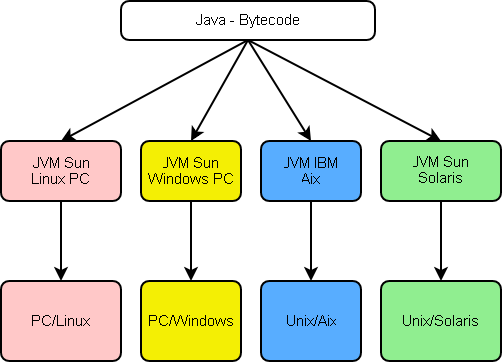

# Abstracciones

La **abstracción** es un concepto clave en todas las facetas relacionadas al software.

En esta unidad van a aparecer varios conceptos que apuntan a _elevar_ nuestro nivel de abstracción. Empecemos pensando en qué entendemos por abstraer, y por qué es importante.

## Qué es eso de abstraer
¿A qué nos referimos con "abstraer", _de qué_ nos abstraemos? 
- Nos abstraemos _de detalles_ para concentrarnos en los aspectos importantes de lo que hay que resolver.
- Nos abstraemos _de diferencias_ no esenciales, para pensar o aplicar una misma herramienta en varios casos similares.

¿Por qué es vital manejar abstracciones en el campo del software?
- Porque el software atraviesa muchos aspectos **complejos**: dominios complejos, hardware complejo, interacción compleja entre componentes, datos complejos, requerimientos complejos en la interface de usuario.
- La **abstracción** es la principal arma que tenemos para abordar situaciones complejas.  
La _abstracción de detalles_ nos permite aislar un aspecto con el que debemos trabajar, sin que sea necesario manejar el detalle completo de la situación.  
Por su parte, la _abstracción de diferencias_ nos ayuda a comprender _patrones_, factores similares entre distintos problemas que permiten aplicar un mismo esquema de solución.

(acá puede ir una imagen de la abstracción combatiendo al dragón de la complejidad. Una típica en lenguajes de programación es la tapa del "libro del dragón", la pongo para que se vea la idea )  
 

 

Un concepto común en informática es el de _capa de abstracción_, que se agrega en un diseño para que la "capa de arriba" no necesite conocer detalles de la "capa de abajo", de forma tal que cambiando la capa de abstracción, la misma "capa de arriba" pueda funcionar en una variedad de "capas de abajo".  
Un ejemplo típico es la Java Virtual Machine (JVM), que permite que el mismo código Java ("capa de arriba") pueda ejecutarse en distintos entornos operativos ("capas de abajo").

(imagen del rol de la JVM, pongo una muy vieja y fea, confío en quien diagrame)  
 

## Algunos ejemplos iniciales
Muchos conceptos relevantes relacionados con el software, surgen como formas de abstracción. Veamos

- Los _lenguajes de programación_ surgieron para abstraernos de muchos detalles engorrosos que aparecen al programar en lenguaje-máquina o en assembler, muy cerca del hardware.
- Los _compiladores_ / _intérpretes_ / _máquinas virtuales_, permiten abstraer un programa del hardware / sistema operativo en el que se va a ejecutar. Un ejemplo es la JVM recién mencionada.
- Las distintas _unidades de software_ (funciones, procedimientos, objetos/clases, módulos) permiten utilizar una pieza de software abstrayéndonos de cómo está implementada.
- Los _protocolos_ o _interfaces_ de comunicación, nos permiten comunicarnos con una pieza de software o hardware, abstrayéndonos de cómo está construida.
- La noción de _containers_ nos permite definir unidades de despliegue de software, abstrayéndonos de los detalles del hardware en donde se ejecuta, incluso si este hardware se encuentra on-premise o si se utilizan recursos cloud.

## Protocolos
Entre los conceptos mencionados, el más general es el de _protocolo_ o _interface_.  
Este concepto es, tal vez, el más ubicuo en el ámbito de la informática.

En el campo del _hardware_ se manejan multitud de protocolos, que permiten abstraernos de marcas y modelos al configurar centros de servicios informáticos.

(acá tal vez pueda ir algún dibujito que represente la idea de "protocolo")
 

En el software, un ejemplo paradigmático es el _protocolo HTTP_ que permite la comunicación de programas por intermedio de la Internet, con total independencia de los lenguajes y tecnologías utilizados para construir cada programa.

### Protocolos dentro de un programa

Dentro de los componentes que forman un programa, también pueden definirse protocolos.  
La comunicación entre componentes mediante protocolos permite abstraer, en cada componente, los detalles de implementación de los componentes que utiliza.  
Además, el uso de protocolos facilita la configuración de un programa, y brinda una forma de documentación: si un componente cumple con un protocolo, su función dentro de un programa queda clara a partir de comprender dicho protocolo.

Concretemos estas ideas mediante

> **un pequeño ejemplo**.  
> Dentro de un programa, puede surgir la necesidad de enviar mails.   
Un protocolo para el envío de mails, puede consistir en la especificación de los datos que requiere el componente que realiza el envío, y la de los datos que otorga como respuesta; siguiendo la idea _request-response_ de p.ej. HTTP.  
Una definición de estas características conlleva varias ventajas
> 1. Los componentes que invocan a la funcionalidad de envío de mails, no necesitan conocer detalles sobre cómo llevar a cabo esta tarea, más allá del protocolo que deben respetar.
> 1. Se pueden definir distintos componentes, con variantes en cómo envían mails (p.ej. usando IMAP o SMTP, recopilando mensajes y haciendo envíos en bloque, etc.), de forma tal que pueda elegirse cuál se utiliza, sin que el componente que invoca a la funcionalidad se vea afectado.
> 1. De los componentes que responden al protocolo definido, queda clara su función en el programa.
<!-- > 1. En los puntos del programa donde se requiera enviar mails, queda claro cómo invocar al componente que realiza esta tarea, y qué se recibirá como respuesta. -->

La forma concreta que toma un protocolo dentro de un programa, dependerá del estilo y lenguaje de programación utilizados.  

Varios de los _patrones en desarrollo de software_ que mencionaremos más adelante, están fuertemente vinculados a la idea de protocolo.

