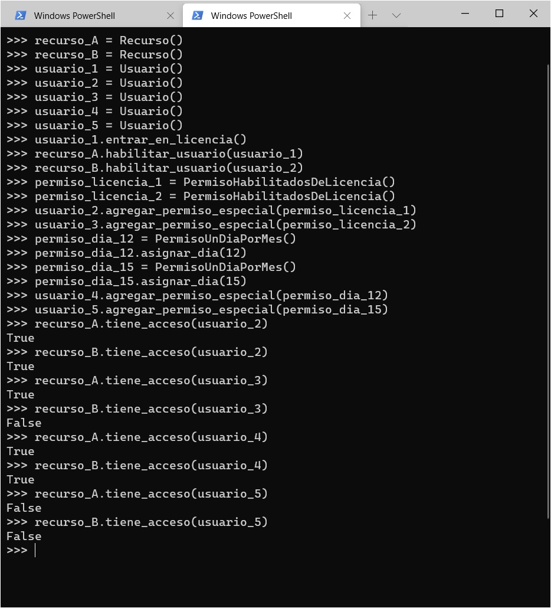

# Programación orientada a objetos - un ejemplo un poco más elaborado
En el ejemplo presentado en la página anterior, la interacción entre los objetos era muy sencilla: los únicos objetos que intervienen son recursos y usuarios, y la interacción se limita a verificar si un usuario está o no en una lista.

A continuación, presentaremos una versión un poco más elaborada, que nos dé la oportunidad de apreciar interacciones más complejas entre los objetos.

En concreto, agregamos al modelo una serie de _permisos especiales_ que se pueden asignar a los usuarios. Cada permiso especial puede, o no, habilitar a un determinado recurso.  
Un usuario que posea un permiso especial que habilita a un determinado recurso, gana acceso a dicho recurso. Esta condición se agrega a la whitelist que ya incluye cada recurso.

Esta es la definición de recursos y usuarios resultante.
``` python
class Recurso:
    def __init__(self):
        self.usuarios_habilitados = []

    def habilitar_usuario(self, usuario):
        self.usuarios_habilitados.append(usuario)

    def tiene_acceso(self, usuario):
        # se contemplan permisos especiales, más whitelist por recurso
        return (usuario in self.usuarios_habilitados) or usuario.tiene_permiso_especial(self)


class Usuario:
    def __init__(self):
        self.permisos_especiales = []
        self.esta_de_licencia = False

    def agregar_permiso_especial(self, permiso):
        self.permisos_especiales.append(permiso)

    def entrar_en_licencia(self):
        self.esta_de_licencia = True

    def volver_de_licencia(self):
        self.esta_de_licencia = False

    def tiene_permiso_especial(self, recurso):
        return any(permiso.habilita_acceso(recurso) for permiso in self.permisos_especiales)
```

Se agrega la información que indica si un empleado está de licencia, por motivos que veremos más adelante.

La clave de este nuevo modelo está en el método `tiene_acceso`, en la clase `Recurso`. Se agrega la condición
``` python
usuario.tiene_permiso_especial(self)
```
que da lugar a la evaluación de los permisos especiales.

A su vez, cada usuario tiene una lista de estos permisos.  
Cuando se le consulta si tiene un permiso especial que lo habilite para un recurso, el usuario _delega_, a su vez, en cada uno de los permisos especiales que tenga asignados. Si hay alguno que habilite el acceso al recurso seleccionado (ese es el sentido del `any`), entonces el usuario responde que sí tiene un permiso especial, lo que a su vez (gracias al `or`) provoca que el recurso responda que el usuario tiene acceso.


## Permisos especiales - repasamos el concepto de protocolo
Hasta ahora, no hemos descripto explícitamente a los objetos que representan a los permisos especiales.  
Revisando el código, podemos obtener información sobre cómo están modelados. Prestemos atención al código del método `tiene_permiso_especial` en la clase `Usuario`.
``` python
return any(permiso.habilita_acceso(recurso) for permiso in self.permisos_especiales)
``` 
A cada permiso se le hace una consulta bien definida: `habilita_acceso`, pasando un recurso como parámetro. La lógica de la función `any` indica además, que la respuesta a esta consulta debe ser un valor booleano.

Esta información es suficiente para comprender el _protocolo_ que deben cumplir los objetos que representen permisos especiales: deben responder a la consulta `habilita_acceso`, que recibe un recurso, y devuelve un booleano.  
Cualquier objeto que cumpla con este protocolo, puede ser considerado la representación de un permiso especial. 

Esto permite que si aparecen nuevos tipos de permisos a posteriori, se puedan agregar las clases que permitan contemplarlos, sin necesidad de modificar el código existente.


## Algunos ejemplos
Veamos dos ejemplos de permisos especiales. Uno habilita cualquier recurso, un solo día por mes. Otro habilita los recursos para los cuales todos los usuarios en la _whitelist_ están de licencia.

``` python
class PermisoUnDiaPorMes:
    def __init__(self):
        self.dia_del_mes = 1

    def asignar_dia(self, dia):
        self.dia_del_mes = dia

    def habilita_acceso(self, recurso):
        return date.today().day == self.dia_del_mes


class PermisoHabilitadosDeLicencia:
    def habilita_acceso(self, recurso):
        return all(usuario.esta_de_licencia for usuario in recurso.usuarios_habilitados)
```

Más allá de los detalles de implementación, subrayamos que las dos clases incluyen el método `habilita_acceso`, lo que implica que sus instancias van a cumplir con el protocolo requerido, de acuerdo a lo descripto en el parágrafo anterior.

Realicemos una pequeña prueba. En ella definimos dos recursos, A y B, y cinco usuarios del 1 al 5, con estas reglas
- el usuario 1 está en la whitelist del recurso A.
- el usuario 2 está en la whitelist del recurso B, y tiene un `PermisoHabilitadosDeLicencia`.
- el usuario 3 tiene un `PermisoHabilitadosDeLicencia`.
- el usuario 4 tiene un `PermisoUnDiaPorMes` para los días 12.
- el usuario 5 tiene un `PermisoUnDiaPorMes` para los días 15.
- el usuario 1 está de licencia.

Si se ejecuta este escenario en un día 12, los resultados esperados son:
- el usuario 2 tiene acceso al recurso A, por el `PermisoHabilitadosDeLicencia`, y al B por whitelist.
- el usuario 3 tiene acceso al recurso A, por el `PermisoHabilitadosDeLicencia`.
- el usuario 4 tiene acceso a todos los servicios.
- el usuario 5 no tiene acceso a ningún servicio.

Con un poco de paciencia, se puede configurar este escenario y hacer las comprobaciones en la consola interactiva de Python.

 

