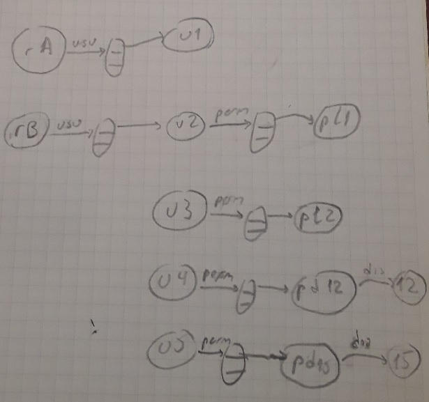

# Patrones de diseño

En esta página comenzaremos con la descripción de uno de los tópicos principales de esta unidad, los _patrones de diseño_.

Este concepto se aplica a varios ámbitos relacionados con el software. En este material cubriremos dos de estos ámbitos: el desarrollo de software, y la configuración de containers y pods para el despliegue de aplicaciones.  
Para aplicar el concepto de patrones al desarrollo de software adoptaremos la perspectiva de la POO, que es donde este concepto se identificó originalmente (siendo descripto en el ya clásico [libro-de-patrones o "GoF book"](https://www.amazon.com/-/es/Erich-Gamma-ebook/dp/B000SEIBB8)) y donde la idea de "patrón de diseño" tiene un mayor desarrollo. En particular, [este sitio](https://refactoring.guru/design-patterns) tiene buenas explicaciones y ejemplos.  
Esto no implica que el concepto no pueda aplicarse en otros paradigmas de programación.

Los dos ámbitos identificados, el de la programación según el modelo de la POO y el de los sistemas de containers, pueden ser percibidos como _muy_ distintos.  
Para comprender cómo un mismo concepto, el de patrón de diseño, puede aplicarse a ambos, comenzaremos realizando una descripción abstracta del modelo de programa que propone la POO, que nos permitirá resaltar sus similitudes con los sistemas formados por  containers (y de hecho, con toda estructura organizada como un sistema).

Luego de esto, daremos una visión de _diseño_ que puede aplicarse de igual manera a los dos ámbitos estudiados. Es a partir de esta visión unificada que, finalmente, describiremos la idea de patrón de diseño.

## Una visión abstracta de la POO
En el modelo de programa que propone la POO, se distinguen unidades bien definidas, que son los objetos.  
Estas unidades se relacionan, formando una _estructura_. El principal medio para establecer esta estructura son las relaciones que se establecen mediante los valores de los atributos de cada objeto.  
Por lo tanto, la _configuración_ de un programa construido según la POO, consistirá en la creación de los objetos necesarios, y la asignación de los valores de atributos que genere la estructura deseada.

En el ejemplo de la [página anterior](./oop-algo-mas.md), esta configuración consiste en:
- la creación de los objetos que representan recursos, usuarios y permisos especiales.
- algunas configuraciones particulares, en este caso los días a los que se refieren los permisos de un día por mes, y los usuarios que están en licencia.
- la configuración de la whitelist para cada recurso.
- la asignación de permisos especiales a los usuarios.

Todas estas tareas se pueden observar en el ejemplo al final de la página. Una vez concluida la configuración, se puede utilizar la estructura de objetos generada, para el propósito del programa, que es verificar permisos. 

El siguiente diagrama ilustra los objetos que forman parte del ejemplo al final de la página anterior, y las relaciones entre ellos. Las iniciales corresponden a los nombres de variable utilizados, p.ej. "rA" para `recurso_A` o "pl1" para `permiso_licencia_1`. Las flechas con nombre representan los atributos, y las estructuras en forma de ciempiés representan las listas, a partir de las cuales se accede a los elementos de cada una.

 

## Analogía entre distintos ámbitos
La descripción que hicimos sobre la POO destaca tres conceptos
1. _elementos_: los objetos
2. _estructura_ : mediante atributos que relacionan los objetos
3. _configuración_: creación de objetos y asignación de valores a los atributos

Esta caracterización a partir de elementos, estructura y configuración aplica a otros ámbitos dentro de la industria del software. En particular, al segundo ámbito que nos interesa en esta unidad: las _redes de containers_ que se establecen para el despliegue de aplicaciones.

En este caso tenemos
1. _elementos_: containers, recursos, redes locales, etc..
2. _estructura_ : agrupamiento de containers en pods, inclusión de distintos containers o pods en una red local, etc...
3. _configuración_: creación de elementos, configuración de pods, recursos y redes, etc.. Es lo que se hace p.ej. mediante archivos de configuración de `docker-container`. 

En ambos casos, el comportamiento del sistema depende de los elementos que se incluya y de cómo se hayan configurado.

## Diseño
A partir de los conceptos de elemento, estructura y configuración, podemos reconstruir una idea de _diseño_ que aplique de igual modo a los dos ámbitos que estamos estudiando.

Definiremos como _diseño_ las actividades que llevan a definir los _elementos_ principales de un sistema, a establecer las relaciones entre estos elementos que forman la _estructura_ del sistema, y a realizar las acciones de _configuración_ que se requieran.

Así, el diseño de un programa construido de acuerdo a la POO, involucrará entre otras tareas
- definir qué clases configurarán la representación de la información relevante del dominio de aplicación del programa.
- determinar las formas en que se vincularán los objetos que se creen, primariamente mediante los atributos que se definan en cada clase.
- especificar los contratos necesarios, e indicar qué clases deben incluir los métodos necesarios para que sus instancias cumplan con cada contrato.
- indicar qué instancias deben crearse para cada clase, y cómo deben ser configuradas.

En el caso de un sistema de despliegue, tendremos estas tareas
- definir containers y recursos.
- determinar qué containers tienen acceso a qué recursos, definir pods para agrupar containers.
- generar las redes locales necesarias, y conectar los containers definidos mediante las mismas.
- especificar ports y protocolos de comunicación entre los containers, y de los containers con el exterior.

Estas tareas implican la _toma de decisiones_: aparecerán varias opciones, ante las cuales la diseñadora deberá adoptar las que resulten más adecuadas al problema a resolver.  
También puede requerirse una cuota de _ingenio_ para elucidar soluciones a problemas complejos o poco conocidos.

## Patrones de diseño
Al emprender tareas de diseño en cualquier ámbito, hay problemas que se presentan recurrentemente en distintos proyectos. 

Un diseñador experimentado, podrá reconocer que en la tarea que tiene actualmente entre manos, se presenta un problema similar al que ya resolvió en algún proyecto anterior, que le comentó una colega, o sobre el que leyó en un artículo. A partir de esa información, podrá evaluar si las estrategias de solución aplicadas en las experiencias pasadas son útiles en la situación actual, y realizar las adaptaciones necesarias.

Los patrones de diseño no son más, ni menos, que la codificación de un cúmulo de experiencia e intuición de muchos diseñadores, seguido por un trabajo de sistematización que clasifica los problemas comunes, les pone un nombre que los identifique, y describe la estructura de una solución.

Estos son algunos ejemplos de problemas que aparecen recurrentemente en el desarrollo de software, que motivaron la definición de patrones.
- garantizar la existencia de un único elemento de un determinado tipo. En POO, que exista una única instancia de una clase.
- flexibilizar la configuración de una operación, tal que puedan generarse distintas combinaciones de características.  
P.ej. respecto de los permisos, habilitar distintas combinaciones de condiciones: exigir que el usuario sea administrador, cuotas de uso (límite de cantidad de usos por unidad de tiempo), intervalo entre usos, etc..  
En otro dominio, la operación involucrada podría ser calcular el precio de un servicio, al que pueden aplicarse distintos descuentos, recargos, etc..

En la organización de containers, también encontramos problemas comunes, que también han dado lugar a la definición de patrones en este ámbito. Mencionamos algunos ejemplos.
- definir un único punto de acceso para un recurso que está replicado en varios nodos.
- adaptar la información generada por distintos containers, a un formato unificado que pueda ser consumido por una herramienta de monitoreo.

Recomendamos vivamente la lectura de la primera sección de la introducción del [libro clásico de patrones](https://www.amazon.com/-/es/Erich-Gamma-ebook/dp/B000SEIBB8), que describe muy bien esta idea. Son dos páginas sin desperdicio.

(imagen sobre el "libro de patrones")  
 

## Vehículos de comunicación
El conocimiento de patrones de diseño, en el ámbito en que nos toque desempeñarnos, eleva nuestra capacidad de reconocer problemas comunes cuando los encontramos, y nos brinda herramientas para concebir soluciones.

Pero hay una segunda utilidad de la noción de patrón de diseño, no menos relevante que la recién mencionada. 
Los patrones elevan el nivel de comunicación en un equipo de trabajo. Forman un vocabulario común, que permite describir una idea con gran precisión y en forma muy concisa.

Al diseñar una estructura de containers, si una ingeniera le dice a otra "en esta situación, conviene configurar un _sidecar_", la segunda puede captar inmediatamente la idea y evaluarla, sin necesidad de largas explicaciones, y mitigando el riesgo de una comunicación defectuosa.

Lo mismo pasa con un desarrollador al que se le sugiere utilizar un _decorator_ para resolver un determinado problema.

