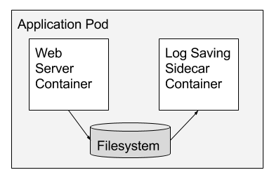
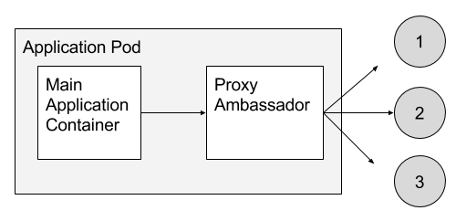
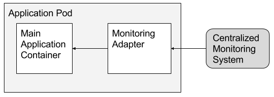

# Patrones de diseño para containers
Concluimos esta unidad con una descripción suscinta de algunos de los patrones de diseño para containers más extensamente difundidos.  
La aplicación de la idea de patrón de diseño a las redes de containers para despliegue de software es más reciente que su correlato en desarrollo de software. 
Concretamente, surge en un [artículo](https://www.usenix.org/conference/hotcloud16/workshop-program/presentation/burns) presentado en una conferencia de 2016 sobre Cloud Computing.
Los patrones que se presentan, junto con algunos otros, fueron propuestos originalmente en el artículo mencionado, del cual tomamos las imágenes que se incluyen en esta página.

La presentación será mucho más abreviada que la desarrollada para patrones de desarrollo de software: nos limitaremos a describir brevemente el propósito y características principales de cada patrón.

## Single container

### Propósito
Reforzar las ideas que motivan las arquitecturas de despliegue basadas en containers: separación de responsabilidades, modularidad, previsibilidad y sencillez.

### Características
Este patrón indica, simplemente, que se recomienda:
- utilizar un container _dedicado_ para el despliegue de un componente, y 
- desplegar cualquier otra funcionalidad, incluso los servicios que requiere el componente, en containers separados.

Este patrón se considera el punto de partida para la utilización de containers para el despliegue de aplicaciones.  
Para la interacción de los componentes con otros servicios, o para distintas variantes de configuración, se definen otros patrones, algunos de los cuales se describen a continuación.

El concepto de _single-container_ es acompañado por propuestas acerca de las  acciones de gestión asociadas a una aplicación desplegada en un container, tanto respecto del monitoreo de las aplicaciones por parte de herramientas específicas, como de la relación de la aplicación con el container donde está desplegado (aviso ante la baja del container, posibilidad de obtener datos de configuración a partir de recursos disponibilizados por un container, etc.).

## Sidecar

### Propósito
Establecer un mecanismo estandarizado para proveer servicios (logging, autenticación, etc.) a un componente desplegado en un container, sin romper con el principio recién mencionado de _single-container_.

### Características
Se propone disponibilizar los servicios requeridos en containers separados, que se comuniquen con el componente a través de canales y/o recursos compartidos, tales como una red local o un volumen.

La siguiente imagen muestra un ejemplo de un container donde está desplegado un web server, junto con un _sidecar container_ que se encarga del log.  
 

La separación de responsabilidades que propone este patrón brinda varios beneficios, entre los que señalamos.
- la posibilidad de controlar por separado el uso de recursos en cada container. En el ejemplo, si los dos containers se alojan en el mismo equipo físico, se puede dar prioridad a la atención de pedidos del componente principal, relegando el otorgamiento de recursos al servidor dedicado al log.
- el componente principal se empaqueta y despliega por separado de los servicios a los que accede.
- los errores ocurridos en un servicio accesorio, no impactan en el funcionamiento del container donde está alojado el componente principal.

## Ambassador

### Propósito
Reforzar la escalabilidad, simplificando el despliegue de múltiples instancias de un mismo componente o servicio.

### Características
Se propone configurar containers separados, a los que se denomina _ambassadors_, que sirvan de proxies para cada servicio o componente que se replique en varias instancias. 
Estos proxies deben respetar el mismo protocolo que el servicio o componente replicado.  

Los ambassadors son responsables del balanceo de carga, monitoreo, y otras cuestiones ligadas al funcionamiento de las instancias del servicio o componente.

La siguiente imagen muestra, en forma esquemática, una implementación de este patrón.  
 

La consecuencia principal del uso del patrón Ambassador, es que el desarrollo de la aplicación que necesite comunicarse con un servicio, puede abstraerse de la existencia de varias instancias de dicho servicio en el entorno de producción. La comunicación es idéntica a si existiera una única instancia; el _ambassador_ se encarga de la complejidad agregadas por la existencia de múltiples instancias.

Finalmente, señalamos la similitud de esta idea con la expresada en el [patrón Proxy](../patrones-desarrollo-software/proxy) para desarrollo de software. 

## Adapter

### Propósito
Presentar una versión estandarizada de un aspecto del funcionamiento de múltiples componentes.

### Características
En un sistema complejo, existen componentes que deben recabar información de una cantidad de otros componentes. Un ejemplo típico son los servicios de monitoreo, que recolectan y analizan datos generados por múltiples componentes.

En un sistema en el que conviven componentes generados por distintos equipos, lo que se da en particular si se utilizan componentes _legacy_, puede ocurrir que coexistan componentes que exponen su información de monitoreo utilizando distintos formatos o protocolos.  
Por otro lado, la configuración de un servicio de monitoreo se simplifica si se le presenta un formato unificado de información de los componentes a los que debe controlar.

El patrón Adapter permite resolver esta tensión. 
Propone agregar, para cada componente cuyo comportamiento difiera del standard elegido para el sistema en su conjunto, un container dedicado a la traducción del formato utilizado por el componente específico, al formato definido como standard.

La siguiente imagen muestra el uso de este patrón para el escenario mencionado de monitoreo.  
 

Otra utilización posible de este patrón es la estandarización de la interface de los componentes de un sistema complejo, en el cual algunos componentes exponen una interface API REST, mientras que otros ofrecen una interface SOAP.

## Leader Election

### Propósito
Desacoplar la tarea de selección de líder (leader election) de un conjunto de réplicas, de los componentes que implementan la funcionalidad replicada.

### Características
La existencia de componentes replicados que requieren que una de las réplicas sea caracterizada como _líder_ es un fenómeno cada vez más común en los sistemas altamente distribuidos.
Este fenómeno trae aparejada la necesidad de contar con un mecanismo de _leader election_: la selección de una nueva réplica líder, en caso de que la que actualmente cumple ese rol se desactive.  
Estos mecanismos son inherentemente complejos.

Este patrón propone definir componentes que se encarguen específicamente de la tarea de selección de líder, descargando de esta responsabilidad a las réplicas.  
En esta propuesta, cada container que aloja a una réplica, es acompañado por un container que "representa" a esa réplica respecto de las selecciones de líder. 
Los componentes dedicados de selección de líder, cuentan con una interface simplificada mediante la cual gestionan los eventos asociados a esta tarea.

Un beneficio particular de este patrón es que la lógica de selección de líder implementada en los containers dedicados, puede reusarse en distintos contextos donde existan componentes replicados. De esta forma, se abstrae a estos contextos de la tarea compleja de selección de nuevo líder.
