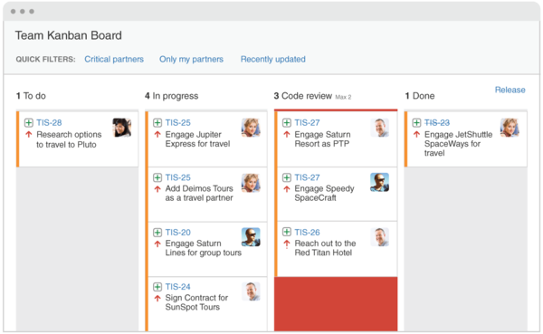

# Entrega continua

Siguiendo con la metáfora del _pipeline_ o tubería, ya estamos a punto de _"ver la luz al final del túnel"_: hemos logrado satisfactoriamente preparar los artefactos necesarios y nuestros mecanismos automáticos de aseguramiento de la calidad (o QA) ya indican que podemos continuar. Según la premisa _una tarea se considera concluida únicamente cuando está operativa en un entorno productivo_, lo que resta ahora es, nada más y nada menos, desplegar los cambios en el entorno productivo.

Sin entrar en detalles de qué implicaría técnicamente este "pasaje a producción" (porque en cada organización implicará procesos diferentes), podemos mencionar algunas estrategias metodológicas que son útiles para no perder la **trazabilidad** de las funcionalidades. En el enfoque tradicional quizás no era necesario tener un control fino del ciclo de vida de cada funcionalidad, porque había largos períodos de tiempo entre una versión y la siguiente. Pero en un contexto donde se habla de publicar todas las semanas o incluso todos los días, resulta fundamental tener un registro.

Veremos a continuación algunas ideas que nos ayudarán a responder a la pregunta: ¿cómo asegurar qué funcionalidad está presente en cada ambiente?

## Gestión de tareas dentro de un proyecto software

Como mencionamos en la Unidad 4 al hablar de [gestión de defectos](../testing/sistematizacion/bug-tracking), las herramientas que inicialmente daban soporte para reportar defectos hoy se han transformado en una especie de "ordenadoras" de todo el trabajo de desarrollo. 

En particular, resulta interesante la visualización en forma de _tablero Kanban_ que muchas de estas herramientas ofrecen, y que nos ayudan a tener una visión global del estado actual del proyecto. 

_algo así, pero donde se vean también otros estados relacionados al entorno: "Deployed to QA", "Ready for production", etc_

Como se ve en la imagen, cada columna representa a un posible estado que puede tener que ver con una etapa del desarrollo, del despliegue o incluso del negocio. Retomando lo que mencionamos en la introducción de esta unidad, sería interesante que este tablero se actualice cada vez que un build es "promovido" a otro ambiente. Y naturalmente, estas herramientas ofrecen puntos de extensión para que esta tarea se pueda automatizar desde el servidor de CI / CD.

## Pipeline: un caso práctico

A partir de todo lo mencionado, podríamos imaginar un _pipeline_ completamente automatizado como el siguiente:

1. El equipo de desarrollo toma una tarea, crea una rama en Git y realiza un push al repositorio. Esta acción provoca que la tarea transicione de **Pendiente** a **En progreso**.
1. Una vez finalizada, se crea un _pull request_ y la tarea pasa a **En revisión**.
1. Se ejecutan las pruebas automatizadas y arrojan errores, por lo que se le informa al desarrollador responsable y la tarea vuelve al estado **En progreso**.
1. El desarrollador corrige los defectos, y la tarea vuelve nuevamente a **En revisión**. 
1. Esta vez sí pasa las pruebas y además sus compañeros lo aprueban, por lo que la tarea pasa a **Lista para QA**. 
1. En el CI se dispara un proceso de despliegue a un entorno de QA, y se notifica a los responsables de las pruebas manuales.
1. Este equipo concluye satisfactoriamente las pruebas y transiciona, manualmente, la tarea a **Lista para desplegar**. 
1. El día Martes (porque así lo decidió la organización), se toman todas las tareas que están en el estado **Lista para desplegar** y se suben a producción.
1. Terminado el despliegue, las tareas pasan al estado **En producción**.

En conclusión, una tarea podría pasar por muchos estados antes de llegar a producción, y llevar un registro manual de eso sería imposible. Se vuelve especialmente necesario definir cada estado correctamente, así como las transiciones entre cada uno de ellos y los eventos que se desencadenan. Cabe destacar que las tareas manuales que el _pipeline_ tenga (como el paso 7 del ejemplo) deben también estar sistematizadas, y podrían ser desencadenantes de otras tareas automáticas.

Retomaremos algunos de estos conceptos al hablar de trabajo colaborativo en la siguiente unidad.
