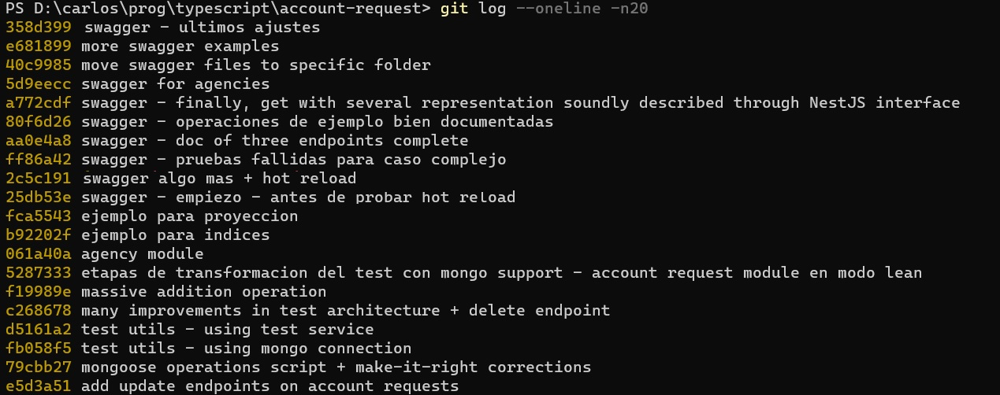
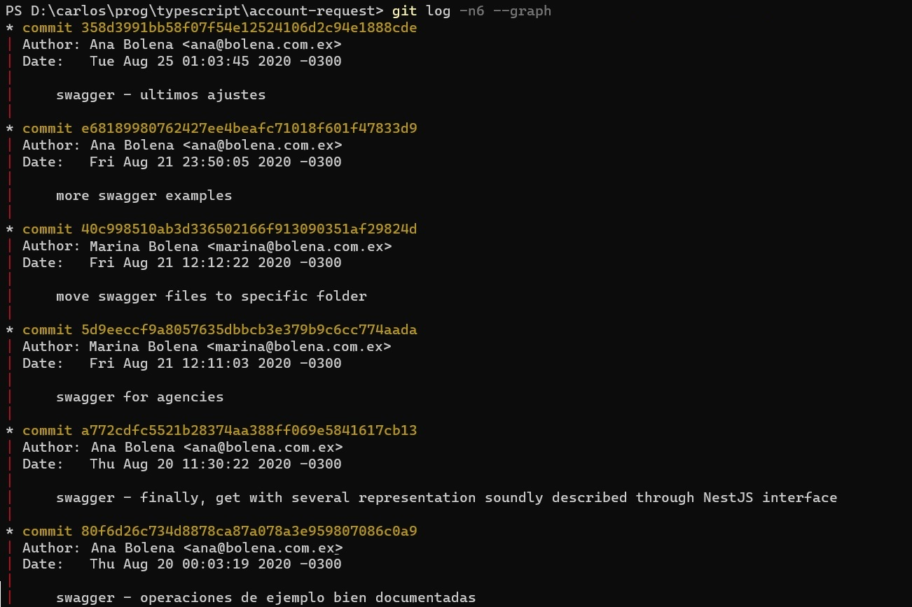
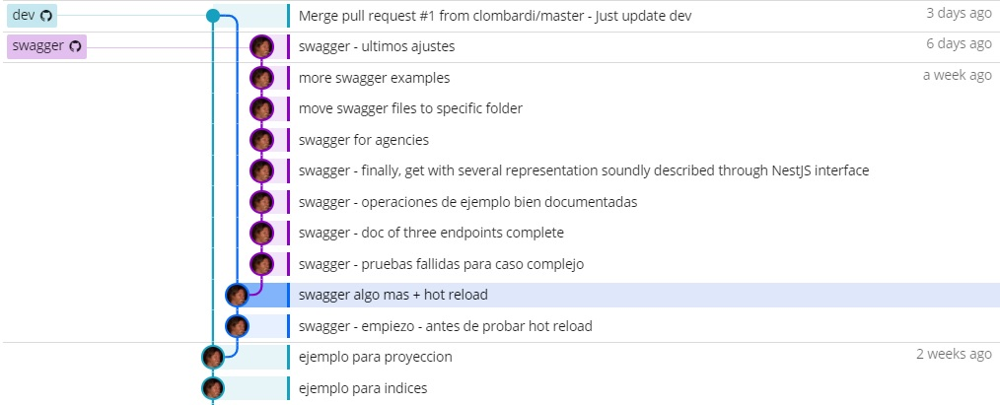
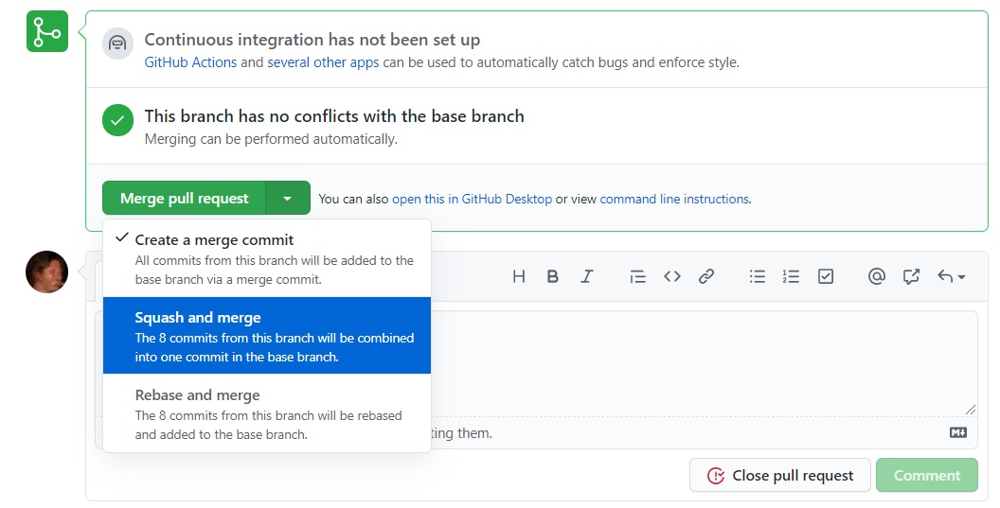
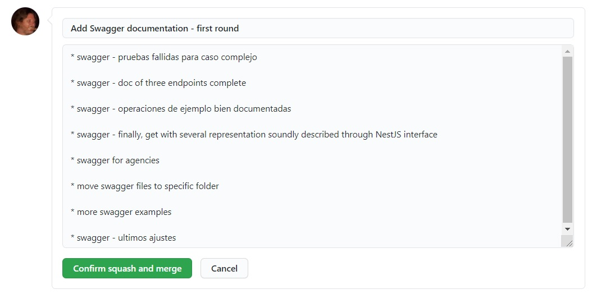
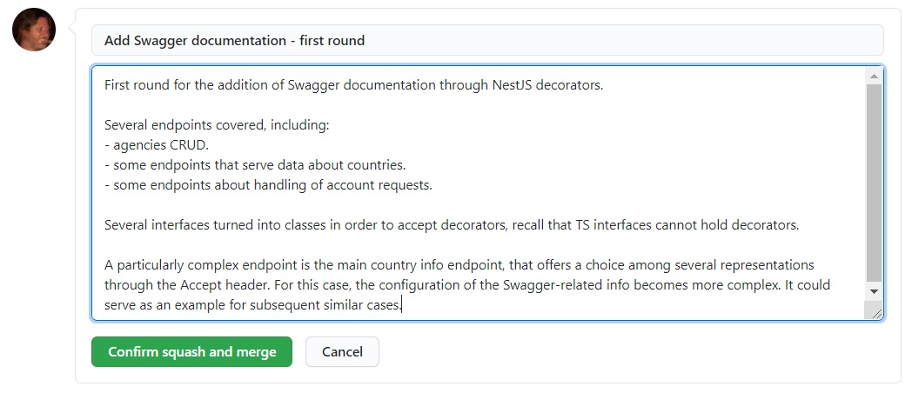
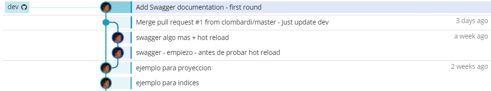
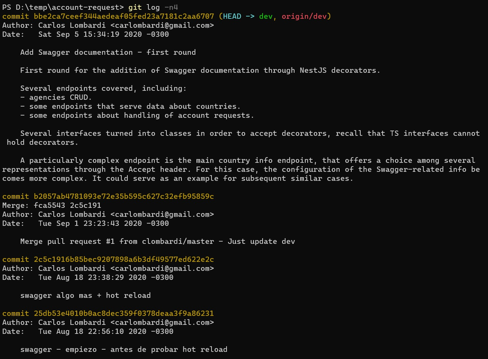

# Historia de commits, commit messages

## Historia de commits como recurso de documentación
Ya señalamos en esta unidad que cada rama define una _secuencia de commits_. Esta secuencia conforma lo que se conoce como **historia** de una rama.  
El comando `git log` permite visualizar esta historia. Esta imagen muestra el log de una rama, limitado a los últimos 20 commits, en una versión ultra-compacta.  
  

En una versión con más información, los últimos 6 commits se ven como se muestra a continuación.  
  

En ambos casos, la información que brinda el log incluye un **mensaje** que se asocia a cada commit, como se describió en la [introducción a Git](../scm-git/git).
En la visión más extendida, aparece la persona que realizó cada commit.

La secuencia de los mensajes asociados a cada commit constituye un _recurso adicional de documentación_, que ofrece una perspectiva histórica sobre un repositorio Git y el código que incluye. 
Esta perspectiva puede resultar útil para visualizar rápidamente cuándo se introdujo una característica, funcionalidad, o el código que generó un defecto; y qué desarrolladores estuvieron involucrados.

Por lo tanto, estos mensajes son un recurso valioso dentro de un proyecto de desarrollo.

## Frecuencia de commits, squash de commits
La _frecuencia_ con que cada desarrolladora realiza commits impacta, entre otras cuestiones, en la documentación que representan los mensajes asociados a cada commit.  
Una mayor frecuencia de commits generará una historia más detallada, mientras que commits realizados en forma espaciada y con una densidad importante de cambios en cada commit, redundarán en una historia más compacta.

¿Cuál es el **nivel de detalle más conveniente** para la documentación conformada por la historia de commits de una rama? La respuesta a esta pregunta puede variar según la naturaleza o el propósito de cada rama.  
Para una _rama asociada a una tarea_, puede convenir una historia extendida, que permita un análisis preciso de los cambios introducidos por cada integrante del equipo en cada momento, e incluso de los razonamientos que llevaron a cada una a generar sus contribuciones al código común. 
Adicionalmente, contar con unidades de cambio más frecuentes y pequeñas permite una integración más ágil dentro del equipo, y brinda una mayor cantidad de puntos de control para poder explorar soluciones alternativas a un problema.  
Por otro lado, en _ramas que integran_ el trabajo de varias personas o sub-equipos, una historia excesivamente detallada podría resultar difícil de estudiar o de seguir.

Para cubrir esta problemática, surge el concepto de **squash de commits**, un proceso por el cual los cambios de varios commits se consolidan en uno solo.  
Atendiendo a que un escenario probable para esta operación es durante la integración en una rama principal, actualmente varios servidores Git ofrecen la posibilidad de realizar un squash junto con el merge de un pull request. 

Veamos un ejemplo similar al del ejemplo utilizado en la [presentación de pull request](./pull-requests). Este es el estado del repositorio antes del PR.
.  
En este estado, se crea un PR para integrar el branch `swagger` en el branch `dev`.

En GitHub, el squash aparece como una de las opciones para el merge de un PR.  
.  

Si se elige esta opción, la siguiente pantalla presenta campos para ingresar la descripción para el commit que resulta de la consolidación.  
.  
Aquí notamos que Git permite indicar para cada commit, además del mensaje resumido, una _descripción extendida_. GitHub propone completar este campo con una lista de los mensajes asociados a cada commit que se está consolidando. 
Este texto puede modificarse libremente.  
.  

Luego de aceptar, se crea un nuevo commit que consolida los 8 commits en `swagger`, que se agrega a la historia de la rama `dev`.  
.  

De esta forma, se evita que la historia de la rama utilizada para integración sea demasiado extensa.

Finalmente, señalamos que la descripción extendida del commit consolidado aparece al solicitar `git log`.  
.  

## Recomendaciones sobre commit messages
La importancia de los mensajes asociados a cada commit se refleja en la existencia de varias recomendaciones, e incluso propuesta de estándares, para su redacción.

Entre las recomendaciones, encontramos
- no incluir detalles sobre el código modificado, que puede ser analizado utilizando el comando `git diff`.
- agregar una descripción extendida para commits relevantes.
- que al leer el mensaje se comprenda la motivación del cambio.
- preferir descripciones conceptuales, p.ej. "se agregan funciones para el cálculo de comisiones", en lugar de otras más ligadas al código, p.ej. "se agrega la función `calculo_comisiones` en `funciones.py`".
- utilizar un estilo indicativo, p.ej. "se corrige el defecto X", en lugar de alternativas como "corrección del defecto X" o simplemente "defecto X".
- incluir referencias a la tarea o defecto relacionado con el cambio.

Para mayor información, se pueden consultar las referencias existentes en la Web al respecto, como [estas reglas para escribir un mensaje](https://chris.beams.io/posts/git-commit/) o [esta guía al respecto](https://www.freecodecamp.org/news/writing-good-commit-messages-a-practical-guide/).

Finalmente, mencionamos que algunas de estas ideas se integran en las propuestas existentes sobre estándares para textos de mensajes de commits, entre las que mencionamos [Conventional Commits](https://www.conventionalcommits.org/en/v1.0.0/).

