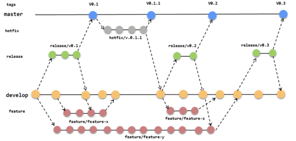

# Estrategias de branching

Hasta aquí hemos hablado sobre qué puede hacerse con _branches_ y cómo estas nos sirven para crear "pequeños ambientes aislados" que facilitan el desarrollo en paralelo. Pensando desde una visión de Operaciones, podríamos también tener branches que contengan el código de algún entorno de ejecución particular, en el sentido que le dimos en la [Unidad 5](../scm-git/entornos).

Las posibilidades de _branching_ o ramificación son infinitas, y para intentar darle orden a ese potencial caos surgen las _estrategias de branching_, que no son más que convenciones sobre cómo utilizar las branches. Cada una de estas estrategias responde a un flujo de trabajo que abarca desde el desarrollo hasta el despliegue, e indica ante qué eventos debería crearse una nueva rama o integrarse los cambios de una sobre otra. 

A medida que los proyectos de software evolucionan y los equipos que los sostienen crecen, gestionar el código y las distintas versiones que se van generando se vuelve cada vez más complejo. Tener una estrategia que sea adecuada para las características de cada proyecto, y velar por que todo el equipo la respete, resultará de vital importancia para el éxito o fracaso de este. 

Del sinfín de estrategias que existen, tomamos para este material las que más representativas resultan: _git flow_, _GitHub flow_ y _trunk based development_. Cada una de estas estrategias da soporte a una metodología de desarrollo, y está alineada a una visión de cómo gestionar las distintas versiones. Describiremos a continuación cada una de ellas.

## Git flow

Este flujo empezó a popularizarse en el año 2010 (poco después del surgimiento de Git), y fue diseñado especialmente para el software que más se construía en aquel entonces: aplicaciones de escritorio. En ese marco, era usual tener que dar soporte en paralelo para distintas versiones de la misma aplicación, y esta estrategia está organizada en torno a esta necesidad.

Pensando en este escenario, _git flow_ propone una rígida separación entre el código "listo para producción" y las versiones en desarrollo. Para esto, se vale de dos ramas o _branches_:

* `master` o `main`: la rama principal, donde eventualmente todo el código debería confluir.  Cada vez que se integra algo a esta rama, se le añade un [tag](../scm-git/gestion-de-versiones) que indica el nombre de la versión: `v1.2`, `3.7.245`, etc. Se asume que lo que llega aquí está listo para ser desplegado en producción (y podría incluso automatizarse este despliegue). 
* `develop`: aquí es donde sucede todo el desarrollo, y desde donde eventualmente se crearán nuevos _releases_ o versiones, que terminarán integrándose en `master`. Pensando desde el punto de vista de las versiones, esta branch siempre alojará al código de la **próxima versión**.

Esta estrategia determina también una serie de estados intermedios por los que debería pasar una cierta funcionalidad hasta llegar a producción, representados con branches con nombres especiales. Un flujo típico de desarrollo sería el siguiente:

* Al comenzar una nueva funcionalidad, una desarrolladora crea una nueva branch partiendo de `develop`. La convención es que el nombre de esta branch comience con `feature/`, por ejemplo: `feature/support-online-` o `feature/rol-based-access-control`.
* Una vez finalizada esta funcionalidad, se integra nuevamente en la branch `develop`. Como dijimos, en esta branch se irá armando la siguiente _release_.
* Cuando el conjunto de funcionalidades relacionadas a la _release_ se completan, se creará una nueva branch partiendo de `develop`, con el nombre de la release. En este caso la convención de nombre es utilizar el prefijo `release/`, resultando así en `release/v1.2` o `release/3.7.245`. En este punto convendría publicar la aplicación en algún ambiente pre-productivo (QA, testing, staging) y realizar pruebas más intensivas. Si surgieran bugs o pequeñas correcciones, se hacen directamente sobre la branch correspondiente al release.
* Finalizada esta etapa de prueba, se integran finalmente los cambios del `release` en `master` y se genera el tag correspondiente. Si en la _release branch_ hubo algún commit nuevo, se integra nuevamente a `develop` para que esté disponible en las siguientes versiones.
* Si surgiera algún defecto en producción que necesitara ser resuelto con urgencia, esta estrategia propone resolverlo en una branch que parte y se integra directamente en `master`. En la jerga, a este tipo de cambios se los suele llamar `hotfix` (arreglo en caliente), y ese es también el nombre que la estrategia le da a estas branches. Una vez corregido el defecto, será necesario integrar esos cambios en `develop`, para que también estén disponibles para la próxima versión

En el siguiente esquema puede verse una "foto" de un proyecto manejado con esta estrategia:

_(sería bueno volver a armar todos los esquemas de esta unidad para que tengan la misma estética)_

