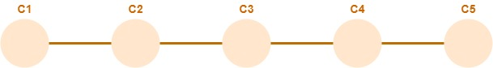
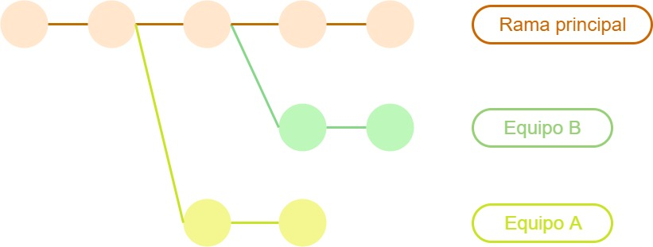

# Uso extendido de ramas
En esta página, brindaremos algunos elementos relacionados con el uso de **branches** o **ramas** dentro de un proyecto de desarrollo.

## Riesgos del trabajo sobre una base única de código
Pensemos en un escenario de un proyecto de desarrollo en el que participan muchas personas escribiendo código.
Supongamos que todos ellos, y ellas, utilizan una única base de código común, soportada por un repositorio de código en el cual cada participante vuelca su código a medida que lo va generando, en una única rama.

Aunque el trabajo se organice de forma tal que cada persona o subgrupo pequeño, trabaje en funcionalidades o aspectos separados, algunas veces los cambios  introducidos por una persona o grupo incidirán sobre el trabajo de otros, porque afectan a funcionalidades utilizadas o compartidas por varios grupos. 
Esto conlleva el riesgo de que el trabajo de otros grupos se vea perjudicado, si un componente compartido cambia su comportamiento o interfaz, se introduce un defecto como consecuencia de un cambio, o se requieren modificaciones en el entorno de ejecución de desarrollo.

Señalemos también la posibilidad de que un commit defectuoso en el repositorio donde está la base compartida, puede provocar la pérdida o modificación involuntaria de código, lo que otra vez implica el riesgo asociado de perjudicar o retrasar el trabajo de varios equipos.


### Un ejemplo
Los fenómenos mencionados pueden aparecer cuando existe una función, desarrollada por un equipo específico, que utilizan varios equipos. Tomemos como ejemplo una función que responde al siguiente esquema.
``` python
def importe_comisiones(operacion):
    # implementación
```
Para simplificar el ejemplo, asumimos que la función `importe_comisiones` devuelve un número.

Todos los equipos comparten un repositorio con una única rama. Supongamos que en un determinado momento, esta rama cuenta con cuatro commits:  
  


En esta situación, el equipo A necesita usar esta función para calcular las comisiones para ciertas operaciones. Este equipo escribe un test para verificar que la función calcula el importe correcto de comisiones para una operación determinada.
``` python
def test_comisiones_A():
    miOperacion = # definición de la operación
    assert importe_comisiones(miOperacion) == 100
```

Al ejecutar el test, falla porque la función calcula un importe de comisiones de 0, en lugar de 100.
El equipo A encuentra que falta considerar ciertas condiciones en el código de la función. La modifica de modo tal que sus tests funcionan correctamente, y genera un nuevo commit:  
  

El código que está desarrollando el equipo B _también_ utiliza la función `importe_comisiones`; entre los tests desarrollados por este equipo encontramos el siguiente.
``` python
def test_comisiones_B():
    unaOperacion = # definición de la operación
    assert importe_comisiones(unaOperacion) == 300
```

Puede ocurrir que como consecuencia de las modificaciones agregadas en el commit `C5`, se introduzca un defecto en la función `importe_comisiones`, que provoque que _deje de dar el resultado esperado_ en algunos casos que no aplican al trabajo del equipo A, pero sí al del equipo B. En particular, el ` test_comisiones_B` puede fallar, porque para la operación involucrada, el importe calculado de comisiones pase de 300 a p.ej. 500.  

Resumiendo: 
- En el commit `C4` funciona correctamente el `test_comisiones_B` pero no el `test_comisiones_A`. 
- Al introducir el commit `C5` se _invierte_ la situación: funciona `test_comisiones_A` y deja de funcionar `test_comisiones_B`.

En este escenario, el equipo B **debe interrumpir su trabajo**, hasta compatibilizar las necesidades de los dos equipos respecto de la función, y realizar las modificaciones necesarias en la misma.

Análogamente, si por un error involuntario, la función desaparece como consecuencia de un commit agregado, el código de _todos los equipos que la utilizan_ deja de funcionar.


## Solución: trabajo con branches
Para evitar este tipo de problemas se alienta, en muchos proyectos, la utilización extensiva de **branches o ramas** en los proyectos de desarrollo.  
Si cada persona o subgrupo trabaja en un branch particular, se minimiza el riesgo de que cambios hechos por otras personas o equipos puedan afectar su trabajo en el día a día. Al mismo tiempo, también se disminuye el riesgo de que los cambios realizados por esa persona o equipo, puedan perjudicar el día a día del resto del equipo de desarrollo general del proyecto. En resumen, permite brindar un mejor manejo de los _efectos cruzados_ del trabajo de cada equipo.

Como ya apuntamos, una de las motivaciones principales para la rápida adopción de Git en la industria es que provee un manejo de branches superior al de los repositorios de código más populares al momento de su popularización.

En el ejemplo anterior, si los equipos A y B trabajan en ramas separadas de esta forma  
  
entonces las modificaciones introducidas por el equipo A no afectan al trabajo diario del equipo B.

Obviamente, esta forma de trabajo no hace desaparecer mágicamente el problema; la ventaja que se obtiene es que se puede resolver en forma aislada del trabajo diario de cada equipo.  
En concreto, el problema va a surgir durante la [integración](../scm-git/integracion) del trabajo de alguno de los equipos en la rama principal. 
En esta instancia, los tests de [regresión](../testing/testing-software/regresion) son una herramienta importante para detectar posibles efectos del trabajo de un equipo en el resto del código.


## Diversidad de branches, surge un nuevo problema
Lo indicado más arriba sugiere la existencia de un branch para cada persona o equipo de trabajo. En rigor, actualmente se prefiere asociar los branches a tareas, antes que a personas.  
Por lo tanto, por cada _tarea_ que se está desarrollando en un determinado momento, existirá un branch activo en el repositorio de código del componente afectado.

Estas **no** son las únicas ramas previstas en un proyecto de desarrollo.
También se suele definir una rama para cada versión que esté actualmente activa en algún entorno de integración, test o producción; y también una rama para trabajar sobre cada defecto relevante que se haya reportado.

La proliferación de branches, al tiempo que soluciona varios problemas frecuentes y a veces complejos que afectan el trabajo diario de los grupos de desarrollo, crea un _nuevo problema_: cómo **integrar** el trabajo que se desarrolla por separado en branches distintos.  
Para abordar esta cuestión, se han establecido varias prácticas y herramientas. La principal es el concepto de **pull request**, que describiremos en la siguiente página.


## Comentario adicional: multiplicidad de varios conceptos
La existencia de una multiplicidad de ramas de código, se agrega a la de otros conceptos relacionados con SCM, mencionados en la unidad 5.
Actualmente, es habitual que un proyecto de desarrollo tenga que gestionar múltiples _versiones_ de los desplegables que produce, y requiera de múltiples _entornos_ para soportar el día a día de la evolución del proyecto.  
Este carácter múltiple en varios aspectos, refleja la naturaleza evolutiva de muchos proyectos de desarrollo, en particular aquellos concebidos de acuerdo a marcos de trabajo ágiles.

Una consecuencia de este fenómeno es una gran presión sobre las tareas de Operaciones. Esto constituye una de las motivaciones principales para elevar el grado de automatización en la ejecución y monitoreo de dichas tareas, lo que a su vez alienta la adopción de una visión DevOps.
