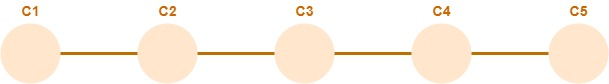
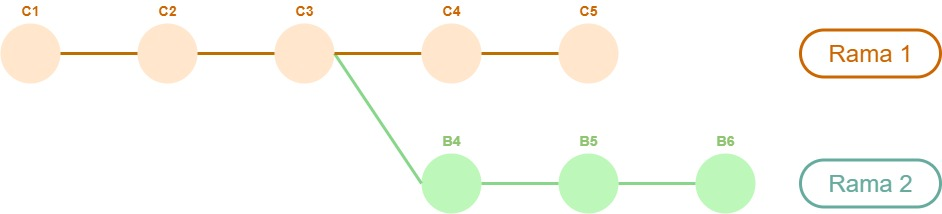
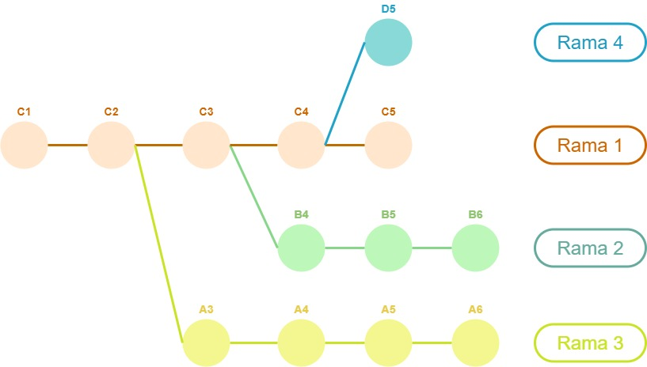
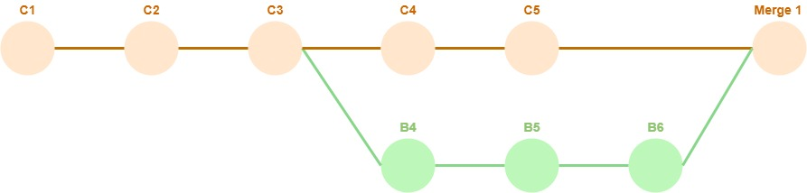

# Ramas en Git
Como se describió en la [Unidad 5](../scm-git/git), uno de los aspectos destacados de Git es la simplicidad y agilidad en el manejo de ramas o branches. 
Esta característica es fuertemente aprovechada en el uso que se hace de Git en el estado actual del desarrollo de software.

En esta página, describiremos brevemente el concepto de rama.
En la siguiente, justificaremos su uso extensivo en muchos proyectos de desarrollo.


## Escenario básico - secuencia de commits
Cada commit en un repositorio agrega cambios sobre un commit anterior, que se conoce como su commit progenitor o _parent commit_. La excepción es el _commit inicial_, que carece de progenitor.
En principio, un repositorio Git toma la forma de una secuencia de commits.

Esta imagen   
  
muestra un repositorio sobre el que se realizaron cinco commits, siendo el primero `C1` y el último `C5`. En cada uno se agregan, eliminan y/o modifican archivos, sobre el commit anterior.

Describamos un posible ejemplo de un repositorio con esta secuencia de commits. Incluimos archivos de texto de una sola línea, para simplificar la descripción.

**Commit inicial `C1`**  
Se agregan dos archivos.
- `uno.txt`, con el texto `uno - one`.
- `dos.txt`, con el texto `dos - two`.

**Commit `C2`**  
- se modifica `uno.txt`, el nuevo contenido es `uno - one - één`.
- se agrega `tres.txt`, con el texto `tres - three`.

**Commit `C3`**  
- se modifica `dos.txt`, el nuevo contenido es `dos - two - twee`.

**Commit `C4`**  
- se modifica `dos.txt`, el nuevo contenido es `dos - two - twee - deux`.

**Commit `C5`**  
- se modifica `tres.txt`, el nuevo contenido es `tres - three - drie`.
- se agrega `cuatro.txt`, con el texto `cuatro - four`.


El estado actual del repositorio cuenta con los archivos 
- `uno.txt`, con contenido `uno - one - één` (commit `C2`).
- `dos.txt`, con contenido `dos - two - twee - deux` (commit `C4`).
- `tres.txt`, con contenido `tres - three - drie` (commit `C5`).
- `cuatro.txt`, con contenido `cuatro - four` (commit `C5`).


## Ramas en un repositorio
Una _rama_ es una bifurcación en la secuencia de commits de un repositorio, a partir de cierto punto.

En este gráfico se muestra un repositorio que incluye dos ramas.
  


Cada rama tiene una secuencia de commits y un estado actual propios. 
En este ejemplo, la secuencia correspondiente a la rama 1 es `C1 - C2 - C3 - C4 - C5`, mientras que para la rama 2 tenemos `C1 - C2 - C3 - B4 - B5 - B6`.  
Por lo tanto, entre los commits que incluye este repositorio, encontramos que
- `C1`, `C2` y `C3` son compartidos por las ramas 1 y 2.
- `C4` y `C5` pertenecen únicamente a la rama 1.
- `B4`, `B5` y `B6` pertenecen únicamente a la rama 2.

Supongamos que los cambios de los commits `C1` a `C5` son los mismos que en el ejemplo anterior, que en `B4` se agrega el archivo `cinco.txt`, y en `B5` y `B6` se modifica dicho archivo, cuyo contenido final es `cinco - five - vijf - cinq`.  
En tal caso, el estado actual de la rama 1 coincide con el estado del repositorio descripto en el ejemplo anterior.
Por su parte, el estado actual de la rama 2 incluye los siguientes archivos.
- `uno.txt`, con contenido `uno - one - één` (commit `C2`).
- `dos.txt`, con contenido `dos - two - twee` (commit `C3`).
- `tres.txt`, con contenido `tres - three` (commit `C2`).
- `cinco.txt`, con contenido `cinco - five - vijf - cinq` (commit `B6`).

Notamos que las modificaciones hechas en los commits que pertenecen sólo a una rama, no afectan al estado de la otra.

El primer ejemplo presentado en esta página corresponde a un repositorio que contiene una única rama.


## Apertura a partir de una rama principal
Aunque para Git no hay (por lo general) diferencias entre las distintas ramas, en su uso se suelen distinguir ramas que se consideran como principales, a partir de las cuales se _abren_ ramas secundarias.   
En el ejemplo anterior, la rama 1 es la principal, mientras que la rama 2 es secundaria.
Pueden abrirse varias ramas a partir de una misma rama principal; el gráfico siguiente muestra un repositorio con tres ramas abiertas a partir de la rama 1 que se considera como la principal.  
  


## Merge entre ramas
Por lo general, las modificaciones generadas en una rama secundaria se **integran** eventualmente a una rama principal. Para ello, se ejecuta la operación conocida como `merge` en Git, que genera un nuevo commit que reúne las modificaciones de dos ramas.  
El siguiente gráfico muestra el estado del repositorio del ejemplo con dos ramas, luego de realizar el merge de la rama 2 sobre la rama 1.  
   
El commit `Merge 1` es el resultado del merge, es el último commit de la rama 1. Se considera que la secuencia de la rama secundaria termina en el commit `B6`.
Luego de esta operación, el estado de la rama 1 incluye estos archivos.
- `uno.txt`, con contenido `uno - one - één` (commit `C2`).
- `dos.txt`, con contenido `dos - two - twee - deux` (commit `C4`).
- `tres.txt`, con contenido `tres - three - drie` (commit `C5`).
- `cuatro.txt`, con contenido `cuatro - four` (commit `C5`).
- `cinco.txt`, con contenido `cinco - five - vijf - cinq` (commit `Merge 1`).

Si en los commits exclusivos de cada rama que interviene en un merge se modifica un mismo archivo, se produce la posibilidad de conflicto descripta al comentar las cuestiones de [integración](../scm-git/integracion) en la Unidad 5.


<!-- **Commit inicial `C1`**  
Se agregan los archivos `uno.txt` y `dos.txt`, con este contenido.

`uno.txt`  
```
uno
one
```

`dos.txt`  
```
dos
two
```

**Commit `C2`**  
Se agrega una línea a `uno.txt`, que queda así:
```
uno
one
één
```

Por otro lado, se agrega `tres.txt`, con este contenido
```
tres
three
```

**Commit `C3`**  
Se agrega una línea a `dos.txt`, que queda de esta forma
```
dos
two
twee
```

**Commit `C4`**  
Se agrega una nueva línea a `dos.txt`, que queda así
```
dos
two
twee
deux
```

**Commit `C5`**  
Se agrega una línea a `tres.txt`, que queda así:
```
tres
three
drie
```

Por otro lado, se agrega `cuatro.txt`, con este contenido
```
cuatro
four
```
 -->
