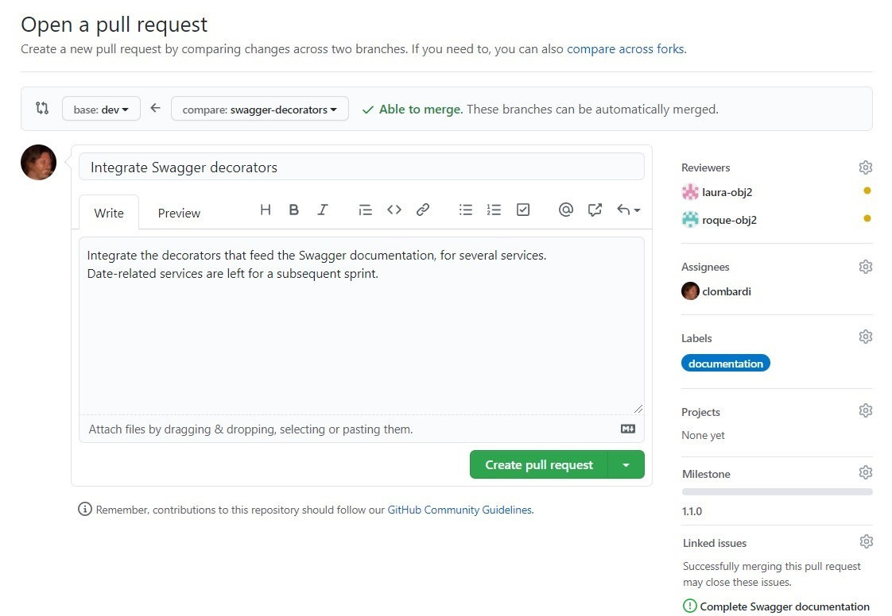
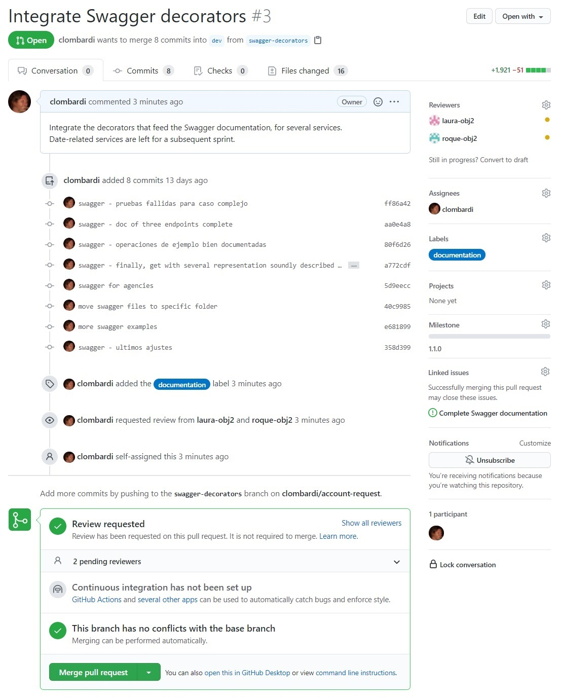
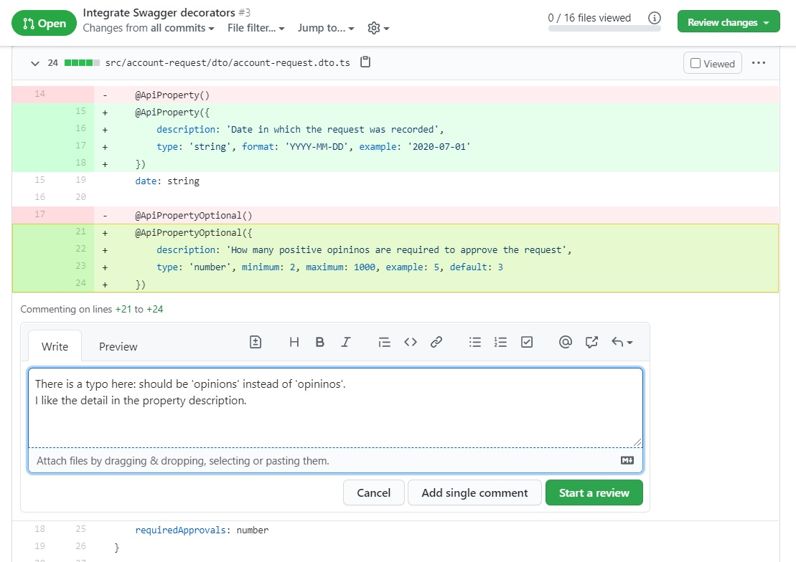
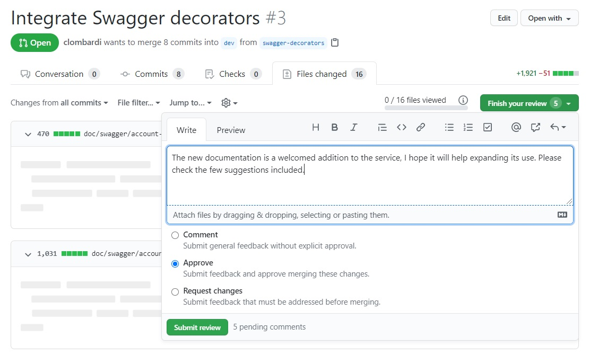
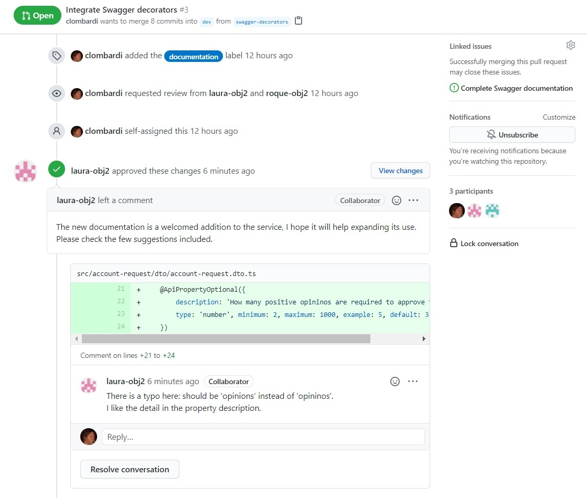
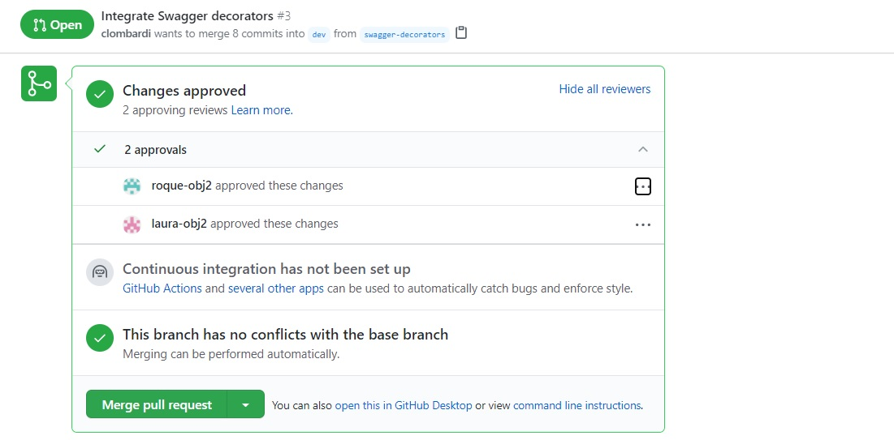

# Pull requests

## Una herramienta para la integración
Un rasgo significativo dentro de la concepción actual del desarrollo de software, es la importancia que se brinda al acto de **integrar** el trabajo hecho por una persona o equipo, al código que recoge todas las contribuciones al código de un componente o producto.

Este proceso puede disparar distintas tareas, entre ellas la revisión de código (para validar la calidad del código a ser integrado), la ejecución de tests (para minimizar el riesgo de la aparición de defectos como consecuencia de la integración), y la posibilidad de establecer debates dentro del equipo de desarrollo, en relación a las técnicas de codificación reflejadas en el código objeto de la integración.  
De esta forma, la integración se torna un paso que contribuye a elevar la estabilidad, la robustez y la calidad del código.

El concepto de **pull request** fue concebido para dar un soporte adecuado, desde el repositorio de código, a esta forma de concebir los eventos de integración.

## Qué es un pull request
Un pull request (conocido por sus siglas PR) es la formalización, dentro de un repositorio de código, del pedido de integrar el código presente en un branch _origen_, dentro de otro branch _destino_. 
En el caso más común, el branch origen corresponde al desarrollo de una tarea o resolución de un defecto, y el branch destino es aquel en el que se recolecta el código de un componente o producto.  
Los principales servidores de Git, entre ellos GitHub, GitLab y Bitbucket, incorporan el concepto de pull request. Señalamos que en GitLab, este concepto se conoce como **merge request**, o sea MR.

Típicamente, un PR es iniciado por el equipo o persona responsable por la rama origen. Además de las ramas origen y destino, se puede especificar información adicional. Entre ellos destacamos una propuesta de _reviewers_, o sea desarrolladores a quienes se invita a que revisen el código a ser integrado antes de incorporarlo. También se puede indicar un número de versión, que será el primero en el que se incorpore el código a ser integrado; y la identificación de una tarea o defecto que dicho código permite completar o resolver. 

De acuerdo a la _estrategia de branching_ elegida por el equipo, se define qué rama utilizar para la integración de acuerdo a cada situación posible (finalización de una tarea planificada, corrección de un defecto de prioridad urgente, etc.); estas serán las _ramas destino_ de cada pull request. 
Este tema será abordado más adelante en la presente unidad.

La pantalla siguiente muestra los datos de carga para un nuevo pull request en GitHub, en el que se solicita integrar el código agregado en la rama origen `swagger-documentation`, a la rama destino `dev`.  

Observamos que se está designando a los usuarios `laura-obj2` y `roque-obj2` como revisores, que la versión (o sea, el _milestone_) candidata para incorporar estas modificaciones es la 1.1.0, y que se también se designa un miembro del equipo _asignado_ al pull request. Esta persona será responsable del manejo del pull request, incluyendo las eventuales modificaciones derivadas de los comentarios de los revisores.  
Además, GitHub permite indicar la naturaleza de los cambios de código incluidos en un PR mediante `labels`: en este caso, se trata de modificaciones que mayormente agregan documentación. 

### El repositorio de código integra información y procesos
Entre la información que se suministra al abrir el pull request, destacamos que se asocia un issue (tarea o defecto) al PR, indicando que la incorporación del código completa la tarea o resuelve el defecto.  
Realizar esta asociación resulta sencillo porque los issues están registrados _en el mismo repositorio_ GitHub en el que se almacena el código. Esta es una muestra de la integración, en los repositorios de código, de información y procesos relativos al desarrollo.

Otros proveedores de servicios para el desarrollo ofrecen soluciones integradas, en las que un pull request generado desde un repositorio puede vincularse con un issue generado en un _issue tracker_, concepto mencionado en la [Unidad 5](../testing/sistematizacion/bug-tracking).   
Este es el caso de Atlassian, que permite la integración entre repositorios de código Git gestionados por Bitbucket, con proyectos organizados en el issue tracker Jira.

## Pull requests como dispositivos de comunicación
Una vez abierto un pull request, todas las personas involucradas pueden acceder a varias vistas con información sobre este pedido de integración.

Esta es una vista resumen que propone GitHub sobre un pull request recién creado.

Se listan los commits realizados sobre la rama origen, que contienen los cambios a ser integrados. Abajo, aparece una historia de los eventos asociados al PR. Finalmente, encontramos un recuadro en el que se indica que se han solicitado opiniones ("Review requested"), y que el acto de integrar los cambios en la rama destino no genera conflictos debidos a modificaciones concurrentes ("This branch has no conflicts with the base branch").

### Revisión: comentarios particulares y generales
La interfaz gráfica de GitHub ofrece otras vistas sobre un PR. Una de ellas muestra el detalle de los cambios a integrar sobre cada archivo de código fuente, consolidando los cambios de todos los commits involucrados.  

Utilizando esta vista, una revisora puede realizar comentarios que se asocian a porciones específicas de un archivo. La imagen siguiente muestra el código seleccionado para el comentario (las líneas 21 a 24), junto con el texto del comentario que está realizando la revisora.

En la vista de detalle de cambios, se muestran las líneas eliminadas en rojo, y las agregadas en verde.

Una revisora puede realizar varios comentarios, sobre distintas partes del código a integrar. Finalmente, genera un comentario y una recomendación generales, dando de esta forma por cerrada la revisión.

En este caso, la revisora recomienda aprobar el PR, o sea, que el código sea efectivamente integrado.

### Después de las revisiones
Las revisiones se agregan a la vista de resumen. 
En la historia de eventos, se incluyen los comentarios de cada revisor.

Para cada comentario particular, se ofrece la posibilidad de contestarlo, generándose una conversación en la que varios miembros del equipo de desarrollo pueden debatir sobre el código a ser integrado. 
La secuencia de mensajes aparece en las distintas vistas del pull request.

En el cuadro inferior, se informa que hay dos revisiones que aprueban el PR.

En este mismo cuadro, se ofrece la posibilidad de _mergear_ el pull request. Esto genera que el código efectivamente se integre en el branch destino. En caso de ocurrir conflictos, se pueden manejar como se indica en la página de [integración](../scm-git/integracion) en la Unidad 5.