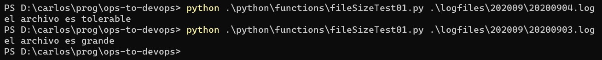
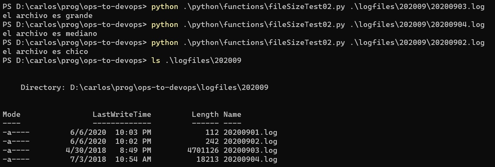

# Alternativa - "el if"
Repasemos brevemente un elemento presente en cualquier lenguaje de programación: la _alternativa_, o (en un lenguaje más coloquial) "el `if`".

Muchas veces, nuestros programas deben realizar una acción, sólo si se cumple cierta condición.  
P.ej. bloquear un usuario _si_ intentó acceder a cierto recurso sensible, crear un nuevo archivo de log _si_ el actual supera cierto tamaño, volver a levantar un servicio _si_ está caído.  
A veces la condición es implícita, p.ej. las tareas que involucran copiar o mover un determinado archivo, por lo general deben realizarse sólo _si_ tal archivo existe.

La alternativa se utiliza para contemplar estas situaciones. Por suerte, en los tres lenguajes esta idea se asocia a la palabra `if`, aunque como veremos, cada uno tiene sus variantes.

Para verlo con un ejemplo sencillo, armemos un script que recibe el nombre de un archivo, y simplemente indica por pantalla que `el archivo es grande` si su tamaño es de más de 1Mb, y `el archivo es tolerable` en caso contrario.

Este es el código en Python
``` python
from sys import argv
from pathlib import Path

file = Path(argv[1])
size = file.stat().st_size
one_mb = 1024 * 1024

if size > one_mb:
    print("el archivo es grande")
else:
    print("el archivo es tolerable")
```
Este es un ejemplo de uso de este script.
 

Vemos que a cada uso de alternativa (el "if") se le puede asociar una cláusula complementaria (el "else") que se ejecuta si la condición _no_ se cumple.

## Varios casos
Pidámosle algo un poco más sofisticado a nuestro script: queremos que indique:
- `el archivo es grande` si su tamaño es de más de 1Mb,
- `el archivo es mediano` si "pesa" entre 1Kb y 1Mb, y
- `el archivo es chico` en caso contrario (o sea, si "pesa" menos de 1Kb).

Para simplificar el script, podemos usar la característica de "ifs encadenados", que en Python tiene la sintaxis `if ... elif ... else`. En concreto:
``` python
from sys import argv
from pathlib import Path

file = Path(argv[1])
size = file.stat().st_size
one_kb = 1024
one_mb = one_kb * one_kb

if size > one_mb:
    print("el archivo es grande")
elif size >= one_kb:
    print("el archivo es mediano")
else:
    print("el archivo es chico")
```

Comprobemos que funciona de acuerdo a lo esperado.
 

Obsérvese que en la condición del `elif`, no es necesario comprobar que el tamaño no supere 1Mb.  
Esto es así porque las cláusulas se evalúan de arriba hacia abajo; si una se verifica, se ejecutan sólo las acciones asociadas a esa cláusula, y las que siguen se ignoran. En este caso, si el archivo "pesa" más de un Mb, se activa la primer cláusula, y se ignoran tanto la segunda como el `else`.


## En lenguajes de scripting
Un script idéntico en PowerShell
``` PowerShell
$fileInfo = Get-Item $args[0]
$fileSize = $fileInfo.Length
$oneKb = 1024
$oneMb = $oneKb * $oneKb

if ($fileSize -gt $oneMb) {
    Write-Host "el archivo es grande"
} elseif ($fileSize -ge $oneKb) {
    Write-Host "el archivo es mediano"
} else {
    Write-Host "el archivo es chico"
}
```

La sintaxis es un poco distinta: hay que poner las llaves en lugar del caracter dos-puntos `:` que se usa en Python, para delimitar el código cuya ejecución está sujeta a la condición.  
Esta diferencia sobre cómo se delimita una unidad de código, en rigor, ya apareció en la [definición de funciones](./funciones), y también se translada a otras construcciones de cada lenguaje que veremos más adelante.  
Ya más específico de la alternativa, vemos que en lugar de `elif` es `elseif`.  

Vamos con Bash
``` bash
file_size=$(wc -c < $1)
one_kb=1024
one_mb=$((one_kb * one_kb))

if [ $file_size -gt $one_mb ]
then
    echo el archivo es grande
elif [ $file_size -ge $one_kb ] 
then
    echo el archivo es mediano
else
    echo el archivo es chico
fi
```  
Otra variante de la sintaxis: la condición va entre corchetes, y ¡atención! los espacio que separan los corchetes de la condición son _obligatorios_. Además, va una palabra `then` en la siguiente línea; y se cierra con `fi`.

Una peculiaridad: las condiciones de mayor y mayor-o-igual, que en la mayor parte de los lenguajes se escriben `>` y `>=`, en PowerShell y en Bash son `-gt` y `-ge`. Esto es porque los caracteres `<` y `>` se reservan para operaciones de comandos.
