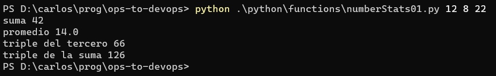

# Funciones

En la [sección anterior](./arrays-listas) trabajamos con listas, que es un concepto que nos permite _organizar datos_.  
En esta sección, el tema van a ser las _funciones_, que nos van a permitir _organizar código_.

## Definición rápida
Diremos que una función es un pequeño programa, al que le ponemos un nombre, y que realiza una tarea acotada.  
Desde otros puntos del programa, se puede _invocar_ a cada función definida, mediante el nombre asignado.

Una función puede, o no, _generar un resultado_ o respuesta. Además, puede _tomar parámetros_, o sea, valores que se indican cada vez que se invoca.

Creemos que es más sencillo entenderlo con un ejemplo. En esta sección trabajaremos en Python, y al final daremos algunos ejemplos equivalentes en PowerShell y bash.  

## Un ejemplo matemático
El siguiente script toma tres números, devuelve suma, promedio, el triple del tercer número, y triple de la suma.  
Más allá de algunos detalles, en particular sobre cómo se genera la salida, creemos que se entiende qué se está haciendo. La lista `argv` es proporcionada por Python (en rigor, por la librería `sys` que se está incorporando), sus elementos son los argumentos pasados por línea de comando.
``` python
from sys import argv

value1 = int(argv[1])
value2 = int(argv[2])
value3 = int(argv[3])

the_sum = value1 + value2 + value3
average = the_sum / 3
third_tripled = value3 * 3
sum_tripled = the_sum * 3

print(f'suma {the_sum}')
print(f'promedio {average}')
print(f'triple del tercero {third_tripled}')
print(f'triple de la suma {sum_tripled}')
```
Este es un ejemplo de uso
 

A continuación mostramos el mismo script, donde definimos una función para cada uno de los cálculos involucrados.
``` python
from sys import argv

#   numeric functions
###########################################
def do_sum(n1, n2, n3):
    return n1 + n2 + n3

def do_average(n1, n2, n3):
    return do_sum(n1, n2, n3) / 3 

def do_triple(n):
    return n * 3


###########################################
value1 = int(argv[1])
value2 = int(argv[2])
value3 = int(argv[3])

the_sum = do_sum(value1, value2, value3)
average = do_average(value1, value2, value3)
third_tripled = do_triple(value3)
sum_tripled = do_triple(the_sum)

print(f'suma {the_sum}')
print(f'promedio {average}')
print(f'triple del tercero {third_tripled}')
print(f'triple de la suma {sum_tripled}')
```

Recordemos que las líneas que comienzan con numeral son comentarios.

En esta versión, definimos tres funciones, las tres toman parámetros y devuelven un valor. Las dos primeras funciones, `do_sum` y `do_average`, toman tres parámetros; la otra, `do_triple`, toma uno solo.  
En el programa principal, no realizamos ningún cálculo directamente; de esto se encargan las funciones definidas.  

Aunque las funciones involucradas en este ejemplo son muy sencillas, ya podemos apreciar algunos elementos.  
El principal: la definición de funciones permite _organizar el código_. Todos los cálculos están en las funciones. El programa se encarga de tomar valores, invocar a los cálculos, y finalmente mostrar los resultados.  

Destacamos otros dos detalles.
1. en el cuerpo del programa, invocamos _dos veces_ a la función `do_triple`, con distintos valores.
1. dentro de la función `do_average` se invoca a la función `do_sum`. O sea, dentro de una función pueden utilizarse otras funciones.  

Finalizamos con un comentario: las funciones de suma y promedio serían más potentes si pudieran recibir una cantidad arbitraria de valores, para que una misma función sirviera para calcular el promedio de 3 valores, de 4, de 5, de la cantidad que fuere. Una forma para lograr esto es que reciba un solo valor por parámetro, que sea _una lista_ cuyos elementos son los números a promediar. Volveremos sobre esto en la sección siguiente.

## En lenguajes de scipting
Pasando a los lenguajes de scripting, este es un script idéntico al segundo, en PowerShell.
``` PowerShell

#   numeric functions
###########################################

function do_sum {
    param($n1, $n2, $n3)
    return $n1 + $n2 + $n3
}

function do_average {
    param($n1, $n2, $n3)
    return (do_sum $n1 $n2 $n3) / 3
}

function do_triple {
    param($n)
    return $n * 3
}


$value1 = [int]$args[0]
$value2 = [int]$args[1]
$value3 = [int]$args[2]

$the_sum = do_sum $value1 $value2 $value3
$average = do_average $value1 $value2 $value3
$the_triple = do_triple $value3

Write-Host suma $the_sum
Write-Host promedio $average
Write-Host "triple del tercero" $the_triple
```

Observamos que la forma de _invocar_ una función es distinta, lo que en Python (y por lo general, en lenguajes de propósito general) escribimos como 
``` python
do_sum(value1, value2, value3)
```
en PowerShell es
``` PowerShell
do_sum $value1 $value2 $value3
```
o sea, los valores que se pasan separados por espacios y sin paréntesis.

Vamos con la versión en bash
``` bash
#   numeric functions
###########################################

do_sum () {
    return $(($1 + $2 + $3))
}

do_average () {
    do_sum $1 $2 $3
    return $(($? / 3))
}

do_triple () {
    return $(($1 * 3))
}

do_sum $1 $2 $3
the_sum=$?
do_average $1 $2 $3
the_average=$?
do_triple $3
third_tripled=$?
do_triple $the_sum
sum_tripled=$?

echo suma $the_sum
echo promedio $the_average
echo triple del tercero $third_tripled
echo triple de la suma $sum_tripled
```

En este caso, la invocación tiene otra variante. Se realiza como en PowerShell, pero el resultado que se obtiene, debe accederse en una línea posterior mediante el símbolo específico `$?`.

Cerramos haciendo una aclaración que estimamos importante sobre Bash.  
**En el programa principal**, los símbolos `$1`, `$2`, etc. se refieren a los _valores pasados por línea de comandos_. 
**Dentro de una función**, los _mismos_ símbolos se refieren a los _valores pasados al invocar la función_.  
En el ejemplo, esto se nota respecto de la función `do_triple`. El `$1` mencionado dentro de la función es el valor enviado en la invocación, que es _el tercer_ parámetro por línea de comando en la invocación `do_triple $3`, y la suma calculada previamente en `do_triple $the_sum`.  


## Organización sintáctica: indentación vs. llaves
Volvamos a la definición de una función en los tres lenguajes.

Python:
``` python
def do_sum(n1, n2, n3):
    return n1 + n2 + n3
```

PowerShell:
``` PowerShell
function do_sum {
    param($n1, $n2, $n3)
    return $n1 + $n2 + $n3
}
```

Bash:
``` bash
do_sum () {
    return $(($1 + $2 + $3))
}
```

Entre las varias diferencias, queremos destacar un aspecto en el que Python es distinto a los otros dos (y a la gran mayoría de los lenguajes): cómo es la _organización sintáctica_ del código. En este caso, se refleja en cómo se indica el código que forma parte de una función.  
En PowerShell y Bash, esto se indica mediante llaves. Las llaves son, en general, los delimitadores de una _unidad de código_, en este caso de una función. El hecho de indentar el código y ponerlo en una línea aparte es una convención, no está forzado por el lenguaje. Esto es, la función en PowerShell podría escribirse así
``` PowerShell
function do_sum { param($n1, $n2, $n3) return $n1 + $n2 + $n3 }
```
Aquí **no estamos recomendando** esta forma de escribir una función, sólo indicamos que el lenguaje no obliga a la indentación.

En Python, la situación es distinta. Lo que marca la delimitación de una unidad de código es, precisamente, _el indentado_; y no se incluyen llaves. Sí se indica el comienzo de una unidad de código, colocando un símbolo de dos-puntos `:` al final de la linea previa; en este caso, la que indica el nombre de la función.  
Por lo tanto, el indentado y la definición en una línea separada son _obligatorios_ en Python.


## Más sobre funciones
Está claro que este ejemplo "matemático" tiene como _único_ objetivo introducir el concepto de función. Más adelante, veremos un ejemplo (que esperamos resulte) algo más interesante al realizar una pequeña integración, dentro del [estudio de repetición](./repeticion). 
También utilizaremos funciones al trabajar con el [problema que planteamos para su resolución](../desafio-enunciado).

