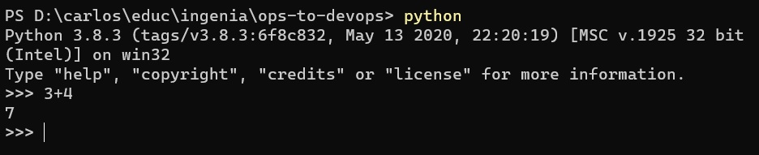

# Lenguajes de programación
No descubrimos nada al decir que los lenguajes son una herramienta de primerísimo orden para la programadora/desarrolladora, al mismo tiempo que un tema recurrente de debates, motivo del desarrollo de comunidades alrededor de cada lenguaje, e incluso objeto de defensas (o ataques) apasionados.  
En este material, intentaremos adoptar un estilo más calmo respecto del gusto por uno u otro lenguaje. 
Reconocemos la relevancia que tiene conocer, en lo posible, _varios lenguajes_, para poder nutrirnos como desarrolladores de las características e ideas presentes en cada uno; así como aplicar las técnicas específicas del lenguaje en el que estemos trabajando, que puedan facilitarnos nuestro trabajo diario.

Típicamente, un proyecto de desarrollo de cierta envergadura involucra el uso de varios lenguajes, algunos (que incluso puede ser sólo uno) que forman la base, y otros utilizados para tareas específicas. 
Esta es otra razón por la que las desarrolladoras suelen incluir conocimientos sobre varios lenguajes en su "caja de herramientas", aunque probablemente cada una tenga mayor fluidez o manejo de técnicas específicas sobre alguno (o algunos) en particular.

## Lenguajes de propósito específico y de propósito general
Algunos lenguajes fueron diseñados para un tipo de tareas o programas particulares, son los conocidos como _lenguajes de propósito específico_.  
En el ámbito de las operaciones IT, están los _lenguajes de scripting_, como bash o PowerShell, utilizados en ambientes Unix/Linux y Windows respectivamente.  
Mencionemos también los lenguajes orientados a problemas matemáticos o estadísticos, como R y Matlab; y los de bases de datos como SQL.

Por otro lado, existen los llamados _lenguajes de propósito general_, como Python, Java, C, C# o JavaScript.  
Lamentablemente, los nombres de los lenguajes tienen a veces más motivaciones de mercado que de claridad, por eso creemos pertinente aclarar que el lenguaje _C#_ es, en rigor, mucho más parecido a Java que a C; y que a su vez, _JavaScript_ no es especialmente parecido a Java.  
Sobre JavaScript también, subrayamos que en rigor surgió como un lenguaje de propósito específico para ser usado en el desarrollo de páginas Web con capacidades dinámicas, y que sólo después fue ampliando su radio de acción, hasta ser hoy en día uno de los lenguajes más ubicuos y más populares.

Hay varios _rankings de popularidad_ de lenguajes, con fuentes de información y enfoques distintos. Los siguientes tres están entre los más consultados.
- [Tiobe Index](https://www.tiobe.com/tiobe-index/)
- [IEEE Spectrum](https://spectrum.ieee.org/computing/software/the-top-programming-languages-2019)
- [PYPL Ranking](http://pypl.github.io/PYPL.html)

## Lenguajes a utilizar en esta unidad
(logo de Python o imagen que remita a Python)  
 

Entre los lenguajes de propósito general, algunos se adaptan bien al desarrollo de scripts. Entre ellos destacamos a _Python_, que reúne varias características que (al menos a nuestro entender) lo hacen adecuado para esta tarea. Entre ellas:
- incluye una sintaxis sencilla y muy poco burocrática para definir programas.
- es muy sencillo ejecutar un programa Python desde línea de comandos.
- puede instalarse en cualquier entorno operativo, y es trivial hacerlo.

Como se puede apreciar en los rankings mencionados más arriba, Python es actualmente uno de los lenguajes más populares en el ámbito general de la programación.  
Por estas razones, elegimos Python como lenguaje de propósito general para esta unidad. 

(logos de PowerShell y bash, o imagen/imágenes que remitan a estos lenguajes)  
 

También trabajaremos con lenguajes de scripting, para mostrar que muchos conceptos básicos de programación y algoritmia se pueden aplicar en distintos lenguajes, y a la vez apreciar las diferencias entre distintos tipos de lenguaje.  
En particular, vamos a utilizar _PowerShell_ para realizar un desarrollo completo del desarrollo y evolución de un programa que resuelva el [problema planteado](../desafio-enunciado.md). 
También vamos a mostrar algunos ejemplos en _bash_.

## Qué versiones usar de cada lenguaje
Les recomendamos que usen estas versiones
- Python: 3.4.1 en adelante. OJO es muy importante que sea un "Python 3", hay diferencias importantes entre Python 2.x y Python 3.x, y **no** es retrocompatible.
- PowerShell: 5.0 en adelante.
- bash: cualquiera de 4.1 en adelante debería servir.

En Python, recomendamos usar la _consola interactiva_, que se accede tipeando simplemente `python`.  
 

## Qué sigue
En las siguientes páginas, vamos a repasar algunos conceptos básicos que están presentes en prácticamente todo lenguaje de programación.  
Esta reseña tiene un _enfoque puramente práctico_, no pretende dar definiciones ni entrar en debates de carácter académico, sino simplemente acercar algunos elementos que, esperamos, ayuden a hacer más comprensible el material posterior, y a tener un primer acercamiento con elementos de programación a quienes estén más lejanos a esta disciplina.
