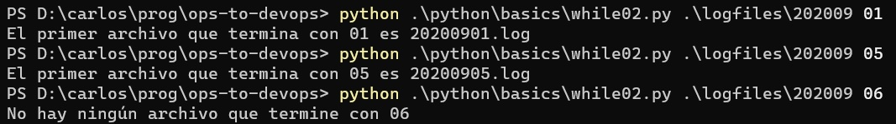

# Repetición - otras variantes
En esta página completamos el tratamiento de la repetición, estudiando variantes que son, actualmente, menos utilizadas que el "for estructural" descripto en la [página anterior](./repeticion.md).


## For, versión "clásica" o "indexada"
En este material vamos a usar siempre la versión estructural de la repetición "for", porque entendemos que se adapta mejor a las necesidades de recorrido usuales en el desarrollo de scripts.

Por otro lado, señalamos que en muchas fuentes, la forma de `for` que va a aparecer es distinta. Está basada en un número que se va a utilizar para acceder a cada elemento de una lista mediante su _índice_. Esta variante está ligada al concepto de _repetición indexada_.  
Esta variante es históricamente anterior al for "estructural", por eso sigue siendo el primero que aparece en muchos materiales.

Python no tiene una sintaxis específica para este tipo de "for". Mostramos un ejemplo en PowerShell, retomando el ejemplo en el que se calcula la cantidad de números hasta 20 y mayores a 20 de una lista de números.

``` powershell
$lista = @(32, 8, 14, 21, 109, 5, 65)
$cantidad_menores = 0
$cantidad_mayores = 0
for ($i = 0; $i -lt $lista.Length; $i++) {
    $numero = $lista[$i]
    if ($numero -le 20) {
        $cantidad_menores += 1
    } else {
        $cantidad_mayores += 1
    }
}
```

Obsérvese que la repetición está asociada a la variable `$i`, que va a tomar sucesivamente los valores entre 0 y uno menos que la longitud de la lista. Para acceder al elemento correspondiente, utilizamos `$lista[$i]`.


## While
Hasta aquí, hemos estudiado la repetición de un bloque de código en el que se recorre una estructura ejecutando el bloque una vez para cada elemento, o bien se establece una cantidad fija de repeticiones.

Como lo indicamos al principio, existe un segundo tipo de repetición, en el que se establece una _condición_, y el bloque se repite mientras la condición sea cierta.

A título de ejemplo, definamos una función que calcula (de la forma más ineficiente posible) el primer múltiplo de un número determinado que sea menor a 100.

En Python:
``` python
def first_multiple_over_100(n):
    result = 0
    while (result <= 100):
        result = result + n
    return result
``` 
Un ejemplo de uso sería
``` python
>>> first-multiple_over_100(7)
105
```
El bloque controlado por el `while`, consiste en la operación `result = result + n`, que va haciendo que `result` vaya tomando, sucesivamente, el valor de cada múltiplo de `n` (de 7 en el ejemplo de uso). Cuando el valor supera 100, se termina la repetición porque deja de cumplirse la condición asociada `result <= 100`.


La misma función en PowerShell:
``` powershell
function first_multiple_over_100 {
    param($n)
    $result = 0
    while ($result -le 100) {
        $result += $n
    }
    return $result 
}
``` 

y en Bash:
``` bash
first_multiple_over_100 () {
    local result=0
    while [ $result -le 100 ] 
    do
        result=$(($result + $1))
    done
    return $result 
}
```


En algunos casos, puede convenir utilizar un `while` para implementar un recorrido sobre una lista. En estos casos debemos manejar un índice similar al del for "clásico".  
En particular, el `while` es útil cuando estemos buscando un elemento en particular, al encontrarlo ya podemos "cortar" el recorrido.  
Usémoslo para hallar, en Python, el primer archivo en una carpeta cuyo nombre termina de cierta forma. Presentamos el script completo.

``` python
from pathlib import Path
from sys import argv

def first_file_that_ends_with(files, ending):
    i = 0
    found_file = None
    while (found_file is None and i < len(files)):
        file = files[i]
        if (file.stem.endswith(ending)):
            found_file = file
        else:
            i = i + 1
    return found_file

p = Path(argv[1])
ending = argv[2]
files = list(p.iterdir())
the_file = first_file_that_ends_with(files, ending)

if (the_file is None):
    print(f"No hay ningún archivo que termine con {ending}")
else:
    print(f"El primer archivo que termina con {ending} es {the_file.name}")
```

Y ejemplos de uso
 

El índice arranca en 0, y avanza de a una posición. Se accede al archivo mediante `files[i]`. Para avanzar en la lista, se "avanza" haciendo `i = i + 1`.   
Si se encuentra un archivo con la condición deseada, se "corta" la repetición. Para esto se utiliza el valor `None`, que es un valor especial presente en Python que se utiliza para indicar que una variable no tiene un contenido válido, es un "no-valor". En otros lenguajes, se usa en nombre `null` para este mismo concepto.  
Para indicar que no se ha encontrado un archivo, se asigna el valor `None` a la variable `found_file`. Si se encuentra un archivo que cumple la condición, se cambia el valor de `found_file`, que ya no va a ser `None`.  
Para lograr el "corte" de la repetición, se agrega la condición `found_file is None` al `while`. Al cambiarse el valor de la variable, ya no será `None`, y por lo tanto se interrumpirá la repetición.


