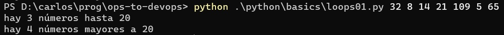
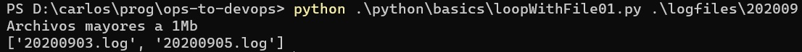

# Repetición, recorrido, y algo de integración
La _alternativa_, que repasamos brevemente en la [sección anterior](./alternativa.md), es uno de los dos elementos básicos de la algoritmia. El otro es la _repetición_.

Como vimos, la alternativa permite la _ejecución condicional_ de una unidad de código. La repetición permite ejecutar una unidad de código _varias veces_. 

¿_Cuántas_ veces, _hasta cuándo_ se repite el código incluido en una repetición?  
La respuesta a esta pregunta distingue a los dos tipos principales de estructuras de repetición.
1. Se define la _cantidad de veces_ que se quiere repetir el código, 3 veces, 5, 80. El número puede ser conocido, o puede ser el resultado de una cuenta.  
Un ejemplo típico de lo segundo es cuando se quiere realizar una operación para cada elemento de una [lista](./arrays-listas.md), en este caso la cantidad de repeticiones coincide con la cantidad de elementos de una lista.  
Esta idea se suele asociar a la palabra `for`.
1. Se define una _condición_, la unidad de código se repite mientras se cumple una condición, o hasta que deja de cumplirse.  
Por ejemplo: hasta que se encuentre un usuario habilitado para una operación, mientras la suma del tamaño de ciertos archivos a copiar no supere el tamaño del dispositivo donde queremos copiarlos, mientras haya errores de carga.  
Esta idea se suele asociar a la palabra `while` (o menos frecuentemente, a `until`).

En resumen, podemos denominar a los dos tipos de repetición como "el `for`" (repetición por cantidad) y "el `while`" (repetición ligada a una condición).  
En esta página vamos a trabajar con una variante simplificada del `for`, y a aprovechar para integrar varios de los temas vistos en este resumen.  
Dejamos para una página separada, el tratamiento de la versión "clásica" del `for`, y el del `while`.

## For, versión estructural
La forma de `for` más utilizada actualmente, está asociada a una estructura, p.ej.  una lista. En Python, la estructura
``` python
for <elem> in <lista>:
    # hacer algo con elem
```
permite ejecutar una unidad de código una vez para cada elemento de la lista. 

Por ejemplo, calculemos la cantidad de elementos por encima y por debajo de 20 en una lista de números
``` python
lista = [32,8,14,21,109,5,65]
cantidad_menores = 0
cantidad_mayores = 0
for numero in lista:
    if numero <= 20:
        cantidad_menores += 1
    else:
        cantidad_mayores += 1
```
la unidad (o _bloque_) de código interna al `for` se ejecuta una vez para cada elemento de la lista, y la variable `numero` toma, en cada repetición (o _iteración_) el valor de cada elemento en orden. En este ejemplo, el bloque se ejecuta 7 veces, en la primera la variable `numero` toma el valor 32, en la seguna el valor 8, etc..  
El resultado es el esperado: se calculan las cantidades de elementos hasta 20 y mayores a 20. El siguiente script toma los valores por línea de comandos y realiza el análisis indicado:
``` python
from sys import argv
lista = [int(arg) for arg in argv[1:]]

cantidad_menores = 0
cantidad_mayores = 0
for numero in lista:
    if numero <= 20:
        cantidad_menores += 1
    else:
        cantidad_mayores += 1

print(f"hay {cantidad_menores} números hasta 20")
print(f"hay {cantidad_mayores} números mayores a 20")
```
Esta es la salida del script para el ejemplo indicado arriba.
 

Notemos que la lógica es la misma, sólo cambió el lugar de donde se obtienen los números.

> Reconocemos que, para obtener los números ingresados por línea de comandos, estamos utilizando una estructura que ... veremos más adelante. Por ahora, concentrémonos en el `for`.


## Utilizando archivos - un pequeño ejemplo integrador
La estructura sobre la que trabajamos, puede ser muy distinta a una lista de números. Este script informa los nombres de los archivos en una carpeta cuyo tamaño supera 1 Mb.

``` python
from pathlib import Path
from sys import argv

one_mb = 1024 * 1024

p = Path(argv[1])
files = p.iterdir()

large_file_names = []

for file in files:
    this_file_size = file.stat().st_size
    if (this_file_size > one_mb):
        large_file_names.append(file.name)

print("Archivos mayores a 1Mb")
print(large_file_names)
```
Este es un ejemplo de la salida que genera.
 

En este caso, la estructura llamada `files` incluye información de cada archivo en una carpeta. Utilizando el `for`, accedemos sucesivamente a la información de cada archivo, utilizando la variable `file`. Mediante `file.stat().st_size` y `file.name` accedemos, respectivamente, al tamaño y nombre de cada archivo.

En este pequeño ejemplo, combinamos varios elementos básicos: listas, alternativa y repetición. Lo mostramos en los lenguajes de scripting, como ejemplo de for estructural.

Así es en PowerShell
``` powershell
$files = Get-ChildItem $args[0]
$one_mb = 1024 * 1024

$large_file_names = @()

foreach ($file in $files) {
    $this_file_length = $file.Length
    if ($this_file_length -gt $one_mb) {
        $large_file_names = $large_file_names + $file.Name
    }
}

Write-Host "Archivos mayores a 1Mb"
Write-Host $large_file_names
```

Y así, en Bash
``` bash
one_mb=$((1024 * 1024))

large_file_names=()

for f in $1/*
do
    file_size=$(wc -c < $f)
    if [ $file_size -gt $one_mb ]
    then
        strict_file_name=$(basename $f)
        large_file_names+=( $strict_file_name )
    fi
done

echo Archivos mayores a 1Mb
echo ${large_file_names[*]}
``` 

<br/>

Completamos esta sección poniendo en contexto el concepto incorporado, o sea la idea de repetición en general, y el "for estructural" en particular, revisando una sintaxis particular de Python mencionada previamente, e integrando el concepto de _función_ en el ejemplo.

## Recorrido - el **objetivo** del "for"
En los dos ejemplos que mostramos, y en la gran mayoría de las situaciones que aparecen en el desarrollo de scripts, la repetición está relacionada con la necesidad de _recorrer_ una estructura, y realizar alguna acción o análisis para cada elemento.

El _objetivo_ es realizar el recorrido, de una lista de números o de los archivos en una carpeta. El `for` es la _técnica_ que nos permite implementar el recorrido deseado.

Hacemos esta puntualización sobre la diferencia entre **objetivo** y **técnica**, porque si tenemos claro el objetivo, nos será más sencillo incorporar y entender nuevas técnicas que puedan surgir, que apunten al mismo objetivo.


## Recorrido simplificado en Python, _list comprehension_, código "Pythónico"
De hecho, la estructura que mencionamos brevemente en la descripción de [algoritmos standard](./algoritmos-standard.md):
``` python
[<que_quiero_extraer>
    for <elemento> in <secuencia_o_lista>
    if <condicion>
]
```
también tiene como objetivo implementar un recorrido, aunque .

Esta sintaxis se conoce como _list comprehension_ en el "mundo Python". Es un ejemplo de "código Pythónico" (en inglés, _Pythonic code_), o sea, un estilo de código que aprovecha características particulares de Python.

Utilicémosla para obtener los nombres de los archivos mayores a 1Mb en una carpeta.
``` python
large_file_names = [file.name
    for file in files
    if file.stat().st_size > one_mb
]
```

## Integrando funciones
La siguiente es una versión alternativa del script en Python, que incorpora la idea de _list comprehension_, y define el cálculo en una función separada.

``` python
from pathlib import Path
from sys import argv

one_mb = 1024 * 1024

def large_file_names(files):
    return [ file.name 
        for file in files
        if file.stat().st_size > one_mb
    ]


p = Path(argv[1])
files = p.iterdir()

result = large_file_names(files)

print("Archivos mayores a 1Mb")
print(result)
```

Podemos dar un pequeño paso más, obviando la variable `result` dado que la utilizamos sólo en el `print`.
``` python
p = Path(argv[1])
files = p.iterdir()

print("Archivos mayores a 1Mb")
print(large_file_names(files))
```

Aquí está bien claro el propósito del programa: informar los nombres de los archivos grandes dentro de la carpeta indicada por línea de comandos. La forma de _calcular_ este resultado se separa en la función `large_file_names`.