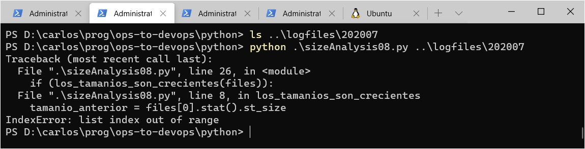
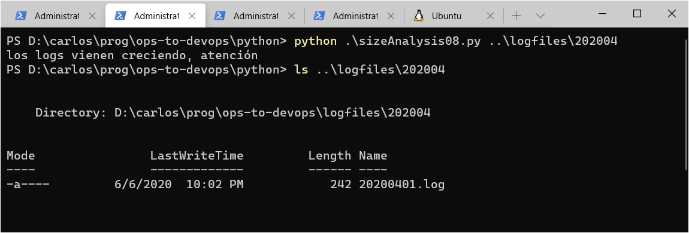

# Análisis de casos límite
Tenemos un programa más robusto, y más modular, que el inicial. 

En particular, sabemos que se comporta correctamente si se le pasa un parámetro que no es un nombre de carpeta.  
El siguiente paso es pensar si funciona correctamente en _cualquier_ caso en que, efectivamente, se le da una carpeta para analizar. 

Este análisis, como la mayor parte del contenido restante de esta unidad, se focaliza en la función que modela la tarea algorítmica, la llamada `los_tamanios_son_crecientes` en [la página donde se hace máxima la modularidad](./librerias-propias.md).  
Transcribimos la versión en Python de esta función.

``` python
def los_tamanios_son_crecientes(files):
    cada_tamanio_es_mas_grande_que_el_anterior = True
    tamanio_anterior = files[0].stat().st_size

    for file in files[1:]:          # a partir del segundo archivo
        tamanio = file.stat().st_size
        if tamanio_anterior > tamanio:
            cada_tamanio_es_mas_grande_que_el_anterior = False
        tamanio_anterior = tamanio

    return cada_tamanio_es_mas_grande_que_el_anterior
```

Los _casos límite_ para un algoritmo, en una descripción rápida, son aquellos en los que algún aspecto que puede afectar el funcionamiento del algoritmo es llevado al límite. Aprender a detectar casos límite, y a razonar sobre ellos, es importante para elevar la robustez y la calidad de una solución algorítmica.  
Estudiemos algunos casos límite para nuestro algoritmo.

## Cantidad de archivos
Como este algoritmo es un recorrido sobre una lista de archivos, un aspecto en el que aparecen casos límite es _la cantidad de archivos_.  
Los casos límite que presentan problemas más asiduamente son cuando hay _pocos_ archivos: ninguno, uno o dos.

### Ningún archivo - tenemos un problema
Analizando el código, descubrimos un problema si la carpeta no tiene archivos: en la línea 
``` python
    tamanio_anterior = files[0].stat().st_size
```
se está accediendo al primer archivo; por lo que se está asumiendo implícitamente que hay al menos un archivo. Efectivamente, si ejecutamos el programa para una carpeta vacía

se genera un error relacionado con la línea de código indicada.

Antes de pensar en una solución, sigamos pensando en casos límite.


### Un archivo - ¿qué respuesta _queremos_?
Ahora supongamos que la carpeta bajo análisis tiene un solo archivo. Como no hay dos archivos distintos, no se puede hacer ninguna comparación. Efectivamente, en este caso `files[1:]` no tiene ningún elemento, y por lo tanto, el ciclo `for` no se ejecuta ninguna vez.  
¿Cuál será el resultado en este caso? Traten de pensarlo, antes de verlo en el screenshot siguiente.


O sea, el resultado del algoritmo es `True`. Analizando el código entendemos la razón: el resultado será `False` solamente si se encuentra alguna comparación "mala" (de acuerdo a lo definido al pensar la [estrategia](../resolvamos/estrategia.md)), y si no se hace _ninguna_ comparación, entonces es imposible que haya alguna "mala".

Esto resulta un poco decepcionante: si hay un solo archivo, en rigor no hay nada que pueda ir "creciendo". Pero sigamos.


### Más y más problemas
¿Qué pasa si tenemos _dos_ archivos?   
En este caso va a hacer _una_ comparación. Si el segundo archivo es más grande que el primero, tendremos un resultado de `True`, si es más pequeño será `False`.  

Parece todo perfecto, pero ... ¿qué pasa si los dos archivos tienen _el mismo_ tamaño? Este es otro ejemplo de _caso límite_: para algoritmos basados en comparaciones, cuando los valores que se comparan son iguales.  
Como definimos que una comparación es "mala" solamente si el `tamanio_anterior` es _mayor_, entonces si los dos archivos tienen el mismo tamaño, el resultado será `True`. Este resultado tampoco nos conforma, porque en rigor no hay un crecimiento.

En resumen: como resultado de un análisis basado en casos límites, aparecieron varios casos en los que el resultado del programa es distinto al que queremos, e incluso un caso (carpeta vacía) en el cual directamente da un error.


## Ciclo de vida para la construcción de un script
Esto **no significa** que hayamos "procedido mal" hasta ahora.   
El mismo proceso de haber armado una primer versión del programa, nos permite pensar con mayor precisión en el comportamiento que _necesitamos_.  
En casos más complejos, el descubrimiento de casos en los que las definiciones no resultan coincidir con lo que en realidad se necesita, se produce recién cuando el programa comienza a funcionar y se observan sus resultados.  

Por lo general, ante cualquier situación suficientemente compleja, uno de los problemas más difíciles que deben resolverse en un desarrollo es determinar el comportamiento _deseado_ del software.  
Este es uno de los fenómenos que llevaron a adoptar la idea de [ciclo de vida](../../programacion-a-desarrollo/ciclo-de-vida.md) y los [marcos de trabajo ágiles](../../programacion-a-desarrollo/intro-agil.md) en el desarrollo de software.  

Este pequeño ejemplo es suficiente para mostrar que las mismas problemáticas presentes en el desarrollo de aplicaciones, pueden aparecer al armar programas específicos para el uso en operaciones; y que por lo tanto, resulta conveniente aplicar ideas del ámbito del desarrollo de software.


## Enfrentando los problemas
Descubrir casos en que el comportamiento del programa no se ajusta a lo que se necesita, nos lleva a pensar con mayor precisión cuál es el comportamiento que _queremos_ de un programa. Para esto, puede ser importante entender cuáles son las condiciones _reales_ en las que se va a ejecutar.   

En nuestro caso: ¿cuál es la probabilidad de que se ejecute para carpetas que tengan uno o dos archivos? ¿Es realmente probable que haya dos archivos consecutivos con _exactamente_ el mismo tamaño, o es una eventualidad que no merece que nos preocupemos?  
También puede servir, afinar la mirada sobre el _propósito_ del programa. En este caso, es un programa que detecta un problema potencial, una especie de alarma. ¿Qué tan _sensible_ queremos que sea esta alarma, preferimos que se "active" ante cualquier posible problema (a riesgo de generar trabajo manual que puede ser muchas veces innecesario) o que sólo se active en casos claros de problema (a riesgo de no detectar un problema a tiempo)?

Esto nos lleva a pensar en más casos posibles. Si hay muchos archivos, cada uno más grande que el anterior _salvo un solo caso_ en el que el tamaño disminuye ¿es suficiente esta excepción para concluir que "no se detecta crecimiento sostenido"?

Terminamos este análisis mencionando un caso límite que es espejo de algunos que analizamos: ¿cómo se comportará el programa ante carpetas con _muchos_ archivos, podremos tener problemas de performance o de uso de recursos?  
Para poder evaluar esto, hay que determinar "cuánto es _muchos_", ante qué dimensión el comportamiento del programa empieza a degradarse. ¿Soporta bien una carpeta con 1000 archivos? ¿Con 5000? ¿Con 25000?  
Por otro lado, en las condiciones en las que se va a ejecutar el script ¿es realmente probable que nos encontremos con estas dimensiones?

Para este ejercicio, supondremos que este problema no se va a presentar: digamos que nuestras carpetas nunca van a tener más de 200 archivos, y que ese tamaño no afecta a la performance del script.


### La peor decisión es no tomar ninguna decisión
Se podrían analizar más situaciones _ad infinitum_.  
Salvo en sistemas enormemente críticos (como podría ser el control de una central nuclear), es conveniente tomar una decisión, aplicarla, y observar el comportamiento del programa para definir si resulta conveniente efectuar ulteriores ajustes. La idea de desarrollo iterativo e incremental descripto al hablar de [marcos de trabajo ágiles](../../programacion-a-desarrollo/intro-agil.md).

En este caso, tomamos las siguientes decisiones
1. Si hay menos de cuatro archivos, no se analiza si los tamaños son crecientes, y se informa que "Hay pocos archivos, no alcanzan para analizar crecimiento".
1. Si el último archivo es más chico que el primero, o es más grande con una diferencia menor al 10%, entonces también se obvia el análisis, y se informa que "No se detecta crecimiento significativo de logs en general".
1. Caso contrario, se realiza el análisis de crecimiento sostenido. Se mantiene el criterio de que un caso en que el archivo anterior sea mayor que el siguiente, alcanza para definir que no hay crecimiento sostenido.
