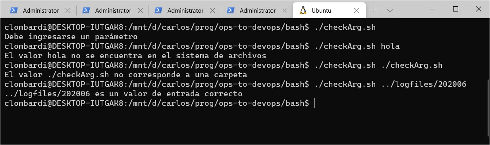
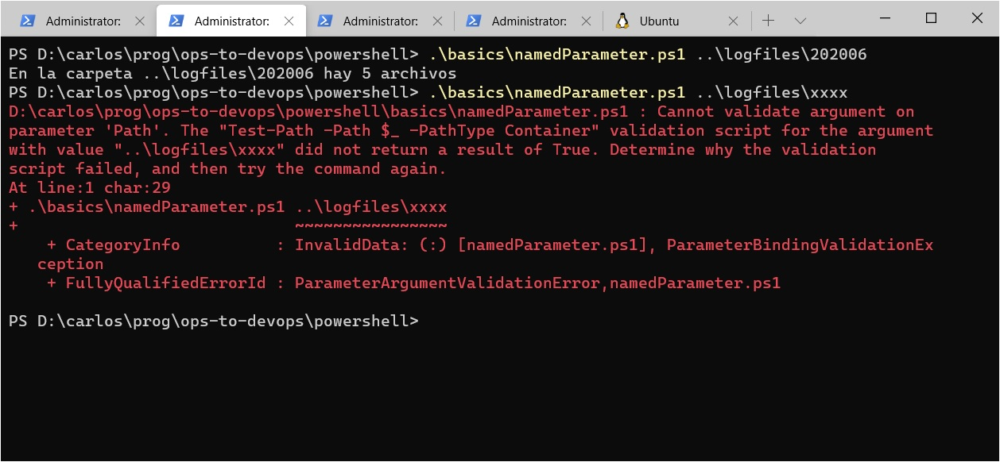

# Validación de datos de entrada

Analicemos la primera de las preguntas que nos realizamos [al cuestionar la calidad del programa generado](./cuestionar-calidad): ¿qué pasa si **no** se le suministra al programa lo que espera?  

Experimentemos con la versión en Python


Estamos mostrando tres posibles _problemas con los datos de entrada_
1. no se suministra un parámetro
1. el valor que se suministra no es el nombre de un elemento del file system
1. el valor que se sumnistra es el nombre de un archivo, se espera una carpeta.

En los tres casos, el programa responde con un mensaje de error ... generado por Python. Un programa de mayor calidad, prevé los posibles problemas, y genera mensajes más adecuados. 
O sea, realiza lo que se conoce como _validación de datos de entrada_.


## Las tareas técnicas involucradas
Tal como nos pasó con el programa, la validación de datos de entrada implica tareas técnicas y otras relacionadas con la estructura del programa.

Las tareas técnicas a resolver son: 
- saber si se suministró un parámetro por CLI al invocar al programa.
- verificar si el parámetro es o no un elemento del file system.
- en caso afirmativo, verificar que sea una carpeta.

Al igual que cuando armamos el [programa](../resolvamos/primer-programa), resumimos en la siguiente tabla las expresiones para estas validaciones, en los tres lenguajes con los que estamos trabajando.

| Lenguaje | No se pasaron parámetros | `<valor>` está en el file system | `<valor>` es una carpeta |
| --- | --- | --- | --- | 
| Python | `len(argv) <= 1` | `Path(<valor>).exists()` | `Path(<valor>).is_dir()` |
| PowerShell | `($cliArgs.Count -lt 1)` | `Test-Path -Path <valor>` | `Test-Path -Path <valor> -PathType Container` |
| bash | `$# -lt 1` | `-e "<valor>"` | `-d "<valor>"` |

Para probar estas expresiones, armemos un sencillo script que testee el valor del parámetro, en bash.

``` bash
if [ $# -lt 1 ]
then
    echo Debe ingresarse un parámetro
elif ! [ -e "$1" ]
then
    echo El valor $1 no se encuentra en el sistema de archivo
elif ! [ -d "$1" ]
then
    echo El valor $1 no corresponde a una carpeta
else
    echo $1 es un valor de entrada correcto
fi
```
(notar la forma de negar la condición, se pone el signo-de-exclamación _afuera_ de los corchetes)

Funciona como se espera



## Integrar la validación en el programa
Para obtener una versión del programa que chequee correctamente el valor de entrada, alcanza con integrar estas validaciones con la [primera versión que generamos](../resolvamos/primer-programa). A continuación, la _segunda_ versión del programa, en Python.

``` python
from pathlib import Path
from sys import argv

if (len(argv) <= 1):
    print("Hay que incluir, al menos, un argumento")
elif (not Path(argv[1]).exists()):
    print(f"El valor {argv[1]} no se encuentra en el sistema de archivos")
elif (not Path(argv[1]).is_dir()):
    print(f"El valor {argv[1]} no corresponde a una carpeta")
else:
    files = list(Path(argv[1]).iterdir())

    cada_tamanio_es_mas_grande_que_el_anterior = True
    tamanio_anterior = files[0].stat().st_size

    for file in files[1:]:          # a partir del segundo archivo
        tamanio = file.stat().st_size
        if tamanio_anterior > tamanio:
            cada_tamanio_es_mas_grande_que_el_anterior = False
        tamanio_anterior = tamanio        

    if (cada_tamanio_es_mas_grande_que_el_anterior):
        print("los logs vienen creciendo, atención")
    else:
        print("no se detecta crecimiento sostenido de logs")
``` 
> **Detalle sobre armado de strings - string interpolation**  
Notar la sintaxis `f"El valor {argv[1]} no corresponde a una carpeta"`, en la que se especifica un string, en el que una parte en realidad va a ser el _resultado_ de una expresión, en este caso `argv[1]`. 
Esta es _una_ de las formas que ofrece Python para aprovechar una técnica conocida como [string interpolation](https://www.programiz.com/python-programming/string-interpolation).  
Como se puede apreciar en el ejemplo anterior en bash, en los lenguajes de scripting esta forma de armar strings se da naturalmente; directamente se intercala la expresión.

Hemos logrado un avance en la calidad del programa: es **más robusto** que la primera versión, porque se comporta en forma más adecuada ante valores de entrada erróneos.


## Recuperando la modularidad
Aunque está claro que hemos dado un paso adelante en la calidad del programa, hay un aspecto en el que percibimos un retroceso: el de la [modularidad](../resolvamos/modularidad-primeras-ideas).  
En la nueva versión, las tareas de manejo de datos de entrada, procesamiento y salida _no son independientes_: el procesamiento y la salida están dentro de un `else` que forma parte del manejo de datos de entrada.

En rigor, la solución encontrada es bastante prolija: el código está bien organizado, a pesar de que analizado rigurosamente, es cierto que se pierde la modularidad.   
A pesar de esto, vamos a modificarlo para recuperar la separación estricta de las tres tareas, por dos motivos. 
El primero, para dar un ejemplo de cómo separar tareas de validación dentro de un script.
El segundo, porque esta separación nos permitirá generar una variante que queremos presentar para su análisis.

Para que la validación quede separada, vamos a utilizar el comando `exit` que corta la ejecución del programa. El programa completo queda así.

``` python
from pathlib import Path
from sys import argv, exit

##     Validación datos de entrada     ##############################
if (len(argv) <= 1):
    exit("Hay que incluir, al menos, un argumento")

if (not Path(argv[1]).exists()):
    exit(f"El valor {argv[1]} no se encuentra en el sistema de archivos")    

if (not Path(argv[1]).is_dir()):
    exit(f"El valor {argv[1]} no corresponde a una carpeta")
#####################################################################

files = list(Path(argv[1]).iterdir())

cada_tamanio_es_mas_grande_que_el_anterior = True
tamanio_anterior = files[0].stat().st_size

for file in files[1:]:          # a partir del segundo archivo
    tamanio = file.stat().st_size
    if tamanio_anterior > tamanio:
        cada_tamanio_es_mas_grande_que_el_anterior = False
    tamanio_anterior = tamanio        

if (cada_tamanio_es_mas_grande_que_el_anterior):
    print("los logs vienen creciendo, atención")
else:
    print("no se detecta crecimiento sostenido de logs")
```


## Más separación, funciones ... y un poco de magia
Ahora que tenemos las validaciones bien separadas, es más fácil pensar en definir [funciones](../basicos/funciones) que las resuelvan. 
Vamos a definir dos funciones
- `checkArgCount(n)`: verifica que se hayan ingresado al menos `n` argumentos por línea de comandos.
- `checkFolder(name)`: verica que el `name` sea un nombre de carpeta.

Cabe la pregunta de por qué queremos verificar `n` parámetros, si para _este_ programa sabemos que esperamos uno, no más. La respuesta, en el siguiente parágrafo.

Estas funciones van a tener una característica peculiar ... que se va a poder explicar más fácilmente luego de mostrar el programa. 
Generamos una nueva versión del programa, siempre en Python.

``` python
from pathlib import Path
from sys import argv, exit

##  Funciones de validación datos de entrada
def check_arg_count(n):
    if (len(argv) <= n):
        exit(f"Hay que incluir, al menos, {n} argumento/s")

def check_folder(name):
    if (not Path(name).exists()):
        exit(f"El valor {name} no se encuentra en el sistema de archivos")    
    if (not Path(argv[1]).is_dir()):
        exit(f"El valor {name} no corresponde a una carpeta")
####################################################################


check_arg_count(1)
check_folder(argv[1])

files = list(Path(argv[1]).iterdir())

cada_tamanio_es_mas_grande_que_el_anterior = True
tamanio_anterior = files[0].stat().st_size

for file in files[1:]:          # a partir del segundo archivo
    tamanio = file.stat().st_size
    if tamanio_anterior > tamanio:
        cada_tamanio_es_mas_grande_que_el_anterior = False
    tamanio_anterior = tamanio        

if (cada_tamanio_es_mas_grande_que_el_anterior):
    print("los logs vienen creciendo, atención")
else:
    print("no se detecta crecimiento sostenido de logs")

```

En esta versión, hemos logrado un programa aún _más modularizado_: las funciones de validación están en funciones separadas.  
En el "cuerpo principal" del programa, las primeras dos acciones consisten en invocar a las funciones. Y aquí vemos la peculiaridad de la que hablábamos antes: como las funciones realizan la salida del programa, en el "cuerpo principal" no es necesario usar condicionales. Simplemente se invoca a las funciones, si alguna de las validaciones falla, la ejecución se corta "automáticamente". 

Esta es la pequeña "magia" que mencionamos en el título de este parágrafo.
Está asociada al concepto de _excepción_ en lenguajes de programación ... que aunque se escapa del propósito de este material, mencionamos para integrar las ideas que se mencionan aquí dentro del marco general de la programación.


## En lenguajes de scripting
Definimos programas similares a la última versión de Python, en los lenguajes de scripting que estamos cubriendo.


En PowerShell.
``` powershell
##  Funciones de validación datos de entrada
function CheckArgCount {
    param ($minCount, $cliArgs)
    if ($cliArgs.Count -lt $minCount) {
        Write-Host Hay que incluir, al menos, $minCount argumento/s
        Exit
    }
}

function CheckFolder {
    param ($name)
    if (-not (Test-Path -Path $name)) {
        Write-Host El valor $name no se encuentra en el sistema de archivos
        Exit
    }
    if (-not (Test-Path -Path $name -PathType Container)) {
        Write-Host El valor $name no corresponde a una carpeta
        Exit
    }
}
############################################################################

CheckArgCount 1 $args
CheckFolder $args[0]

$files = Get-ChildItem $args[0]

$cada_tamanio_es_mas_grande_que_el_anterior = $true
$tamanio_anterior = $files[0].Length

foreach ($file in ($files | Select-Object -Skip 1)) {
    $tamanio = $file.Length
    if ($tamanio_anterior -gt $tamanio) {
        $cada_tamanio_es_mas_grande_que_el_anterior = $false
    }
    $tamanio_anterior = $tamanio
}

if ($cada_tamanio_es_mas_grande_que_el_anterior) {
    Write-Host "los logs vienen creciendo, atención"
} else {
    Write-Host "no se detecta crecimiento sostenido de logs"
}
``` 

En bash.
``` bash
check_arg_count () {
    if [ $2 -lt $1 ]
    then
        echo Hay que incluir, al menos, $1 argumento/s
        exit 1
    fi
}

check_folder () {
    if ! [ -e "$1" ]
    then
        echo El valor $1 no se encuentra en el sistema de archivos
        exit 1
    fi
    if ! [ -d "$1" ]
    then
        echo El valor $1 no corresponde a una carpeta
        exit 1
    fi
}
######################################################################


check_arg_count 1 $#
check_folder $1

files=($1/*)
cada_tamanio_es_mas_grande_que_el_anterior=true
tamanio_anterior=$(wc -c < ${files[0]})

for f in ${files[*]:1}
do
    tamanio=$(wc -c < $f)
    if [ $tamanio_anterior -gt $tamanio ]
    then
        cada_tamanio_es_mas_grande_que_el_anterior=false
    fi
    tamanio_anterior=$tamanio
done

if [ $cada_tamanio_es_mas_grande_que_el_anterior = true ] 
then
    echo "los logs vienen creciendo, atención"
else
    echo "no se detecta crecimiento sostenido de logs"
fi
```
Una pequeña aclaración: como en bash es más fácil acceder a a cantidad de argumentos que al array de argumentos, la función `check_arg_count` recibe como segundo valor, la cantidad de argumentos (el `$#`).


## En PowerShell - manejo específico de parámetros CLI 
Cerramos esta sección comentando una funcionalidad específica de PowerShell, respecto de los valores que se reciben por CLI.  
PowerShell permite definir parámetros nombrados similares a los de los cmdlets. También puede asociarse una validación a cada parámetro. P.ej. este script espera un parámetro `-Path` que debe ser una carpeta.

``` powershell
param(
    [Parameter(Mandatory=$true)]
    [ValidateScript({Test-Path -Path $_ -PathType Container})]
    $Path
)

$files = Get-ChildItem $Path
Write-Host En la carpeta $Path hay $files.Length archivos
```

Veamos cómo se porta ante valores correctos e incorrectos


Por lo que pudimos averiguar, no hay una forma sencilla de manejar el mensaje de error. Por razones que se terminarán de apreciar en la siguiente sección, preferimos el enfoque de definir funciones de validación que mostramos aquí.
