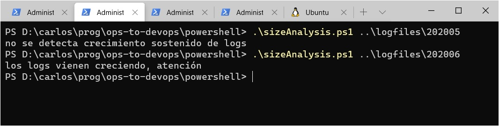
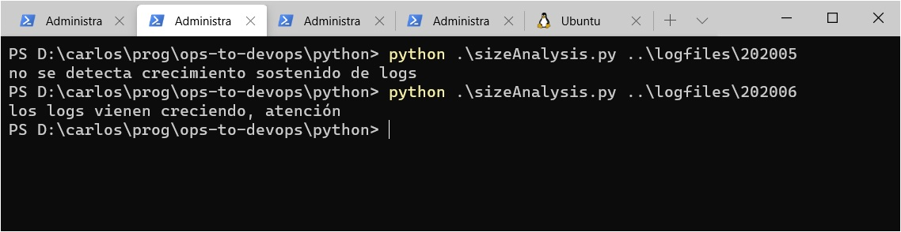
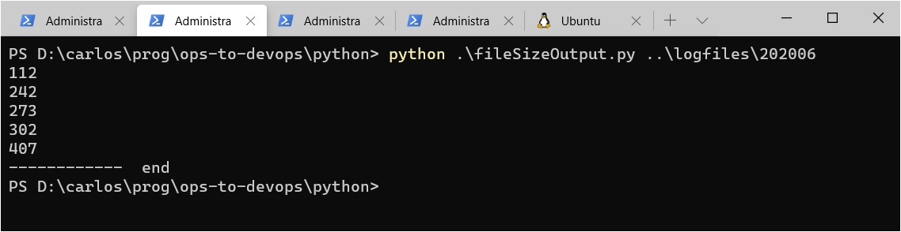
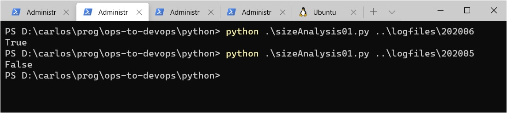
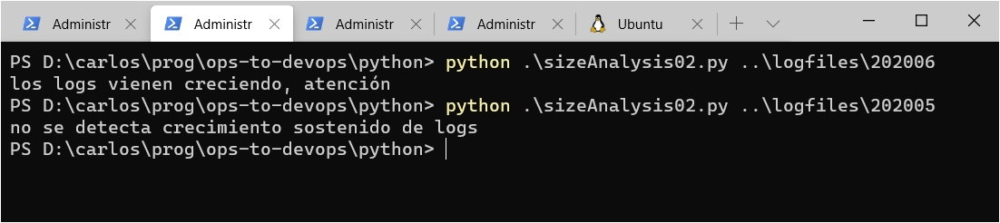

# De algoritmo a programa

En la [página anterior] diseñamos un [algoritmo](./algoritmo.md) que resuelve el análisis que necesitamos hacer sobre el tamaño de los archivos en una carpeta.

El paso siguiente, que vamos a dar ahora, es transformar este algoritmo en un _programa_, que pueda funcionar en un equipo.


## Cómo va a ser nuestro programa funcionando
Digamos que el path de la carpeta va a llegar como parámetro por CLI. Así podría ser en PowerShell; en bash va a ser similar.
 

En En Python tenemos que poner `python` adelante, para que interprete el script
 


## La tarea técnica - muy dependiente del lenguaje
Al describir el [desafío a resolver](../desafio-enunciado.md), mencionamos que además del algoritmo, debe resolverse una _tarea técnica_: obtener los tamaños de los archivos en la carpeta indicada.

Para obtener los tamaños de los archivos necesitamos saber tres cosas:
1. Cómo acceder al parámetro CLI.
1. Cómo obtener la información sobre los archivos en una carpeta.
1. Cómo obtener el tamaño de un archivo, a partir de lo anterior.

La sintaxis depende _fuertemente_ del lenguaje, por eso armamos la siguiente tabla.

| Lenguaje | Primer parámetro CLI | Info archivos de la carpeta `<folder>` | Tamaño del archivo `<file>` |
| --- | --- | --- | --- | 
| Python | `argv[1]` | `list(Path(<folder>).iterdir())` | `<file>.stat().st_size` |
| PowerShell | `$args[0]` | `Get-ChildItem <folder>` | `<file>.Length` |
| bash | `$1` | `$<folder>/*` | `$(wc -c < $<file>)` |

_En Python_, adicionalmente, hay que incorporar dos _librerías_: una para acceder a la información de una carpeta (específicamente, a la definición de `Path`), y otra para acceder a los parámetros CLI (específicamente, a los `argv`, que forman una lista).  
Las distribuciones standard de Python incluyen una gran cantidad de librerías, que ya vienen incorporadas, no hay que descargarlas. Pero sí es necesario indicar explícitamente en el programa que se va a hacer uso de las librerías que se requieran. En este caso, al principio del programa hay que agregar estas dos líneas
``` python
from sys import argv
from pathlib import Path
```

Para verificar que tenemos todos los elementos, armemos un pequeño script en Python que simplemente muestra por consola el tamaño de cada archivo en la carpeta cuyo nombre llega por CLI.

``` python
from pathlib import Path
from sys import argv

files = list(Path(argv[1]).iterdir())

for file in files:
    print(file.stat().st_size)

print("------------  end")
``` 
Lo probamos
 
perfecto, anda. La tarea técnica está resuelta. Les invitamos a hacer lo mismo en PowerShell y bash, antes de seguir.


## Ensamblamos para obtener un programa
Finalmente, reunimos los elementos que necesitamos para nuestro programa; tanto la tarea técnica como la algorítmica está resuelta.

Para obtener un programa, tenemos que ensamblar las dos partes, y "traducir" a Python el algotitmo. Queda esto.

``` python
from pathlib import Path
from sys import argv

files = list(Path(argv[1]).iterdir())
cada_tamanio_es_mas_grande_que_el_anterior = True
tamanio_anterior = files[0].stat().st_size

for file in files[1:]:          # a partir del segundo archivo
    tamanio = file.stat().st_size
    if tamanio_anterior > tamanio:
        cada_tamanio_es_mas_grande_que_el_anterior = False
    tamanio_anterior = tamanio        

print(cada_tamanio_es_mas_grande_que_el_anterior)
``` 
Notemos que tuvimos que hacer algunas adaptaciones al algoritmo.

Los más relevantes son consecuencia de que en la lista que estamos manejando, cada elemento representa una cantidad de información, donde el tamaño es uno de los datos. Para obtener el tamaño debemos hacer `<file>.stat().st_size`, cada vez. Por claridad, elegimos definir la variable _tamanio_ dentro del ciclo `for`. Podríamos haberlo obviado
``` python
for file in files[1:]:          # a partir del segundo archivo
    if tamanio_anterior > file.stat().st_size:
        cada_tamanio_es_mas_grande_que_el_anterior = False
    tamanio_anterior = file.stat().st_size
``` 
pero con gran daño a la legibilidad. Tal vez una _programadora_ consideraría hacerlo así para "ahorrarse una línea", pero una _desarrolladora_ que es consciente de que tal vez tenga que volver a este código más adelante, muy probablemente no.

El resto son sencillamente la "traducción a Python": desaparecen el `fi` y el `done` porque Pyhton delimita bloques de acuerdo a la indentación (esto lo mencionamos en la [página sobre funciones](../basicos/funciones.md)), se agregan los dos-puntos en algunas líneas, y hay que poner `True` y `False` en mayúscula.


## La salida
Ejecutemos nuestro programa
 

Parece funcionar (efectivamente, los archivos en la carpeta `202006` son de longitud creciente mientras que los de `202005` no), pero ... nos gustaría que en lugar de `True` o `False`, tuviera una salida más explicativa, como la mostrada arriba. Podemos usar nuestro resultado para un condicional, llegando a nuestro **primer programa completo**.

``` python
from pathlib import Path
from sys import argv

files = list(Path(argv[1]).iterdir())
cada_tamanio_es_mas_grande_que_el_anterior = True
tamanio_anterior = files[0].stat().st_size

for file in files[1:]:          # a partir del segundo archivo
    tamanio = file.stat().st_size
    if tamanio_anterior > tamanio:
        cada_tamanio_es_mas_grande_que_el_anterior = False
    tamanio_anterior = tamanio        

if (cada_tamanio_es_mas_grande_que_el_anterior):
    print("los logs vienen creciendo, atención")
else:
    print("no se detecta crecimiento sostenido de logs")
``` 

Ahora sí tenemos la salida que queremos
 


## En otros lenguajes
Para armar las versiones en PowerShell y en bash, alcanza con "traducir" lo necesario.

En PowerShell queda así.
``` powershell
$files = Get-ChildItem $args[0]

$cada_tamanio_es_mas_grande_que_el_anterior = $true
$tamanio_anterior = $files[0].Length

foreach ($file in ($files | Select-Object -Skip 1)) {
    $tamanio = $file.Length
    if ($tamanio_anterior -gt $tamanio) {
        $cada_tamanio_es_mas_grande_que_el_anterior = $false
    }
    $tamanio_anterior = $tamanio
}

if ($cada_tamanio_es_mas_grande_que_el_anterior) {
    Write-Host "los logs vienen creciendo, atención"
} else {
    Write-Host "no se detecta crecimiento sostenido de logs"
}
```

Vamos a bash.
``` powershell
files=($1/*)
cada_tamanio_es_mas_grande_que_el_anterior=true
tamanio_anterior=$(wc -c < ${files[0]})

for f in ${files[*]:1}
do
    tamanio=$(wc -c < $f)
    if [ $tamanio_anterior -gt $tamanio ]
    then
        cada_tamanio_es_mas_grande_que_el_anterior=false
    fi
    tamanio_anterior=$tamanio
done

if [ $cada_tamanio_es_mas_grande_que_el_anterior = true ] 
then
    echo "los logs vienen creciendo, atención"
else
    echo "no se detecta crecimiento sostenido de logs"
fi
```
Notamos que en el segundo condicional, _es necesario_ agregar el `= true`.

Cerramos con una pequeña tabla de manejo de booleanos en cada lenguaje.

| Lenguaje | Verdadero | Falso | Alternativa de condición booleana |
| --- | --- | --- | --- | 
| Python | `True` | `False` | `if condicion:` e indentado |
| PowerShell | `$true` | `$false` | `if (condicion) {...}` |
| bash | `true` | `false` | `if [ condicion = true ] then ... fi` |

Último llamado de atención: los espacios adentro de los corchetes _también son obligatorios_ en bash.

