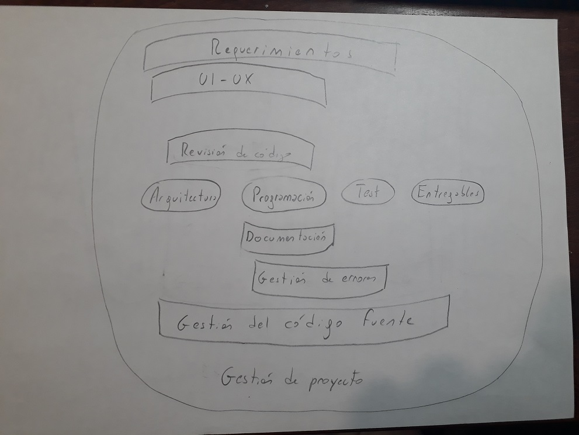

# Desarrollo de software - ¿de qué se trata?
Tal vez, la versión popular sobre el desarrollo es ... como lo muestra (p.ej.) la serie "Silicon Valley": un grupo (o un montón, si la aplicación es grande) de nerds sentados en sus computadoras codeando sin parar, hablando de tecnologías, comiendo en el escritorio, y explotando de alegría cuando resuelven un problema aplicando una genialidad. De todo ese código que escribe este grupo de nerds, mágicamente surge una aplicación que se puede instalar.

(esta intro la hice medio a propósito para meter alguna imagen)  
 

Esta imagen es muy pobre ... en varios sentidos.  
En este material, vamos a referirnos a uno: la visión reducida que se da del rango de _tareas necesarias_, y de perfiles/roles de las _personas que intervienen_, en el desarrollo de una aplicación (la imagen que se da de "les nerds" queda para otro material).

## Programadores y desarrolladores - un primer acercamiento 
Es cierto que hay personas que pasan tiempo programando ... a quienes por lo general ya no llamamos _programadores_ sino _desarrolladores_ (o _devs_ para abreviar).  
¿Por qué _dev_ y no _programador_, hay alguna diferencia?  
Sí, hay una diferencia, sobre cómo encara su trabajo: no produce programas, sino componentes que se van a ir integrando para formar una aplicación, que es algo mucho más complejo. 
Este punto va a quedar un poco más claro (esperemos) después de hablar un poco sobre las tareas involucradas en el desarrollo. Más adelante en esta unidad, volveremos sobre esta diferencia.

## Tareas y roles
Está claro, entonces, que _una_ de las tareas involucradas en el desarrollo es la programación de componentes. Y por lo que venimos diciendo, también está claro que no es _la única_ tarea relevante.

Haciendo un listado de otras tareas necesarias, observamos que dan lugar al surgimiento de distintos roles, y además, que varias involucran el uso de recursos que deben ser gestionados desde operaciones. Veamos.

Antes de arrancar, aclaremos que todas estas tareas arrancan _antes_ de que haya una versión operativa. A esto se le agregan las tareas relacionadas con la operación ... que seguramente les lectores de este material conocerán bien.

(indico en cada sección imágenes que se pueden agregar)  
 

(me quedó muy largo, pero no sé cómo partirlo. Tal vez podrían aparecer sólo los títulos, y que para desplegar un texto se cliquee. Pero es un tiro, la verdad que no sé qué hacer.)
{: style="color: Crimson"}

### Gestión del código fuente
(imagen: logo de git)

El código que escriben les devs (por razones cada vez más de tradición, llamado _código fuente_), es un recurso ultra-valioso, que debe ser resguardado.  
En este punto entran en escena los **repositorios de código**; donde `git` es hoy el formato abrumadoramente más popular.  
Un repositorio está bien preparado para el trabajo colaborativo de varios devs en un mismo componente, ayudando a incorporar las modificaciones hechas por colegas, y a resolver los conflictos que se presentan cuando aparecen modificaciones incompatibles.   
También tiene incorporados conceptos (tal vez hayan escuchado sobre _branches_ y _tags_) que facilitan manejar la multiplicidad de _versiones_: la que está probando QA, la que está a punto de instalarse, la que está actualmente productiva, la que estaba productiva cuando ocurrió aquel error que tenemos que reproducir.

El contenido de estos repositorios debe alojarse en algún lado, esto implica la instalación de servidores, procesos para generar copias de resguardo, la configuración y monitoreo de espacios de almacenamiento ... tareas de _operaciones para-el-desarrollo_.

### Revisión de código
(imagen: pair programming)

Cada vez más, se suele incluir una etapa de _revisión_ del código que se produce, antes de integrarlo en versiones desplegables. Este paso también está previsto en el `git` mediante el concepto de _pull request_.  
Esta tarea la realizan devs con mayor seniority y una visión más amplia del desarrollo.

### Determinación de componentes y mecanismos de comunicación
(imagen: diagrama de componentes de arquitectura)

Si una aplicación se concibe (como pasa cada vez más habitualmente) como un enjambre de componentes, un aspecto importante del desarrollo es definir con qué criterios se van a definir los componentes, y cómo se van a comunicar entre sí, o sea, cómo va a ser la _interface_ entre componentes.

En una aplicación Web, típicamente se distingue entre componentes _front-end_ (que van a ejecutarse en el browser) y _back-end_ (que se ejecutan en servidores), esto implica una dimensión de comunicación que debe tenerse en cuenta. A su vez, los componentes back-end muy probablemente tengan que colaborar entre sí para generar cada respuesta que espera "el front", esto nos da una segunda dimensión de comunicación.

Esta problemática entra en el dominio de lo que se conoce como **arquitectura de software**, que ampliaremos más adelante en esta unidad.

### Documentación de componentes
(imagen: Swagger)

En aplicaciones organizadas en componentes que deben comunicarse entre sí para resolver funcionalidades complejas, y donde puede haber (como es frecuente en desarrollos de gran envergadura) varios equipos independientes, la _documentación_ de cada componente, indicando qué funcionalidad implementa y detallando su interface, es vital para poder llevar adelante el desarrollo.

El mismo código fuente, suplementado con indicaciones específicas, puede servir para generar recursos de documentación; a esto se refiere la especicficación _Swagger_ (o api-docs). Esta documentación se accede mediante accesos adicionales en la interface de cada componente.  
Para documentación más textual, o que incluya gráficos, se utilizan formatos basados en repositorios de código `git`, como GitHub Pages o GitBook, que generan sitios Web.

Esto implica más recursos gestionados desde operaciones: ambientes para los componentes que se utilizan para consultar la documentación Swagger, los sitios de documentación textual.

Por lo general, de la documentación se encargan los mismos desarrolladores. Para casos particulares se puede recurrir a _redactores técnicos_.

### Test
(imagen: vista de ejecución de test en JUnit, Karate o similar)

A medida que las aplicaciones se hacen más complejas, con requerimientos más sofisticados, y menos tolerantes a fallos, se vuelven más relevantes las tareas de **test**.

Tradicionalmente, el test de una aplicación es realizado por un equipo ad-hoc, que incluye _diseñadores de test_ que definen rutinas de testeo, y los _testers_ que las ejecutan. Esto es lo que se conoce como _testeo manual_.

Actualmente, hay una tendencia a aplicar técnicas de _testeo automático_, o sea, rutinas de test que se ejecutan automáticamente, en las que se indica las operaciones a realizar y los resultados esperados.  
Algunos de estos tests son escritos por los mismos desarrolladores. Otros, en especial los que involucran interfaces de usuario, son producidos por especialistas en el tema (¿ingenieros QA?). Incluso, algunos testers se están adaptando a la tarea de producción de tests automáticos

Obviamente, toda esta actividad de testeo implica la generación de los ambientes en los cuales se ejecutan los tests, lo cual involucra en muchos casos tareas de operaciones.

En una unidad posterior de este curso, profundizaremos sobre distintos conceptos relacionados con el test.

### Gestión de errores
(imagen: lista de issues o algún board de JIRA)

Las aplicaciones informáticas fallan, esto no es novedad. En aplicaciones más grandes, claro, aparecerán más errores. Los requerimientos sofisticados respecto de las interfaces, y el deseo de ubicuidad (distintos dispositivos, incluso distintos browsers) es una fuente adicional de defectos en los productos de software.

La gestión de errores, y en general defectos o cuestiones a mejorar, es un tema complejo. Cada error debe ser documentado, luego asignado a un desarrollador o equipo para su resolución, y luego el código que corrige el error debe ser integrado para su posterior despliegue (una vez pasadas todas las instancias de test). Al generarse una nueva versión de componente, debe poder listarse los defectos que (supuestamente) corrige. 

Esta gestión se apoya en herramientas informáticas concebidas específicamente para esta tarea, una de ellas es el JIRA (¿otros ejemplos?).
Otro recurso que debe ser gestionado, probablemente desde operaciones.

De la gestión de los errores suelen ocuparse los _líderes de equipo_, de quienes hablaremos más adelante.

Finalmente, indiquemos que la reproducción de un error puede implicar el armado de un ambiente específico, lo que puede implicar la asistencia de operaciones.

### Diseño de interfaces y de interacción
(imagen: comparación entre un "diseño soviético" y uno moderno)

Las aplicaciones entran por los ojos. Por lo tanto, el diseño de interfaces gráficas es un tema que está ganando en relevancia dentro del desarrollo.  
Lo que se busca no es sólo que las aplicaciones resulten más agradables, sino también (y muchas veces, sobre todo) que resulten más claras, lo que redunda en 
- menor tiempo de operación (que les usuaries encuentren lo que buscan, y realicen lo que necesitan, más rápido)
- menor cantidad de errores en la operación, con el ahorro de costos asociado
- menor frustración por parte de les usuaries.

Esto involucra el manejo de una serie de recursos gráficos como colores, tipos de letra, disposiciones en pantalla y diseño de dispositivos de acceso (menúes, botones, etc.), entre otros aspectos.

Hay desarrolladores (aunque creo que están lejos de ser la mayoría) que adquieren cierta destreza intuitiva en la definición de interfaces. En muchos casos, esto no es necesario. Se requiere el trabajo de especialistas en _interfaces y experiencia de usuario_, campo conocido como _UI/UX_. 

### Determinación de requerimientos
Una aplicación debe implementar cierta funcionalidad.  
¿_Cuál_ es esta funcionalidad, cómo se determina qué se debe esperar de una aplicación?

Las definiciones a este respecto se basan en ciertas _necesidades_ que se detectan, y que deben ser resueltas con el apoyo de los productos de software a construir. Esto se conocen como _requerimientos funcionales_ de una aplicación.  
Comprender cabalmente estos requerimientos implica un conocimiento detallado del dominio en el que se van a utilizar los productos de software, de sus _reglas de negocio_ y de las lógicas asociadas.

Este es el campo de la _ingeniería de requerimientos_ y de sus especialistas.  

<u>Una aclaración al respecto</u>  
la visión en la que primero se definen cabalmente los requerimientos, y después se empiezan a definir y construir los componentes, ha caido largamente en desuso.  
Hoy se entiende que los mismos productos de las etapas iniciales contribuyen a una mejor comprensión de los requerimientos funcionales, que la definición a detalle de todos los requerimientos es una tarea enorme y muy difícil de validar, y que la dinámica de muchos negocios hace que los requerimientos evolucionen en paralelo con el desarrollo.  
Esto lleva a esquemas de organización del desarrollo en los cuales especificación y construcción se retroalimentan. Hablaremos más de esto al tratar las _metodologías ágiles de desarrollo_ más adelante en esta unidad.

### Generación de los productos a desplegar
(imagen: alguna descripción gráfica de CI/CD)

Pasar del código de un componente a la versión del mismo que debe desplegarse en un ambiente, involucra varias cuestiones a resolver, entre ellas:
- Determinar cuál de las múltiples versiones del código es la que debe desplegarse.
- Ejecutar tests que deben verificarse para que el código se considere aceptable.
- Determinar y ejecutar los procedimientos de empaquetado.

Aquí estamos claramente en el dominio de _operaciones_.

Actualmente, hay una tendencia a automatizar (también) estas tareas, de forma tal que el despliegue (al menos en ciertos ambientes pre-productivos) se realice en forma rutinaria, disparada típicamente por la aparición de nuevo código en un _branch_ determinado.  
Los términos _Continuous Integration_ y _Continuous Deployment_ (CI/CD) se refieren a la automatización de, respectivamente, la generación del producto desplegable, y su desplegue en un determinado ambiente.

### Gestión de los equipos de trabajo
Finalmente, mencionemos que alguien debe coordinar todas estas tareas, para lograr un desarrollo armónico que tienda, efectivamente, a la generación de productos que resuelvan las necesidades para las que se crearon.

Este es el ámbito de la _coordinación de proyectos_, con sus roles de _líder de equipo_ y de _gestor de proyectos_ (ok, _team leader_ y _project manager_, o mejor aún, _TL_ y _PM_).

Este diagrama intenta "ubicar" todas estas tareas en una vista integral del desarrollo.

(obviamente que este dibujo horrible debe ser convertido en algo lindo.
Si se pudiera, me encantaría que fuera animado, mostrando cada tarea en el orden en que se listan acá arriba.
En particular, me gustaría que la "Gestión del código fuente" se fuera agrandando a medida que aparecen otros elementos con los que está relacionada)  

## Un último comentario - rol del repositorio de código
A medida que fui escribiendo este pequeño resumen, me di cuenta del rol cada vez más activo y relevante que están tomando los _repositorios de código_ dentro del desarrollo de software moderno.  
Los repositorios están involucrados en cada vez más tareas: se pueden integrar con la ejecución de rutinas de test automáticos, con el control de las versiones desplegadas en los distintos entornos, y (mediante técnicas de CI/CD) con el despliegue. También incluyen facilidades para la gestión de errores.