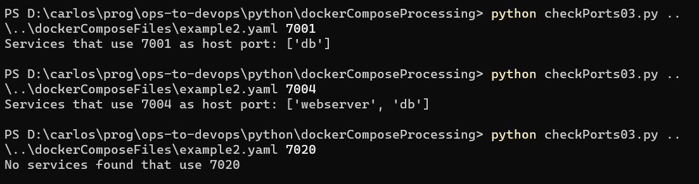

# Programar y desarrollar - con un ejemplo

En esta sección vamos a observar las características de la visión de desarrollador, a partir de la resolución de un requerimiento bien práctico.

En el contexto de un proyecto en el cual se utiliza intensamente Docker, surge la necesidad de poder saber rápidamente cuál/es de los servicios incluidos en un archivo YAML dedefinición `docker-compose`, exponen como _host port_ el puerto con un número determinado.  
(tal vez, pequeña intro, link a página nuestra, o link a página externa, con una mínima intro a los archivos docker-compose)  
Se decide construir un programa que se ejecutará mediante línea de comandos, que se utilizaría del modo que se ve en los siguientes ejemplos.  



Al programa se le pasan dos parámetros: el nombre del archivo donde está la definición, y el numero de puerto.   
En los ejemplos, el segundo caso marca un posible conflicto entre los dos servicios, que están declarando el mismo host port.

En lo que sigue, vamos a mostrar dos programas que resuelven este requerimiento. El primero está pensado con lo que en la [sección anterior](./programar-y-desarrollar.md) llamamos _visión de programador_, acotada a la respuesta que se espera del programa. En el segundo adoptamos una _visión de desarrollador_, que incorpora varios elementos adicionales. Estos elementos van a ir apareciendo en la descripción.

Elegimos **Python** como lenguaje de programación, porque reúne varias condiciones interesantes.  
Por un lado, es un lenguaje de _propósito general_, o sea, no está acotado/orientado a un tipo de tareas o programas específico. Es popular en diversos ámbitos entre ellos: desarrollo de aplicaciones Web, en particular backend pero actualmente también para frontend; programas con uso intensivo de técnicas de ciencia de datos; programas de uso en el ámbito científico.  
Al mismo tiempo, su _sintaxis_ es sencilla, es un lenguaje poco burocrático.  
Finalmente, al estar disponible para una multitud de plataformas, y ser muy sencilla la ejecución de programas por línea de comandos, es muy práctico para el desarrollo de scripts.  
Por eso es, tal vez, el lenguaje de propósito general más utilizado actualmente en el ámbito DevOps.

Este estudio sobre cómo concebir, organizar e implementar un programa, forma una transición hacia la siguiente unidad; incluiremos varios pequeños ejemplos de razonamiento algorítmico.  
Por otro lado, en esta sección nos concentraremos en los aspectos que marcan la presencia de una visión más amplia para la codificación. 
No se realizará un análisis detallado de cada programa ni se explicarán los elementos del lenguaje utilizados, esperando que el contenido de esta sección pueda transmitirse adecuadamente sin necesidad de entrar en demasiados detalles técnicos. 
Quienes estén interesados en los mismos, pueden consultarlos en la _enorme_ cantidad de material sobre Python disponible online.  
(acá mandar un par de links)  

Asimismo, se pueden consultar los archivos completos en (link ¿a un repo Git?)


## Primera resolución - visión de programador
Empecemos diciendo que en _ambas_ versiones, definimos una lista llamada `servicesForPort`. El objetivo del programa es completar esta lista con los nombres de los servicios que utilizan al puerto indicado como host port. Al final, se muestran los resultados: este código
``` python
# program output
if len(servicesForPort) > 0:
    print(f"Services that use {portNumber} as host port: {servicesForPort}")
else:
    print(f"No services found that use {portNumber}")
print()
```
genera las salidas que se muestran en la imagen de consola del parágrafo anterior.  
(tal vez, link sobre string interpolation)


### Tomar parámetros
Python ofrece una sintaxis sencilla para obtener los parámetros en un acceso por línea de comandos. Hay que utilizar una librería, que está incorporada en las distribuciones standard de Python.
``` python
from sys import argv 

filename = argv[1]
numeroDePuerto = int(argv[2])
``` 
en la última línea, se convierte el string que es el parámetro, en un número. Esto va a simplificar el análisis más adelante.


### Estrategia general: se lee el archivo línea por línea
Este primer programa está basado en la lectura del archivo, línea por línea, utilizando la siguiente estructura que provee el lenguaje
``` python
fileContents = open(filename, 'r')
for line in fileContents:
    # el código que se incluye aquí se ejecuta una vez por cada línea del archivo
    # line es un string con el contenido de cada línea
```

Debe controlarse cuándo se "entra" a la definición de un servicio, tomando el nombre para poder informarlo a la salida. Para esto nos basaremos en la _indentación_. Tomemos una definición esquemática
``` yaml
version: '3'
services:

    #first service
    service1:
        build:
            context: .
            dockerfile: Dockerfile
        ports:
            - "3306:3306"
            - "7001-7010:9001-9010"
        # etc

    #second service
    service2:
        image: nginx:alpine
        restart: unless-stopped
        ports:
            - "80:80"
            - "7004:443"
            - "9999"
        # etc
```
la primer línea después de `services:` (sin considerar líneas en blanco ni comentarios) contiene el primer nombre del servicio, `service1:`. Esta línea tiene cuatro espacios de indentación. Toda la definición del `service1` tiene una indentación mayor. La definición del segundo servicio, `service2:`, es la siguiente línea con la misma indentación, cuatro espacios.  
Este es el "truco de programador" que permite acotar la definición de cada servicio presente en el archivo, y poder obtener el nombre de cada servicio.  
A su vez, para implementar esta idea, se adapta una técnica conocida como "corte de control", que típicamente se estudia en materias de programación. Esta técnica involucra la definición de variables que se usan en el control, en este caso tenemos entre otras
``` python
servicesForPort = []
servicesDefinitionJustDetected = False
leyendoServices = False
leyendoPorts = False
```

Estos comentarios se incluyen como  ejemplo del tipo de razonamiento de una programadora, y del uso de técnicas específicas.


### Procesamiento de una definición de ports
El siguiente paso es analizar la definición de ports, que involucra dos variantes.  
La primera es distinguir si incluye host ports o se dejan implícitos, de acuerdo a la presencia del caracter dos-puntos `:`. Para ello, se utiliza una función presente en prácticamente cualquier lenguaje moderno, que separa un string a partir de un caracter que marca la separación, en este caso `:`. Esta operación se suele asociar al nombre `split`.

En concreto, una vez obtenido (en la variable `portSpec`) el string que representa los ports, p.ej. `3306:3306`, `9999` o `7001-7010:9001-9010`, se obtiene la parte que corresponde a los host ports de esta manera
``` python
sections = portSpec.split(":")
if len(sections) == 1:
    continue
else:
    # los host ports son la penultima seccion, el formato es [ip:]host:container
    portRangeSpec = sections[-2]
```
Dos pequeños comentarios sobre esto:
- si hay una sola sección, es que el `portSpec` no incluye ningún `:`, p.ej. `9999`. Esto indica que no se definen host ports explicitos, por lo tanto se continúa en la siguiente línea
- si hay más, pueden ser dos o tres. Si son dos hay que tomar la primera, si son tres, la segunda. En ambos casos es _la penúltima_. Python (y otros lenguajes p.ej. Ruby) permite usar índices negativos para acceder a los últimos elementos de una lista o array, `-1` es el último, `-2` el penúltimo, etc..

Una vez obtenido el rango de host ports, aparece la segunda variante: puede tratarse de un único port (p.ej. `3306`) o de un rango que incluye varios (como `7001-7010`).
Para manejar esta cuestión, se define una función separada que transforma el string en una lista o rango de números. Sigue el análisis completo de una especificación de puertos.
``` python
sections = portSpec.split(":")
if len(sections) == 1:
    continue
else:
    # los host ports son la penultima seccion, el formato es [ip:]host:container
    portRangeSpec = sections[-2]
    # transformo en lista de numeros para contemplar "desde-hasta" o "unicoPuerto"
    portRange = parsePortRange(portRangeSpec)
    if numeroDePuerto in portRange:
        servicesForPort.append(currentService)
```
La función `parsePortRange` es la que transforma el string en una lista o rango de números. Para preguntar si un valor (en este caso `numeroDePuerto`, que es el parámetro que se le pasó al script) está en una lista o rango, se usa la sintaxis de Python 
``` python
<elemento> in <conjunto-lista-rango>
```
en este caso `numeroDePuerto in portRange`.

La definción de la función `parsePortRange` forma parte del mismo programa, la incluimos para completar la resolución de esta parte del programa
``` python
def parsePortRange(rangeSpec):
    sections = rangeSpec.split("-")
    if (len(sections) == 1):
        return [int(sections[0])]
    elif (len(sections) == 2):
        return range(int(sections[0]), int(sections[1]) + 1)
    else:
        raise f"Port range specification {rangeSpec} invalid"
```
aquí se utilizan varias técnicas de programación 
(mensaje onda "consulte a su programadora amiga" o "googlee `python range`, `python raise` y `python list literal`, y pruebe usando la CLI de Python)


## Un pequeño análisis 
En la descripción anterior intentamos puntualizar varios conceptos y técnicas que utiliza habitualmente un programador al codificar. 
