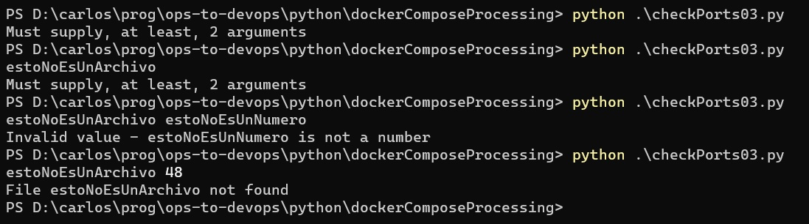

# La visión de desarrollador en la práctica
En esta sección, describiremos la construcción de un segundo programa que responde al mismo requerimiento del que describimos en [la sección anterior](./programar-y-desarrollar-ejemplo-prog.md). Aparecerán varios de los aspectos que compon lo que dimos en denominar _visión de desarrollador_ al tratar las [diferencias entre programar y desarrollar](./programar-y-desarrollar.md).

## Detección de una tarea habitual, búsqueda de una librería
El programa que debemos construir, involucra la lectura y análisis de un archivo en formato YAML. 
Está claro que este no será el primer programa en Python que debe trabajar con este formato, de hecho debe ser un fenómeno común. Surge la pregunta: ¿existirán librerías que faciliten la tarea, serán sencillas para instalar y usar?

Por suerte la respuesta es un rotundo "sí". Encontramos la librería [PyYAML](https://pyyaml.org/wiki/PyYAMLDocumentation), que se ajusta perfectamente a lo que necesitamos.  
Utilizando esta librería, el código de análisis del archivo buscando las secciones correspondientes a la definición de ports se reduce a lo siguiente
``` python
servicesForPort = []
parsedContents = yaml.load(fileContents, Loader=yaml.BaseLoader)
for (serviceName, serviceSpec) in parsedContents['services'].items():
    if ('ports' in serviceSpec):
        for portSpec in serviceSpec['ports']:
            # procesamiento de cada definición de ports
```
Comparando esta versión con la incluida al final de la sección anterior, observamos que desapareció la necesidad de un corte de control, con el manejo sutil de variables que requiere.  
Un factor aún más importante, es que al usar una librería generada por un equipo que se dedicó específicamente al análisis de YAML, es mucho más probable que todas las variantes del formato hayan sido contempladas, y que se generen nuevas versiones de producirse cambios en dicho formato. 

Por lo tanto, la actitud de buscar una librería, nos lleva a un código que al mismo tiempo es más robusto (por la mayor cobertura del formato YAML), más compacto, y menos delicado.


## Manejo de los datos de entrada
Otro aspecto que se repite en otros programas, es el manejo de los datos de entrada. Probablemente, en el mismo proyecto, aparecerán nuevos scripts que tomarán nombres de archivo y/o números como parámetros por línea de comando. 

Supongamos que buscamos librerías al respecto y no encontramos.  
Una alternativa consiste en _crear nuestras propias librerías_, que iremos reutilizando y realimentando a medida que generemos distintos scripts.

Definir una librería en Python es tan sencillo como incluir las definiciones en un archivo, e incluir las carpetas donde vayamos generando nuestras librerías en la variable de entorno `PYTHONPATH`.  
En este caso, definimos varias funciones que permiten que nuestro programa comience así

``` python
from scriptUtils import getCliArgument, checkFile, getNumberOrFail

# get and check values from CLI args
# minimum amount of args is implicitly checked by the getCliArgment function
portNumberArg = getCliArgument(2)
portNumber = getNumberOrFail(portNumberArg)
filename = getCliArgument(1)
checkFile(filename)
```

Nuestra librería de manejo de datos de entrada, a la que llamamos `scriptUtils`, incluye las tres funciones indicadas en la primer línea. Transcribimos la descripción de estas funciones, del archivo fuente de la librería.

``` python
################################################
#   Gives the value of the n-th CLI argument, as a String.
#   If less than n arguments have been supplied, 
#   halts execution with an explanatory message.
################################################
def getCliArgument(n):
    # implementacion

################################################
#   checks whether the given filename is indeed
#   the name of an existing file, that furthermore is not a folder.
#   Otherwise, halts execution with an explanatory message.
################################################
def checkFile(filename):
    # implementacion

################################################
#   Gives the numeric value represented by the given string.
#   E.g. getNumberOrFail('45') yields the number 45.
#   If the string does not correspond to a number, 
#   e.g. getNumberOrFail('hi'), halts execution with an explanatory message.
################################################
def getNumberOrFail(str):
    # implementacion
```

(indicar que la definición de estas funciones se puede consultar donde dejemos la implementación completa del programa)

Al utilizar estas funciones, se logra que el programa brinde mensajes que representa el error encontrado, para distintos casos de datos de entrada.




## Organización del código
La utilización de la librería `PyYAML` no sólo provocó un código más compacto, sino también la posibilidad de pensar en términos de los datos, en lugar de que el foco esté en los detalles de cómo recorrer el archivo.

En concreto, permitió comprender que el resultado del cómputo debe ser la lista de los nombres de aquellos servicios que incluyen al puerto indicado entre los host ports. 
De este razonamiento se deriva la concepción de una función que recibe a la definición del servicio y al número de puerto, y sencillamente responde `True` o `False` según si el puerto indicado se encuentra, o no, entre los host ports. Se eligió el nombre `serviceIncludesHostPort` para esta función.

La compacidad del código también ayudó a destacar el hecho de que no se estaba cerrando el archivo. Se pasó a una variante sintáctica de Python para el uso de recursos, que garantiza que los mismos se liberan, basada en la palabra clave `with`. Se produjo este código ...
``` python
with open(filename, 'r') as fileContents:
    parsedContents = yaml.load(fileContents, Loader=yaml.BaseLoader)

# obtain the services including portNumber as host port
servicesForPort = []
for (serviceName, serviceSpec) in parsedContents['services'].items():
    if serviceIncludesHostPort(serviceSpec, portNumber):
        servicesForPort.append(serviceName)
]
```

... que luego se mejoró utilizando las llamadas _list comprehension_, una particularidad de Python que simplifica varios esquemas de procesamiento de información. Transcribimos la versión final:
``` python
with open(filename, 'r') as fileContents:
    parsedContents = yaml.load(fileContents, Loader=yaml.BaseLoader)

# obtain the services including portNumber as host port
servicesForPort = [serviceName 
    for (serviceName, serviceSpec) in parsedContents['services'].items()
    if serviceIncludesHostPort(serviceSpec, portNumber)
]
```

El siguiente es un posible esquema para la función `serviceIncludesHostPort`
``` python
def serviceIncludesHostPort(serviceSpec, portNumber):
    if not ('ports' in serviceSpec):
        return False

    for portSpec in serviceSpec['ports']:
        # procesamiento de cada definición de ports
```
donde el procesamiento de las definiciones de ports es similar al descripto en la sección anterior.


## Tests automáticos
La función `serviceIncludesHostPort` fue incluida en un archivo separado, que se utiliza mediante `import` en el archivo principal. Este archivo incluye también otras funciones, entre ellas la llamada `parsePortRange` que se describe en la sección anterior.  
Esto permitió generar _tests automáticos_ utilizando el paquete [PyTest](https://docs.pytest.org/en/stable/contents.html). Sigue una definición de tests para la función `parsePortRange`.
``` python
from dockerComposeProcessing.checkPorts03_functions import parsePortRange

# Tests for parsePortRange
##############################################################################
def test_parse_port_range_single():
    rangeSpec = "7001"
    theRange = parsePortRange(rangeSpec)
    assert 7001 in theRange
    assert 7002 not in theRange

def test_parse_port_range_proper():
    rangeSpec = "7001-7010"
    theRange = parsePortRange(rangeSpec)
    assert 7000 not in theRange
    assert 7001 in theRange
    assert 7002 in theRange
    assert 7008 in theRange
    assert 7010 in theRange
    assert 7011 not in theRange
    assert 41 not in theRange
    assert 41904 not in theRange
```

Como se describe al hablar de la [visión de desarrollador](./programar-y-desarrollar.md), los tests muestran cómo utilizar la función: qué valor debe suministrarse por parámetro, y qué se puede hacer con su resultado.


## Conclusiones
En esta versión, contemplamos todos los comentarios que hicimos respecto de la versión anterior, aplicando varias de las _actitudes dev_.

En concreto:
- se realiza una validación adecuada de los datos de entrada.
- se generó una pequeña librería con funciones de validación, que puede ser utilizada en otros scripts.
- se delega el análisis del archivo a una librería que torna mucho menos probable el surgimiento de problemas a ese respecto, y simplifica en gran medida el aspecto algorítimico del problema a resolver.
- se normalizó la nomenclatura utilizando consistentemente nombres en inglés.
- se agregaron comentarios, tanto en el cuerpo principal del programa como en cada una de las funciones definidas.
- se dividió el programa en distintas funciones, todas ellas de tamaño pequeño. 
- se garantiza que el archivo no queda abierto.
- se acompaña al programa con tests automáticos.

El siguiente es el código **completo** del programa principal.
```python
import yaml
from scriptUtils import getCliArgument, checkFile, getNumberOrFail
from checkPorts03_functions import serviceIncludesHostPort

# get and check values from CLI args
# minimum amount of args is implicitly checked by the getCliArgment function
portNumberArg = getCliArgument(2)
portNumber = getNumberOrFail(portNumberArg)
filename = getCliArgument(1)
checkFile(filename)

# parse the yaml file
with open(filename, 'r') as fileContents:
    parsedContents = yaml.load(fileContents, Loader=yaml.BaseLoader)

# obtain the services including portNumber as host port
servicesForPort = [serviceName 
    for (serviceName, serviceSpec) in parsedContents['services'].items()
    if serviceIncludesHostPort(serviceSpec, portNumber)
]

# program output
if len(servicesForPort) > 0:
    print(f"Services that use {portNumber} as host port: {servicesForPort}")
else:
    print(f"No services found that use {portNumber}")
print()
``` 

Un úlitmo comentario: el código, que en la resolución de la sección anterior está en un único archivo de código fuente, en este programa está repartido entre tres archivos, a los que se suman dos archivos de test.  
Este fenómeno, que podría ser visto como una característica incómoda, en realidad es un efecto buscado pues alienta la creación de ecosistemas, en el cual se cuenta con componentes separados que pueden ser utilizados para simplificar la creación de nuevos programas.
