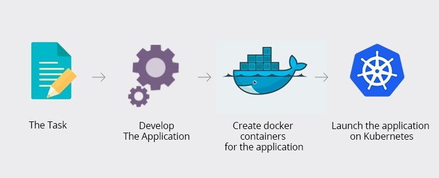

# Entornos
Para que un producto de software pueda operar correctamente, necesita tener acceso a una cantidad de recursos. En particular, bases de datos configuradas de cierta forma, acceso a ciertos puertos de red, conexiones con otras aplicaciones internas o externas, posiblemente acceso a hardware (impresoras, scanners, etc.) y otros.

Todos estos elementos configuran lo que se llama un **entorno** de ejecución del producto de software.

En cada escenario en el que haya que tener una versión corriendo, debe generarse un entorno adecuado. Esto incluye, además de producción, los entornos en los cuales los usuarios y/o clientes tienen acceso a versiones de prueba (los llamados UAT), y otros que sirven para probar la integración entre componentes, y de nuestra aplicación con otras.

## Entornos de desarrollo
Por otro lado, cada desarrollador que forma parte del equipo de desarrollo de un componente, debe ser capaz de comprobar que el código que produce funcione correctamente, no sólo en forma aislada, sino en el contexto general del componente.

Esto trae aparejada la necesidad de configurar los llamados _entornos de desarrollo_. A priori, podríamos pensar en simplemente sumar un entorno más a nuestro "paquete de entornos", pero eso ocasionaría algunas dificultades en el trabajo del equipo de desarrollo. Pensemos en un hipotético escenario donde se trabaja de esta forma: 

> Un equipo de tres desarrolladoras está trabajando en distintas funcionalidades sobre un mismo módulo y quisieran probar su código nuevo en el ambiente de desarrollo. 
> 
> Rocío integra sus cambios, los despliega y comienza a probar. Unos minutos más tarde Julieta intenta hacer lo mismo, pero al comenzar a probar su nuevo código se da cuenta de que los cambios de Rocío introdujeron defectos que impiden que ella pueda continuar. Como ese es el único ambiente de desarrollo que hay, Julieta pasa el resto del día esperando que Rocío arregle sus errores.
>
> Mientras tanto Aimé, que trabaja de forma remota, está teniendo problemas de conectividad y ni siquiera puede acceder al servidor de desarrollo. Su jornada estará dedicada a discutir por teléfono con la empresa de telecomunicaciones que contrató.

En este pequeño ejemplo vemos al menos dos problemas de esta estrategia: la dificultad para trabajar en simultáneo y los problemas derivados de una mala conectividad. Podríamos mencionar otros, pero ya vemos que este esquema no funciona bien ni siquiera en equipos pequeños.

Una alternativa muy utilizada hoy en día es la de tener el entorno de desarrollo configurado en la computadora personal de _cada miembro_ del equipo. Esto sin dudas resuelve los problemas del ejemplo anterior, pero también trae ciertos desafíos adicionales. Mencionamos a continuación algunos de ellos:

* en la mayoría de los casos, este entorno será configurado y mantenido por cada desarrollador de manera autónoma, lo cual impide (o al menos dificulta) la administración por parte del equipo de operaciones;
* muy probablemente, deba funcionar en distintas versiones de un sistema operativo o incluso en sistemas operativos diferentes: alguien podría usar Debian Linux, otra persona macOS y alguien más Windows;
* si es necesario que el desarrollador acceda a recursos externos, aparecerán configuraciones relacionadas a la _seguridad_. Ejemplos de esto podrían ser el manejo de claves SSH, configuración de una VPN, etc.

Dependiendo de la complejidad del software que se esté construyendo, es posible que este pequeño entorno personal no reemplace a un entorno de desarrollo centralizado, pero sí lo complemente: como mínimo debería servir para poder compilar el código, ejecutar las pruebas automatizadas y eventualmente inspeccionar la ejecución en busca de defectos. También es común que se incluyan las bases de datos utilizadas, en conjunto con herramientas para crear una serie de datos de prueba.

## Herramientas que simplifican el manejo de entornos
Esta multiplicidad de entornos, que potencialmente evolucionan en conjunto con el software, requieren de herramientas que van pareciéndose cada vez más a las utilizadas para el desarrollo. En particular, se vuelve necesario contar con distintas versiones de estos entornos, tener la posibilidad de replicarlos sin demasiado esfuerzo, automatizar su configuración y todas las otros aspectos que venimos contando sobre el desarrollo.

En este marco surge lo que conocemos como _DevOps_, que se refiere a esta idea de encarar las tareas de operaciones con herramientas que típicamente se asociaban al desarrollo. Esta tendencia suele venir acompañada de una fuerte inclinación hacia la _virtualización_ de los entornos y su posterior _orquestación_ (puesta en marcha) mediante herramientas automatizadas. Mencionamos a continuación algunas de las herramientas que hoy en día están siendo fuertemente utilizadas.

### Docker

[Docker](https://www.docker.com/) es una herramienta de software libre que surge en el año 2013, como una alternativa "liviana" a las máquinas virtuales. Permite administrar los llamados "contenedores", espacios virtuales que permiten ejecutar procesos de forma aislada dentro de una misma computadora.

Para esto, se vale de dos herramientas:
* unos archivos de texto con una sintaxis especial, conocidos como [Dockerfile](https://docs.docker.com/engine/reference/builder/), donde se especifica todo lo necesario para construir los contenedores;
* una [utilidad de línea de comandos (CLI)](https://docs.docker.com/engine/reference/commandline/cli/) que ofrece acciones para gestionar los contenedores.

A modo de ejemplo, les compartimos una posible configuración de `Dockerfile` que sirve para construir un contenedor con [Flask](https://flask.palletsprojects.com/en/1.1.x/), un servidor web para Python:

```dockerfile
# Utiliza como base una imagen de Python, creada y mantenida por la comunidad de Docker.
FROM python:3.7-alpine
WORKDIR /code

# Configura variables de entorno.
ENV FLASK_APP app.py
ENV FLASK_RUN_HOST 0.0.0.0

# Copia la definición de las dependencias a la imagen y las instala.
COPY requirements.txt requirements.txt
RUN pip install -r requirements.txt

# Expone el puerto 5000.
EXPOSE 5000

# Copia el código fuente dentro de la imagen.
COPY . .

# Especifica el comando que se ejecutará al iniciar el contenedor.
CMD ["flask", "run"]
```

Destacamos especialmente la habilidad para crear imágenes propias a partir de imágenes creadas por la comunidad, como se ve en el ejemplo anterior. Esto no solo nos ahorra trabajo de configuración sino que también nos permite construir software más robusto, utilizando como pilares herramientas que son utilizadas, probadas y mejoradas de manera colaborativa.

### Docker Compose

Hemos visto en el ejemplo anterior cómo construir un contenedor para la aplicación, pero como hemos hablado al comienzo de esta sección, es probable que todavía necesitemos configurar más cosas. 

Imaginemos que la aplicación del ejemplo anterior utiliza dos bases de datos: [Redis](https://redis.io/) como caché y [PostgreSQL](https://www.postgresql.org/) para todas los demás datos que se persisten. En el escenario tradicional, un desarrollador que quiera tener un entorno personal debería instalarse las herramientas de Python, una base de datos Postgre y un Redis, y luego configurar permisos, puertos, credenciales, y un largo etcétera. Usando Docker podríamos simplemente levantar tres contenedores, uno con la aplicación y uno con cada base de datos.

Para este tipo de escenarios, existe una herramienta llamada [Docker Compose](https://docs.docker.com/compose/) que permite concentrar en un solo lugar la configuración de los distintos contenedores, y definir allí mismo cómo interactúan. Tenemos además la ventaja de contar con un [gran repositorio de imágenes](https://hub.docker.com/) ya configuradas, lo cual nos permite fácilmente armar un entorno a partir de imágenes construidas por la comunidad.

En resumen, un `docker-compose.yaml` que nos serviría para levantar un entorno para la aplicación del ejemplo se vería así:

```yaml
version: '3'
services:
  web:
    build: .
    ports:
      - "5000:5000"
  cache:
    image: "redis:alpine"
  db:
    image: "postgres:10-alpine"
    environment:
      POSTGRES_PASSWORD: example
```

Por defecto, las bases de datos expondrán los puertos estándar, lo cual resulta más que suficiente para un entorno de desarrollo. Levantar este entorno resulta tan sencillo como ejecutar `docker-compose up` en el directorio donde se encuentre el archivo YAML.

### Kubernetes

Si bien Docker Compose resulta conveniente para levantar entornos sencillos, no soporta muchas funcionalidades que podrían interesarnos en un ambiente productivo: réplicas, balanceo de carga, posibilidad de escalar, monitoreo, almacenamiento, seguridad...

Para cubrir este vacío aparece [Kubernetes](https://kubernetes.io/es/), otra herramienta de código abierto que permite, según su propia documentación, "automatizar la implementación, el escalado y la administración de aplicaciones en contenedores". Esta actividad muchas veces es conocida como _orquestación_, y Kubernetes ofrece una serie de comandos para automatizarla.

### En resumen

Bajo esta visión _DevOps_, y utilizando las tres herramientas descriptas, podríamos construir un flujo de desarrollo-integración-despliegue como el siguiente:

1. El equipo de operaciones (o el de desarrollo) elabora una configuración de Docker Compose que le sirve a las desarrolladoras para tener un entorno personal funcionando en sus computadoras. Cuando el entorno cambia (porque, por ejemplo, se incluye una nueva base de datos) o cuando una nueva persona se incorpora al equipo, lo único que deben hacer para tener su entorno funcionando es descargar la última versión de la configuración y reiniciar el servicio. 
1. En el repositorio de cada componente se incluye, además del código fuente, un `Dockerfile` que contiene los comandos que realizan todas las tareas necesarias para generar una imagen de la nueva versión del código: descargar dependencias, compilar, ofuscar, etcétera.  
1. Utilizando Kubernetes, los equipos de operaciones y desarrollo colaboran para proveer a las aplicaciones de la configuración necesaria para cada entorno. Usando esta misma tecnología, se definen reglas de monitoreo para cada aplicación, así como condiciones para aumentar o disminuir la cantidad de instancias de cada servicio en función de la carga que tengan.

_(algún esquema así ayudaría a terminar de comprender el flujo que se propone)_

