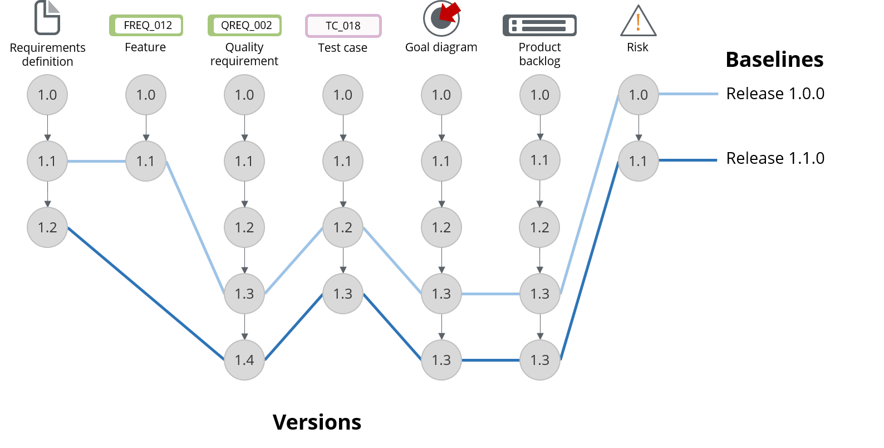

# Gestión de versiones
En el tiempo de vida de un producto de software, desde que comienza su desarrollo hasta que sale de operaciones, se genera una gran cantidad de **versiones** del mismo.

Además de las versiones que efectivamente son desplegadas en entornos de producción, se generan otras de uso interno.
Entre ellas destacamos que se generan versiones para
- ciclos de testing de componentes individuales.
- testing de integración entre componentes.
- pruebas no funcionales.
- revisión con usuarios.
- aceptación por parte del cliente.

En productos que incluyen varios componentes, cada uno de ellos puede llevar una historia de versiones particular. 
A su vez, como lo comentamos en la [introducción](./scm-intro) de esta unidad, cada archivo que interviene en la generación de un producto o componente, también tiene su historia de cambios.

Este escenario muestra la importancia de una adecuada gestión de versiones en un proyecto de desarrollo.

## Baseline
Entre los archivos que forman parte del código fuente de un componente, algunos pueden haber tenido varios cambios a partir de una versión inicial; estos cambios se corresponden con sucesivas versiones registradas en el repositorio de código. De cada versión se conoce fecha, hora, autor, y algún identificador técnico provisto automáticamente por el repositorio.

Cuando se decide generar una versión del componente, debe elegirse cuáles de los archivos presentes en el código fuente deben incluirse, y qué versión de cada uno. 
En escenarios de desarrollo continuo como los descriptos en la [Unidad 1](../programacion-a-desarrollo/ciclo-de-vida), la simple selección de la versión más reciente de cada archivo suele no ser la adecuada, por razones asociadas a los flujos de trabajo que se describirán en la Unidad 6.  
Las versiones elegidas deben formar un todo coherente, a partir del cual se pueda generar un producto desplegable sin que surjan errores, y donde a su vez, el producto generado funcione sin inconvenientes e incluya las funcionalidades definidas para la versión que debe producirse.

(imagen de "baseline" aplicada a componente. Análoga a la de producto, pero con archivos y componente en lugar de componentes y producto)  
 

Un fenómeno análogo se presenta, a una escala mayor, respecto de los componentes que conforman un producto. Para generar una versión de un producto, deben seleccionarse versiones de cada componente que funcionen correctamente en conjunto, y que cumplan con las funcionalidades y características esperadas.

(imagen de "baseline" aplicada a producto. Pongo la única que encontré que da la idea, aunque hay que cambiarla)  
 

En general, se conoce como **baseline** a un conjunto de versiones de distintos elementos, que forman un todo coherente al integrarse.
De acuerdo a lo recién indicado:
- cada versión de un componente se corresponde con un _baseline_ de su código fuente, y
- cada versión de un producto se corresponde con un _baseline_ del conjunto de sus componentes.

### Baselines y repositorios de código
El concepto de _tag_ permite utilizar al repositorio de código como medio en donde se registran los baselines.

Un **tag** es una marca que se aplica en un repositorio de código, señalando la versión de cada archivo que se encuentra activa al momento de generarse.
Un tag puede tener una identificación definida por el usuario, diferente de las identificaciones técnicas generadas por el mismo repositorio.
De esta forma, se puede registrar el baseline de una versión de un componente, generando un tag que incluya la versión seleccionada de cada archivo.
Los tags quedan registrados, pudiendo inspeccionarse en cualquier momento posterior. Esto permite consultar el estado preciso del código fuente que corresponde a una versión desplegada de un componente.

Algunos productos, como GitHub, incorporan también un concepto de _release_, pensado para versiones destinadas a ser desplegadas en entornos operativos o de aceptación.
Un release se forma a partir de un tag, pudiendo agregarse documentación específica (los llamados _release notes_) y archivos adicionales que pudieran necesitarse para el despliegue.

## Dependencias
En la práctica totalidad de los casos, los proyectos de software se sirven de **librerías**, o sea, paquetes de software producidos generalmente por entidades externas, que resuelven aspectos específicos que es necesario manejar en un producto de software.  
Además del obvio ahorro de tiempo de desarrollo, el uso de librerías propende a generar productos de software más _robustos_, porque se aprovechan de código que ya ha sido utilizado repetidas veces en otros proyectos, y más _alineados al estado del arte_, al utilizarse productos que son conocidos en el ámbito de desarrollo.  

Las librerías utilizadas en un producto o componente se conocen como sus **dependencias**, o sea, de qué otros productos _dependen_ para poder generar el producto desplegable.

En mucos casos, las librerías también son productos en evolución constante, que por lo tanto generan regularmente nuevas versiones.
Por lo tanto, es importante incluir en cada baseline de un componente, la especificación de sus dependencias, incluyendo la versión específica de cada una.

### Sistemas de gestión de paquetes
Para varias de las tecnologías más populares en la actualidad, existen los llamados _sistemas de gestión de paquetes_, que incluyen repositorios centralizados en los que se puede buscar entre enormes cantidades de librerías, y también utilidades para la generación de productos desplegables y otras tareas asociadas al desarrollo.

Los sistemas de gestión de paquetes también pueden ser instalados a nivel de una organización, de forma tal de incluir paquetes desarrollados dentro de la misma organización para ser incluidos en distintos proyectos asociados a la misma.

Entre los sistemas de gestión de paquetes más conocidos mencionamos [Maven](https://maven.apache.org/), [npm](https://www.npmjs.com/) y [pip](https://pypi.org/project/pip/), asociados a los lenguajes Java, JavaScript y Python respectivamente.

(logos de maven / npm / pip)  
 

## La importancia de ser retrocompatible
Cada pieza de software: una función u otro elemento en un programa, un componente, una aplicación; _no funcionan en forma aislada_, sino que son utlizadas por, y utilizan a, otras unidades de software.

Por lo tanto, resulta de la máxima importancia que al generarse cambios en una unidad de cualquier nivel, que lleven a una nueva versión, cualquier unidad que utiliza a la que se está modificando y que funciona correctamente en relación a la versión actual, lo haga de la misma manera respecto de la versión a generarse, sin necesidad de modificaciones adicionales.  
Dicho de otra forma, se busca que el cambio de la versión actual por la nueva, no requiera de la modificación simultánea de ninguna otra unidad. 
Esta característica se conoce como **retrocompatibilidad**.

Una nueva versión puede agregar nueva funcionalidad, extender el ámbito de aplicación de la funcionalidad existente contemplando casos no previstos en versiones anteriores, y/o modificar aspectos no funcionales como eficiencia, seguridad, etc., sin dejar de ser retrocompatible.  
La clave es que las operaciones incluidas en versiones anteriores, puedan ser invocadas de la misma manera respetándose las respuestas y los efectos de cada operación.

La retrocompatibilidad resulta clave para que los componentes que forman parte de una aplicación puedan tener evoluciones independientes, de forma tal que desplegar una nueva versión de un componente no genere un efecto en cadena que implique la modificación simultánea de una cantidad importante de otros componentes.

Los [tests de integración](../testing/sistematizacion/tipos-documentacion) mencionados en la unidad 4, tienen como uno de sus objetivos, verificar la retrocompatibilidad de nuevas versiones de componentes.

### Manejo de las excepciones
En proyectos con un tiempo de vida largo, a veces el respeto a ultranza de la retrocompatibilidad puede atentar contra la sencillez: se mantiene código sólo para mantener compatibilidad con versiones muy anteriores, complicando el diseño y/o el código de la unidad de software.  
Por eso, se admite la posibilidad de que eventualmente deje de respetarse una parte de la interfaz de un componente. Esta decisión está muchas veces ligada al convencimiento de que una gran parte de quienes utilizan a la unidad en cuestión ya se han adaptado a las nuevas formas de la interfaz. En otros casos, se desea forzar un cambio de interfaz por razones específicas, p.ej. de seguridad.

Para mitigar el impacto de una pérdida de compatibilidad, se puede anunciar con antelación, para dar tiempo a la adaptación de las unidades que utilizan a la que se está modificando.  
P.ej. en un componente cuya versión actual es la 11, al liberarse la versión 12, se indica que _a partir de la versión 15_, deja de garantizarse la compatibilidad con las versiones 5 y anteriores, dando el tiempo a que quienes utilizan el componente, verifiquen qué versión están utilizando, y si está entre las que dejarán de ser soportadas, se adapten a las modalidades de las nuevas versiones.