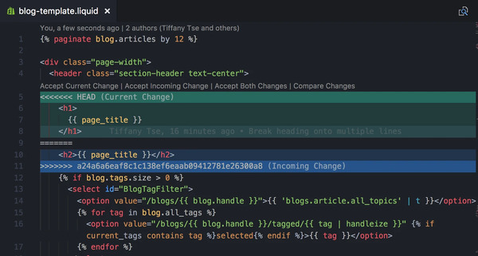

# Integración
En todo proyecto donde participe más de una desarrolladora, se requiere la integración del código generado por cada una. Podemos pensar esta integración en dos niveles distintos:
- integración del código de un _componente sobre el cual estuvieron trabajando distintos miembros del equipo_, para generar las sucesivas versiones de este;
- integración entre _versiones de distintos componentes_, para generar los baselines que dan lugar a las versiones del producto completo, o para comprobar que una nueva versión de un componente puede reemplazar a la actual en un determinado ambiente.

En el primer nivel, las tareas de integración tendrán más que ver con la gestión del código fuente, ya que la actividad de programar implica, básicamente, crear, borrar y editar archivos de texto. Podemos hablar en este nivel de los componentes como _cajas blancas_, donde podemos "abrirlos" y trabajar sobre lo que hay adentro.

En cambio, en el segundo nivel deberemos pensar a los componentes como _cajas negras_, y evaluar si las interfaces que ofrecen permiten que se conecten adecuadamente con otros.

_(acá podría ir alguna imagen de este estilo, donde se termine de ver la idea de "blanco" VS "negro")_


Veremos a continuación algunas de las tareas típicas de ambos tipos de integración.

## A nivel componente
Como dijimos en la introducción, pensar en integración a nivel componente implica tomar decisiones sobre cómo el código fuente que escribieron varias personas se mezclará para dar lugar a un solo código fuente. O, dicho de una manera bastante simplificada, armar un solo _texto_ a partir de los pequeños _textos_ que escribieron estas personas.

No hace falta saber de software para darse cuenta que esto rápidamente da pie a un gran problema: ¿qué pasa cuando dos personas editan el mismo archivo? Si bien los _sistemas de control de versiones_ nos facilitan bastante esta tarea, hay ocasiones en que esta acción deberá ser realizada de forma manual: leer ambas versiones y decidir con qué nos quedamos de cada una de ellas.

Al problema que acabamos de describir se lo conoce como _conflicto_, y a la tarea de resolverlos se la llama, lógicamente, _resolución de conflictos_.

### Resolviendo conflictos
Hoy en día, los repositorios de código incluyen herramientas para detectar y resolver estos conflictos, intentando que la necesidad de intervención humana quede limitada a lo estrictamente indispensable. En la práctica, esto significa que deberemos intervenir manualmente si se da alguna de estas dos situaciones:
* dos personas editaron la misma línea del mismo archivo (y pusieron cosas distintas);
* una persona editó un archivo y otra lo borró.

Asumimos que esas dos personas actualizaron su versión del código fuente con lo que había en el repositorio, trabajaron sobre ella, y en un momento dado decidieron integrar esos cambios nuevamente en el repositorio. Aquel que primero suba sus cambios no tendrá problema: su versión es distinta a la que está en el repositorio, pero no hubo ninguna otra versión en el medio. Cuando el segundo quiera integrar sus cambios, podrán darse dos escenarios: que los cambios del primero se integren armónicamente con los suyos o que se encuentre en alguna de las dos situaciones de conflicto y se requiera su intervención.

Cuando el segundo escenario ocurra, el sistema de control de versiones nos avisará y requerirá nuestra intervención. En Git, eso sería un mensaje de este estilo:

```
Auto-merging blog-template.liquid
CONFLICT (content): Merge conflict in blog-template.liquid
Automatic merge failed; fix conflicts and then commit the result.
```

Luego, al abrir el archivo en algún editor, veremos que se agregaron unos indicadores que muestran dónde está el problema. Existen muchas herramientas que colaboran para que esta _mezcla_ o _merge_, como se lo llama en Git, sea más fácil de hacer. Como ejemplo, vemos una imagen de cómo se ve un conflicto en [Visual Studio Code](https://code.visualstudio.com/), un editor de texto muy utilizado actualmente para programar:



Si bien solo un desarrollador se percatará de este conflicto, será su responsabilidad comunicarse con quien introdujo el otro cambio y acordar entre ambos qué versión será la definitiva. En este ejemplo vemos que el conflicto es mínimo, pero podría incluir muchas más líneas, un archivo completo o incluso varios archivos. 

La dificultad de hacer este _merge_, dependerá de cuánto diverjan las versiones, y esta divergencia tiende a crecer con el tiempo. En un escenario ideal, la integración debería ocurrir a menudo (¿una vez por día?), evitando así llegar a un punto en que las versiones diverjan tanto que sea excesivamente trabajoso volver a hacer que confluyan.

## Entre componentes
Sobre este tipo de integración, lamentablemente, no hay "recetas" tan claras de cómo proceder, pero sí podemos mencionar algunas ideas generales. 

Recuperando lo que trabajamos en la unidad anterior, aquí serán de especial ayuda los [test funcionales](../testing/sistematizacion/tipos-documentacion), particularmente los _tests de integración_ y los _end-to-end tests_. El objetivo será entonces verificar que los cambios realizados en un cierto componente no introdujeron defectos en el funcionamiento de los demás.

Para esta actividad, conviene pensar a los componentes como _cajas negras_, y enfocarnos en comprobar que determinadas entradas producen determinadas salidas. Como se ve, las tareas asociadas a este tipo de integración no tendrán que ver con la gestión del código fuente, sino más bien con el testing.

Otra variable a tener en cuenta es que la idea de _componente_ representará algo diferente para cada equipo de trabajo. Pensando, por ejemplo, en una arquitectura de microservicios, podríamos llamar componente a cada uno de los servicios y la integración estará dada por el intercambio de mensajes que estos realicen. Otro ejemplo podría ser una arquitectura backend - frontend, y ahí la integración estará dada por los pedidos que el frontend haga al backend y las respuestas que este último otorgue. Si pensamos en bibliotecas de código dentro de un mismo lenguaje, la integración estará dada por la interfaz que cada una de estas piezas exponga. 

## Flujos de integración
En ambos niveles, pueden definirse criterios de validación automática, en particular la ejecución de baterías de test o el uso de herramientas de análisis estático de código (para chequear fallas que pueden encontrarse con esta técnica y verificar cumplimiento de estándares de codificación).

Por otro lado, los cambios en el código pueden ser sujetos a aprobación.
Esto da lugar a la definición de _flujos de trabajo_, que pueden activarse a partir de eventos específicos, típicamente relacionados con el repositorio de código fuente. Estos eventos disparan una serie de verificaciones como los que ya mencionamos y procesos de generación de entregables. 

Con todo esto, se va dejando atrás la idea de la integración como una étapa aislada, cargada de tensiones y malestar, para dar paso a una visión que considera a la integración como parte del ciclo (ampliado) de desarrollo. Esta tendencia a la automatización y rutinización de estos procesos, lleva a lo que hoy conocemos como _integración continua_, tema que será profundizado en la Unidad 7.
