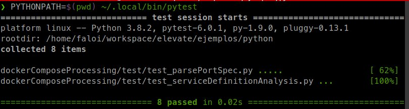
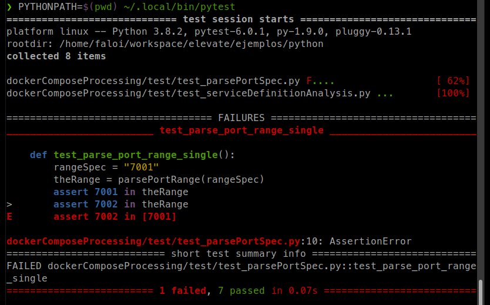
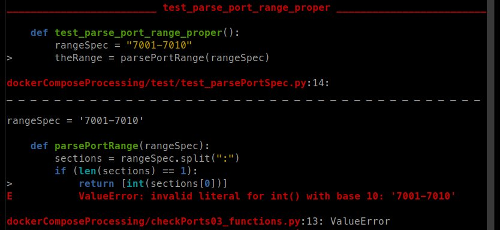

<!-- 
Creo que acá se podría:
* razonar sobre el hecho de que esto es efectivamente un programa que se puede ejecutar (HECHO)
* ejecución: mostrar success, failure y error. (HECHO)
* ¿quién ejecuta este programa? lxs devs, un servidor de CI, un qa (HECHO)
* casuística: ¿por qué se eligieron esos valores? ¿qué representan? ¿se puede mejorar?
* ¿qué se puede testear? costo/beneficio a medida que vamos alejándonos del código (HECHO)
 -->

## Un caso práctico

Al hablar de la visión de _desarrolladora_ en oposición a la de _programadora_, vimos dos posibles soluciones para un script que indica cuáles de los servicios incluidos en un archivo `docker-compose`, exponen como _host port_ un cierto puerto. Incluimos también una serie de _tests automáticos_ que validaban un subconjunto de las funcionalidades de nuestro programa:

``` python
from dockerComposeProcessing.checkPorts03_functions import parsePortRange

# Tests for parsePortRange
##############################################################################
def test_parse_port_range_single():
    rangeSpec = "7001"
    theRange = parsePortRange(rangeSpec)
    assert 7001 in theRange
    assert 7002 not in theRange

def test_parse_port_range_proper():
    rangeSpec = "7001-7010"
    theRange = parsePortRange(rangeSpec)
    assert 7000 not in theRange
    assert 7001 in theRange
    assert 7002 in theRange
    assert 7008 in theRange
    assert 7010 in theRange
    assert 7011 not in theRange
    assert 41 not in theRange
    assert 41904 not in theRange
```

Con un poco de dominio del inglés, podemos fácilmente darnos cuenta de que `assert 7010 in theRange` quiere decir algo así como _"afirmar que 7010 está dentro del rango"_, lo cual _describe_ qué esperamos de nuestra función. Queda en evidencia la primera función importante que cumplen estas pruebas: comunicarle a una persona (una progamadora, alguien de QA, nosotros dentro de unos meses...) qué es lo que _debería_ hacer nuestro código y, de paso, mostrar un ejemplo de cómo se usa.

¿Y _lo automático_ dónde está? Bueno, en efecto estos tests tienen una segunda función, que es igual o más importante que la ya mencionada: la computadora los puede ejecutar sin intervención humana, e indicar si nuestro código satisface las descripciones que escribimos o no. Dicho de otra manera, los tests **son programas** con un formato especial, cuyo propósito es verificar que otros programas funcionan correctamente. Vale entonces lo mismo que ya sabemos sobre los programas: se pueden ejecutar, es deseable utilizar nombres que expresen la intención que tuvimos al escribirlos, irán evolucionando con el tiempo en conjunto con el _código productivo_, probablemente nos interese hacer un adecuado manejo de versiones... En adelante, utilizaremos el término _código productivo_ para referirnos al código que efectivamente resuelve el problema (chequear los puertos de un YAML, comprimir una carpeta con imágenes, indicar si los logs vienen creciendo) y _código de tests_ o simplemente _tests_ para referirnos al código que se encarga de probar.

Hoy en día escribir este tipo de pruebas es bastante común para muchos equipos de desarrollo, y por lo tanto la mayoría de los lenguajes ofrecen bibliotecas o frameworks para ahorrarnos una gran parte del trabajo (y de los dolores de cabeza, claro). Entre las funcionalidades que en general dan estas bibliotecas podemos destacar: _descubrimiento_ de tests (es decir, "encuentran" qué archivos contienen tests), ejecución, reporte del resultado (muchas veces incluyendo tiempos y otras estadísticas), posibilidad de exportar los resultados a formatos como HTML o XML, y varias funciones más. 

Para el ejemplo, utilizamos [pytest](https://docs.pytest.org/en/latest/) como ya habíamos mencionado anteriormente. A continuación compartimos tres resultados de ejecución distintos, que son los tres estados posibles al ejecutar pruebas: 

**Ejecución exitosa, tests exitosos**


Todas las pruebas pasaron satisfactoriamente, no hay mucho más que decir. En particular, la salida de `pytest` incluye algunos indicadores visuales interesantes:
* al lado del nombre de cada archivo que tiene tests, aparece un puntito por cada prueba ejecutada;
* va mostrando el progreso a medida que ejecuta (62% cuando terminó con el primer archivo, 100% cuando terminó el segundo);
* al final, ofrece un resumen que también indica cuánto tardó en completar la ejecución (unas pocas centésimas de segundo).

**Ejecución exitosa, tests fallidos**


En este caso, borramos un `not` de una prueba para que falle, y eso es lo que se ve en esta captura. Además de lo que vimos en la ejecución anterior, se suman aquí algunos reportes propios de la falla:
* uno de los puntitos que mencionamos antes se convirtió en una `F`, que indica que ese test falló;
* la sección `FAILURES` nos muestra el código del test que falló, con el agregado interesante de que reemplazó la expresión `theRange` por el valor que efectivamente tenía cuando se ejecutó (la lista `[7001]`). Esto nos ayuda a entender por qué no funcionó;
* un resumen, al final, de los tests que fallaron. Esto se vuelve especialmente útil cuando tenemos una suite extensa y no llegamos a ver cuando se ejecutó el test fallido.

Es importante destacar que tanto en este caso como en el anterior, el código productivo _no arrojó ningún error_: dicho de otra forma, en ambos casos la función pudo ejecutarse y devolvió _algo_. La diferencia es que en el caso anterior ese _algo_ era lo que las pruebas esperaban y en este caso no, por eso los tests aparece como fallido.

Esta comprobación de que el valor es adecuado es la que tradicionalmente haríamos mentalmente, anotando en un papel, o siguiendo un plan de pruebas en el mejor de los casos. Además de las ventajas que ya mencionamos, comprobamos empíricamente que hacer todas estas tareas insumen una mínima fracción de segundo. ¡Éxito!

**Ejecución fallida**


Para este último ejemplo, introdujimos un pequeño error en el script original: reemplazamos el código `rangeSpec.split("-")` por `rangeSpec.split(":")`, provocando que nuestro programa ahora espere que los rangos vengan con formato `7001:7010` en vez de `7001-7010`.

A diferencia de los dos casos anteriores, en este ejemplo _el código productivo_ falló y ni siquiera pudieron terminar de ejecutarse las pruebas. Si miramos atentamente la salida, veremos que esta vez se incluye la porción de código productivo que falló y el error correspondiente, además del test.

## ¿Quién corre los tests?

Ya tenemos nuestro código productivo y tenemos nuestros tests... ¿y ahora?

El testeo automatizado se lleva especialmente bien con las [metodologías ágiles](../programacion-a-desarrollo/intro-agil.md) que ya discutimos anteriormente. Si bien nunca las pruebas pueden garantizar al 100% que el código funciona (porque después de todo, siguen siendo herramientas construidas por humanos), nos dan cierta seguridad de que el comportamiento de nuestro programa es el deseado. Poder probar todo nuestro código en pocos segundos (o minutos) ayuda a perder el _miedo_ a introducir cambios y mejoras, y nos acerca a la _agilidad_ que prometen estas metodologías.

Un ciclo de desarrollo típico, de los tantos posibles, podría ser el siguiente:
1. se detecta una falla a corregir o una funcionalidad nueva que hay que implementar;
1. se escribe el código que resuelve el problema;
1. **se ejecutan los tests**, para verificar que lo que teníamos sigue funcionando;
1. se modifican los tests existentes y/o se agregan nuevos, que garanticen que lo nuevo que hicimos funciona;
1. se sube el código a algún repositorio;
1. un servidor de integración continua detecta los cambios y **ejecuta los tests**;
1. el equipo aprueba los cambios y el nuevo código se integra a algún ambiente pre-productivo o productivo.

En este ejemplo, vemos que los tests son útiles en dos momentos bien distintos: cuando la desarrolladora está trabajando, como herramienta de soporte de su trabajo; y cuando su trabajo finalizó, como garantía de que sus cambios no introdujeron errores nuevos. Esto sin dudas eleva la calidad del código, pero también ayuda a tener procesos más dinámicos y confiables.

## Las pruebas a mano, ¿no van más?

En el ejemplo que vimos, escribimos pruebas para una aplicación de línea de comandos, diseñada para ser utilizada por alguien con un perfil técnico. Podemos pensar a esa aplicación como tres grandes componentes: uno que interactúa con la usuaria, otro que se encarga de leer el archivo YAML y un tercero que verifica si el modelo cumple con las condiciones. 

Por el momento, solo estamos probando un pequeño subconjunto de este último componente (la parte que interpreta el rango de puertos), pero podríamos fácilmente extender lo que hicimos para probarlo por completo. El segundo componente está prácticamente implementado por la biblioteca externa, así que no tiene tanto sentido escribir pruebas nuevas. En cuanto al primero (la interacción), probarlo representaría ciertas dificultades técnicas como simular la ejecución del script o capturar lo que saldría por pantalla, pero también sería posible realizarlo. Con todo esto nos aseguraríamos de que cada uno de los tres componentes funciona correctamente, pero... ¿qué garantía tenemos de que la interacción entre ellos es correcta? La respuesta no debería sorprender a esta altura: necesitamos también _testear_ esa interacción.

A modo de orientación, podemos esbozar una clasificación (de las miles que existen) de los tipos de pruebas:
* **pruebas unitarias:** verifican que un componente funcione adecuadamente, aislado del resto del sistema. A qué llamamos componente depende del paradigma y del equipo de trabajo, podría ser una función, un módulo, una clase en el paradigma de objetos.
* **pruebas de integración:** verifican que un sistema, o una parte del sistema funcione adecuadamente. Aquí típicamente involucraríamos varios componentes distintos, que en su conjunto se encargan de resolver una parte significativa del problema. Es habitual que haya cierto solapamiento con las pruebas unitarias, aunque el objetivo aquí es diferente.
* **pruebas de interacción:** verifican un sistema a partir de la interacción que un usuario podría realizar, y el _feedback_ que el sistema le da. Este tipo de pruebas, con una gran carga de trabajo manual, son las que probablemente todo proyecto de desarrollo puso en práctica alguna vez.

Si pensamos en estas pruebas como "de abajo hacia arriba" o "de adentro hacia afuera", vemos que cada tipo está más lejos del código y más cerca de cómo un usuario utiliza nuestro sistema. Mientras vamos "hacia arriba", crece también el nivel de complejidad de las pruebas porque vamos incluyendo cada vez más componentes, llegando en última instancia a trabajar con el sistema completo. También se vuelven más complejas las _aserciones_ que hacemos para verificar que el código funcione: verificar que una serie de filas se borraron de la base de datos, que el botón de "Guardar" se deshabilitó o que el reporte PDF se generó de manera correcta. Y como consecuencia de todo esto, estas pruebas ya no se ejecutarán en una fracción de segundo sino en varios minutos o incluso horas, dependiendo de qué tan complejo sea el sistema.

A modo de resumen, podemos decir que **a medida que las pruebas se alejan del código se vuelven cada vez más complejas de desarrollar, mantener y ejecutar**.  Habrá entonces que analizar el costo-beneficio de automatizar las pruebas, siendo una opción perfectamente razonable la de decidir no automatizar cierto tipo de pruebas y sí automatizar otras. Dependerá, como usualmente sucede en el mundo del software, de muchos factores: el _seniority_ del equipo de desarrollo, la visión de la empresa, el dominio del sistema, los recursos disponibles y un largo etcétera. 

<!-- **Para ir mechando en el relato:**

Algunas ventajas de la automatización:
* la obvia, ahorrar tiempo: la computadora tarda mucho menos que un humano en hacer tareas repetitivas;
* baja la tasa de errores propios de la prueba: las personas podemos equivocarnos, incluso cuando la tarea es monótona. Las computadoras, en cambio, nos garantizan que ante la misma entrada siempre se producirá la misma salida;
* nos da cierta seguridad de que el comportamiento de nuestro programa es el deseado;
* como corolario de lo anterior: perdemos el miedo a introducir cambios, porque tenemos una batería de pruebas que podemos ejecutar luego de modificar el código y así verificar que todo siga funcionando como esperábamos.

Desde la _visión de desarrollador_, aportan además las siguientes ventajas:
* documentar la forma esperada de utilizar los módulos (funciones, clases, etcétera);
* especificar con menor ambigüedad qué es lo que se espera de dicho módulo. -->
