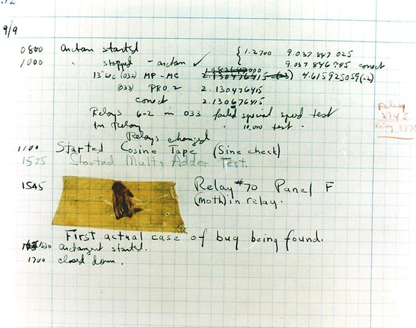
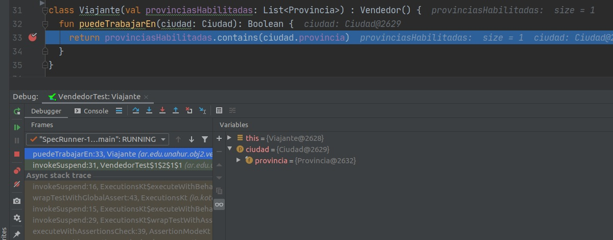

# Conceptos generales de Debugging

Cuenta una de las muchas leyendas que hay sobre el tema, que allá por la decada de 1940 Grace Hopper, una pionera de las ciencias de la computación, encontró una polilla que impedía el funcionamiento de un relé de la computadora en la cual estaba trabajando. Quedaría así inmortalizado en un informe el primer _bug_ de la historia de la computación, que es como en la jerga le llamamos a los defectos.

En esta sección hablaremos brevemente sobre algunas técnicas que suelen usar los programadores para _hacer debugging_ o rastrear defectos, sobre todo aquellos que se resisten a ser encontrados. 

Es importante destacar que estas técnicas **no reemplazan** al testeo automático del código, que sería deseable que siempre exista. Desde nuestra visión, las herramientas de debugging son _un complemento_ de los tests, y no deberían emplearse con un mecanismo para validar que el comportamiento es el deseado.

## Print, print, print

Hacer debugging consiste básicamente en obtener información adicional del código mientras se está ejecutando y luego utilizar esa información para corregir un defecto que, en principio, no se sabe a ciencia cierta qué lo causa. Esta información que nos interesa recolectar puede ser muy variada: datos del entorno de ejecución, de la sesión del usuario, valores intermedios de un algoritmo, estado de la memoria en un cierto punto del programa y casi cualquier cosa que podamos imaginar.

Quizás la técnica más antigua para recolectar esta información es la de imprimirla por pantalla a medida que el programa se ejecuta. Seguramente alguna vez se hayan topado con un `print`, `printf`, `puts`, `console.log` o como sea que el lenguaje de turno permita escribir algo en la pantalla. No ahondaremos demasiado en esta técnica.

Si bien ocasionalmente puede ser una técnica útil, la práctica habitual de esta metodología puede traer problemas:
* el código se vuelve desprolijo, las sentencias para imprimir empiezan a integrarse al código y quedar "por si acaso",
* sumado a lo anterior, se incluyen en el _código productivo_ aspectos que son propios de la tarea de testing, y que luego puede costar quitarlos,
* pueden ocasionar que el código se vuelva ligeramente más lento, porque imprimir es una operación de salida que tiene un costo asociado,
* en aplicaciones con manejo de concurrencia pueden provocar cambios en la sincronización, porque los procesos o hilos competirán por el uso de un mismo recurso (la pantalla).

## Herramientas avanzadas de debugging

Generalmente incluidas dentro de cualquier _entorno de desarrollo integrado_ o IDE moderno, aparecen herramientas especialmente diseñadas para inspeccionar código que se está ejecutando. Estas utilidades se acoplan al proceso que ejecuta nuestro código y permiten tanto inspeccionar como intervenir en la ejecución, otorgando así un abanico de posibilidades mucho mayor y poderoso del que describimos anteriormente.

Si bien las herramientas varían para cada lenguaje y tecnología, podemos mencionar algunas que suelen ser comunes:
* posibilidad de introducir _breakpoints_ en cualquier línea del código: esto provoca que cuando la ejecución llegue a ese punto se pause, para que podamos ver el estado en que se encuentra nuestro programa y seguir con la ejecución de manera controlada (línea por línea, entrando a funciones, etc);
* con el programa detenido, pueden inspeccionarse valores de atributos, variables, argumentos, etc. También algunas tecnologías permiten evaluar expresiones arbitrarias que tienen en cuenta al contexto;
* ver el _stack trace_, que es la pila de las invocaciones de funciones o métodos que provocaron que la ejecución del código llegue hasta ese punto.

En la siguiente imagen, vemos una sesión de _debugging_ del lenguaje [Kotlin](https://kotlinlang.org/) dentro del IDE [IntelliJ Idea](https://www.jetbrains.com/idea/), donde se pueden apreciar varias de las funcionalidades descriptas.

