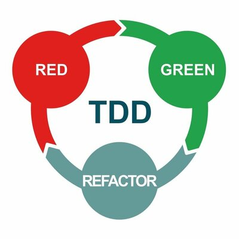

# TDD o Test Driven Development

En el marco de las [metodologías ágiles](../../programacion-a-desarrollo/intro-agil), y más concretamente de Extreme Programming, surge una técnica que plantea como máxima "nunca escribas nueva funcionalidad sin una prueba que falle antes". 

Conocida como _test driven development_, _desarrollo guiado por pruebas_, o simplemente _TDD_, esta técnica (en consonancia con la filosofía ágil) plantea que debe comenzarse por las pruebas, para luego escribir el código productivo que hará que esas pruebas pasen. Según la técnica, se lograría así comenzar pensando en las pruebas de aceptación y tener una especificación ejecutable de lo que se va a construir.

## La técnica

Una regla mnemotécnica que suele utilizarse para referirse a los pasos de la técnica es _"red - green - refactor"_ o _"rojo, verde, refactorizar"_. Veamos en detalle de qué se trata esto:

* <strong style="color: red">Red:</strong> escribir un test automático que especifique la funcionalidad que queremos implementar. Ejecutarlo y ver que falla (de ahí viene lo de _red_).
* <strong style="color: green">Green:</strong> escribir el código más trivial posible para que el test pase. Volver a ejecutarlo y verificar que efectivamente funciona o _"da verde"_, en lenguaje coloquial.
* <strong style="color: grey">Refactor:</strong> tal vez el paso más difícil de la técnica, consiste en decidir si el código merece ser reorganizado y en caso de que sí, hacerlo. 

Como mencionamos en la [unidad 1](../../programacion-a-desarrollo/programar-y-desarrollar), refactorizar se refiere a modificar la organización del código para que resulte más sencillo realizar modificaciones o agregados. En el marco de TDD lo que va a ocurrir es que la implementación inicial que hace que el test pase va ir dando lugar a un diseño más elaborado, a partir de detectar patrones que se repiten y abstracciones que vayan surgiendo.

Es importante destacar que TDD fue concebida como una técnica _para el diseño_ y no _para las pruebas_: el objetivo principal que persigue es el de elevar la calidad del diseño, especificando _qué_ se quiere construir y no _cómo_. Indudablemente un deseado efecto lateral es que, concluida la implementación, quedará un código con una _cobertura_ cercana al 100%.

## Posibles ventajas

En la práctica, esta técnica puede sufrir variaciones, especialmente en la cuestión estricta de "la solución más trivial que haga pasar el test". Sin embargo, es utilizada por muchos equipos de desarrollo y resulta especialmente útil en etapas de definición de una nueva funcionalidad, cuando quizás no se tiene tan claro qué es lo que se pretende construir.

Otra ventaja a mencionar es que favorece los diseños simples, intentando así evitar el _sobrediseño_ y las soluciones complejas que muchas veces aparecen "por las dudas". La premisa es que podemos refactorizar el código cuando surja la necesidad y contaremos con una buena batería de pruebas de regresión que garantizarán que todo sigue funcionando. 
