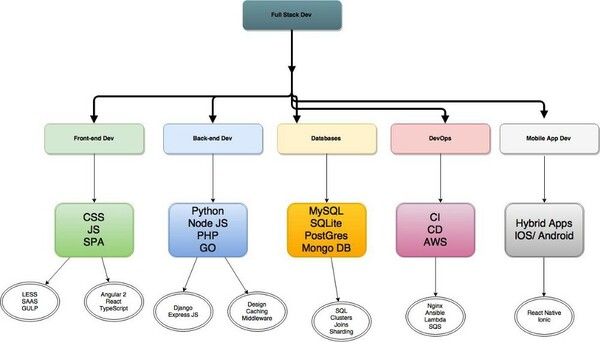

# La importancia del Full Stack development

* Recuperar lo que se dijo en [la unidad 1 sobre arquitectura de software](../programacion-a-desarrollo/arquitectura-de-software) sobre backend y frontend, para dar una idea de qué se trata esto del "full stack".
* Extender esta idea a los otros concerns que aparecen en una aplicación (ver gráfico y listadito).
* Comentar sobre cómo alguien se forma "para ser full stack", y decir que más bien es algo que se aprende después de mucho trajinar.
* Mencionar esta supuesta dicotomía entre tener idea de todo pero no saber de nada VS ser experto en algo.
* (acá o en la parte de collective code ownership) Hablar de lo que en agile llaman "champions" como antipatrón. 

> Full stack die-hards would consider a full stack developer to have specialized knowledge in all stages of software development. Thus, a full stack developer would be proficient, if not fluent, in:

> Server, network, and hosting environment
> Relational and nonrelational databases
> How to interact with APIs and the external world
> User interface and user experience
> Quality assurance
> Security concerns throughout the program
> Understanding customer and business needs

> Others are of the opinion that a full stack developer is simply someone who is familiar with all layers in computer software development. These developers aren’t experts at everything; they simply have a functional knowledge and ability to take a concept and turn it into a finished product. Such gurus make building software much easier as they understand how everything works from top to bottom and can anticipate problems accordingly. In our opinion, this is the most realistic definition of a full stack developer.

> Clearly, it takes years of work experience in different languages, roles, and industries to reach this level of qualification. Because of this, full stack developers are few and far between, making those who exist very employable and in-demand.

> A full stack developer is an engineer who can handle all the work of databases, servers, systems engineering, and clients. Depending on the project, what customers need may be a mobile stack, a Web stack, or a native application stack.

> In fact, “full stack” refers to the collection of a series of technologies needed to complete a project. “Stack” refers to a collection of sub-modules. These software sub-modules or components combined together to achieve the established function while without the need for other modules.
